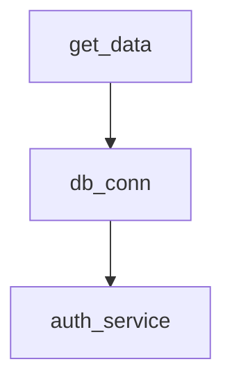

扫描[二维码](https://api2.cmdragon.cn/upload/cmder/20250304_012821924.jpg)关注或者微信搜一搜：`编程智域 前端至全栈交流与成长`


---

### **第一章：依赖注入核心原理**

#### **1.1 依赖树构建机制**

```python
from fastapi import Depends


def auth_service():
    return OAuth2Scheme()


def db_conn(auth: dict = Depends(auth_service)):
    return Database(creds=auth)


@app.get("/data")
async def get_data(conn=Depends(db_conn)):
    return conn.query()
```

**依赖树可视化**：



#### **1.2 作用域控制**

```python
from fastapi import Depends, FastAPI
from sqlalchemy.orm import sessionmaker

SessionLocal = sessionmaker(autocommit=False)


# 请求级作用域
def get_db():
    db = SessionLocal()
    try:
        yield db
    finally:
        db.close()


# 应用级单例
cache = LRUCache(size=100)


def get_cache():
    return cache
```

---

### **第二章：Pydantic深度集成**

#### **2.1 动态模型注入**

```python
from pydantic import create_model


def dynamic_model(fields: dict):
    return create_model('DynamicModel', **fields)


class FilterFactory:
    @classmethod
    def create(cls, model: BaseModel):
        class QueryParams(model):
            limit: int = 100
            offset: int = 0

        return QueryParams


@app.get("/search")
async def search(params=Depends(FilterFactory.create(User))):
    return params.dict()
```

#### **2.2 校验逻辑复用**

```python
from pydantic import validator, root_validator


class GeoValidator:
    @classmethod
    def lat_validator(cls, v):
        if not -90 <= v <= 90:
            raise ValueError("纬度范围错误")
        return v


class Location(BaseModel):
    lat: float
    lng: float

    _validate_lat = validator('lat', allow_reuse=True)(GeoValidator.lat_validator)
```

---

### **第三章：高级注入模式**

#### **3.1 工厂模式注入**

```python
class NotificationClient:
    def __init__(self, type: str):
        self.client = self._create_client(type)

    @staticmethod
    def _create_client(type):
        return {
            "sms": SMSClient(),
            "email": EmailClient()
        }[type]


def get_notifier(type: str):
    def _factory():
        return NotificationClient(type)

    return _factory


@app.post("/alert")
async def send_alert(
        notifier: NotificationClient = Depends(get_notifier("sms"))
):
    notifier.client.send()
```

#### **3.2 条件依赖注入**

```python
from fastapi import Header


def feature_flag_dep(feature_name: str):
    class FeatureChecker:
        def __init__(self,
                     enabled: bool = Depends(check_feature_enabled)
                     ):
            if not enabled:
                raise HTTPException(403, "功能未启用")

    return FeatureChecker


def check_feature_enabled(
        feature: str = Header(...),
        config: Config = Depends(get_config)
) -> bool:
    return config.is_enabled(feature)


@app.get("/beta")
async def beta_feature(
        checker=Depends(feature_flag_dep("beta"))
):
    return "功能可用"
```

---

### **第四章：错误处理与调试**

#### **4.1 依赖链错误传播**

```python
class DatabaseError(Exception):
    pass


def db_dep():
    try:
        yield connection
    except Exception as e:
        raise DatabaseError() from e


@app.exception_handler(DatabaseError)
async def handle_db_error(request, exc):
    return JSONResponse(500, {"detail": "数据库异常"})
```

#### **4.2 依赖图可视化调试**

```python
from fastapi.dependencies.utils import solve_dependencies


def print_dependency_tree():
    routes = app.routes
    for route in routes:
        if isinstance(route, APIRoute):
            solved = solve_dependencies(route.dependant)
            print(f"Route {route.path}:")
            for dep in solved.flat_graph():
                print(f"└─ {dep.call.__name__}")
```

---

### **第五章：测试与维护**

#### **5.1 依赖覆盖测试**

```python
from fastapi.testclient import TestClient


def override_dep():
    return MockDatabase()


app.dependency_overrides[get_db] = override_dep

client = TestClient(app)
response = client.get("/data")
assert "mock" in response.text
```

#### **5.2 依赖版本管理**

```python
from packaging.version import parse


class VersionedDep:
    def __init__(self, api_version: str = Header(...)):
        self.version = parse(api_version)

    def check_min_version(self, min_version: str):
        if self.version < parse(min_version):
            raise HTTPException(400, "版本过低")


@app.get("/new-feature")
async def new_feature(
        dep: VersionedDep = Depends(),
        checker=Depends(dep.check_min_version("2.3"))
):
    return "功能可用"
```

---

### **课后Quiz**

**Q1：如何实现跨路由共享查询参数？**  
A) 在每个路由重复定义参数  
B) 使用全局变量存储参数  
C) 通过依赖注入共享参数

**Q2：依赖注入的yield语句有什么作用？**

1) 实现请求后清理逻辑
2) 提高依赖执行速度
3) 支持异步生成器

**Q3：如何测试被覆盖的依赖项？**

- [x] 使用dependency_overrides
- [ ] 直接修改源代码
- [ ] 配置环境变量

---

### **错误解决方案速查表**

| 错误类型                         | 解决方案                         |
|------------------------------|------------------------------|
| 422 Validation Error         | 检查请求参数是否匹配Pydantic模型定义       |
| DIResolutionError            | 确认依赖树没有循环引用，所有依赖项已正确定义       |
| DependencyInstantiationError | 检查yield依赖是否正确处理异常，验证上下文管理器实现 |

---

### **扩展阅读**

1. **《Dependency Injection Principles》** - 依赖注入设计原则深度解析
2. **《Clean Architecture in Python》** - Python整洁架构实践指南
3. **《FastAPI Internals》** - 框架源码分析与实现原理

---

**架构箴言**：优秀的依赖注入设计应遵循SOLID原则，特别是依赖倒置原则（DIP）。建议使用依赖图分析工具保持注入层次不超过5层，对高频依赖实施缓存策略，并定期进行依赖关系审计。

[探索数千个预构建的 AI 应用，开启你的下一个伟大创意](https://tools.cmdragon.cn/zh/apps?category=ai_chat)

余下文章内容请点击跳转至 个人博客页面 或者 扫码关注或者微信搜一搜：`编程智域 前端至全栈交流与成长`，阅读完整的文章：

## 往期文章归档：

- [FastAPI安全防护指南：构建坚不可摧的参数处理体系 | cmdragon's Blog](https://blog.cmdragon.cn/posts/ed25f1c3c737f67a6474196cc8394113/)
- [FastAPI复杂查询终极指南：告别if-else的现代化过滤架构 | cmdragon's Blog](https://blog.cmdragon.cn/posts/eab4df2bac65cb8cde7f6a04b2aa624c/)
- [FastAPI 核心机制：分页参数的实现与最佳实践 | cmdragon's Blog](https://blog.cmdragon.cn/posts/8821ab1186b05252feda20836609463e/)
- [FastAPI 错误处理与自定义错误消息完全指南：构建健壮的 API 应用 🛠️ | cmdragon's Blog](https://blog.cmdragon.cn/posts/cebad7a36a676e5e20b90d616b726489/)
- [FastAPI 自定义参数验证器完全指南：从基础到高级实战 | cmdragon's Blog](https://blog.cmdragon.cn/posts/9d0a403c8be2b1dc31f54f2a32e4af6d/)
- [FastAPI 参数别名与自动文档生成完全指南：从基础到高级实战 🚀 | cmdragon's Blog](https://blog.cmdragon.cn/posts/2a912968ba048bad95a092487126f2ed/)
- [FastAPI Cookie 和 Header 参数完全指南：从基础到高级实战 🚀 | cmdragon's Blog](https://blog.cmdragon.cn/posts/f4cd8ed98ef3989d7c5c627f9adf7dea/)
- [FastAPI 表单参数与文件上传完全指南：从基础到高级实战 🚀 | cmdragon's Blog](https://blog.cmdragon.cn/posts/d386eb9996fa2245ce3ed0fa4473ce2b/)
- [FastAPI 请求体参数与 Pydantic 模型完全指南：从基础到嵌套模型实战 🚀 | cmdragon's Blog](https://blog.cmdragon.cn/posts/068b69e100a8e9ec06b2685908e6ae96/)
- [FastAPI 查询参数完全指南：从基础到高级用法 🚀 | cmdragon's Blog](https://blog.cmdragon.cn/posts/20e3eee2e462e49827506244c90c065a/)
- [FastAPI 路径参数完全指南：从基础到高级校验实战 🚀 | cmdragon's Blog](https://blog.cmdragon.cn/posts/c2afc335d7e290e99c72969806120f32/)
- [FastAPI路由专家课：微服务架构下的路由艺术与工程实践 🌐 | cmdragon's Blog](https://blog.cmdragon.cn/posts/be774b3724c7f10ca55defb76ff99656/)
- [FastAPI路由与请求处理进阶指南：解锁企业级API开发黑科技 🔥 | cmdragon's Blog](https://blog.cmdragon.cn/posts/23320e6c7e7736b3faeeea06c6fa2a9b/)
- [FastAPI路由与请求处理全解：手把手打造用户管理系统 🔌 | cmdragon's Blog](https://blog.cmdragon.cn/posts/9d842fb802a1650ff94a76ccf85e38bf/)
- [FastAPI极速入门：15分钟搭建你的首个智能API（附自动文档生成）🚀 | cmdragon's Blog](https://blog.cmdragon.cn/posts/f00c92e523b0105ed423cb8edeeb0266/)
- [HTTP协议与RESTful API实战手册（终章）：构建企业级API的九大秘籍 🔐 | cmdragon's Blog](https://blog.cmdragon.cn/posts/1aaea6dee0155d4100825ddc61d600c0/)
- [HTTP协议与RESTful API实战手册（二）：用披萨店故事说透API设计奥秘 🍕 | cmdragon's Blog](https://blog.cmdragon.cn/posts/c8336c13112f68c7f9fe1490aa8d43fe/)
- [从零构建你的第一个RESTful API：HTTP协议与API设计超图解指南 🌐 | cmdragon's Blog](https://blog.cmdragon.cn/posts/1960fe96ab7bb621305c9524cc451a2f/)
- [Python异步编程进阶指南：破解高并发系统的七重封印 | cmdragon's Blog](https://blog.cmdragon.cn/posts/6163781e0bba17626978fadf63b3e92e/)
- [Python异步编程终极指南：用协程与事件循环重构你的高并发系统 | cmdragon's Blog](https://blog.cmdragon.cn/posts/bac9c0badd47defc03ac5508af4b6e1a/)
- [Python类型提示完全指南：用类型安全重构你的代码，提升10倍开发效率 | cmdragon's Blog](https://blog.cmdragon.cn/posts/ca8d996ad2a9a8a8175899872ebcba85/)
- [三大平台云数据库生态服务对决 | cmdragon's Blog](https://blog.cmdragon.cn/posts/acbd74fc659aaa3d2e0c76387bc3e2d5/)
- [分布式数据库解析 | cmdragon's Blog](https://blog.cmdragon.cn/posts/4c553fe22df1e15c19d37a7dc10c5b3a/)
- [深入解析NoSQL数据库：从文档存储到图数据库的全场景实践 | cmdragon's Blog](https://blog.cmdragon.cn/posts/deed11eed0f84c915ed9e9d5aad6c06d/)
- [数据库审计与智能监控：从日志分析到异常检测 | cmdragon's Blog](https://blog.cmdragon.cn/posts/9c2a135562a18261d70cc5637df435e5/)
- [数据库加密全解析：从传输到存储的安全实践 | cmdragon's Blog](https://blog.cmdragon.cn/posts/123dc22a37df8d53292d1269e39dbbc0/)
- [数据库安全实战：访问控制与行级权限管理 | cmdragon's Blog](https://blog.cmdragon.cn/posts/a49721363d1cea8f5fac980120f52242/)
- [数据库扩展之道：分区、分片与大表优化实战 | cmdragon's Blog](https://blog.cmdragon.cn/posts/ed72acd868f765d0ffbced2236b90190/)
- [查询优化：提升数据库性能的实用技巧 | cmdragon's Blog](https://blog.cmdragon.cn/posts/c2b225e3d0b1e9de613fde47b1d4cacb/)
- [性能优化与调优：全面解析数据库索引 | cmdragon's Blog](https://blog.cmdragon.cn/posts/8dece2eb47ac87272320e579cc6f8591/)
- [存储过程与触发器：提高数据库性能与安全性的利器 | cmdragon's Blog](https://blog.cmdragon.cn/posts/712adcfc99736718e1182040d70fd36b/)
- [数据操作与事务：确保数据一致性的关键 | cmdragon's Blog](https://blog.cmdragon.cn/posts/aff107a909f04dc52a887b45e9bd2484/)
- [深入掌握 SQL 深度应用：复杂查询的艺术与技巧 | cmdragon's Blog](https://blog.cmdragon.cn/posts/0f0a929119a4799c8ea1e087e592c545/)
- [彻底理解数据库设计原则：生命周期、约束与反范式的应用 | cmdragon's Blog](https://blog.cmdragon.cn/posts/934686b6ed93e241883a74eaf236bc96/)
- [深入剖析实体-关系模型（ER 图）：理论与实践全解析 | cmdragon's Blog](https://blog.cmdragon.cn/posts/ec68b3f706bd0db1585b4d150de54100/)
-

