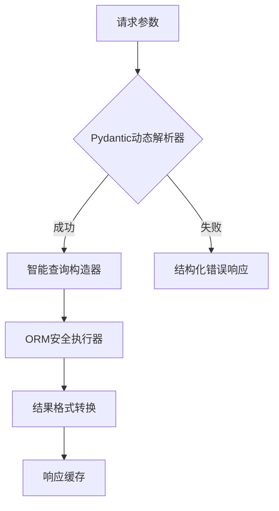

扫描[二维码](https://api2.cmdragon.cn/upload/cmder/20250304_012821924.jpg)
关注或者微信搜一搜：`编程智域 前端至全栈交流与成长`

[探索数千个预构建的 AI 应用，开启你的下一个伟大创意](https://tools.cmdragon.cn/zh/apps?category=ai_chat)

**💣【传统架构的毁灭性缺陷】**

- 致命缺陷1：硬编码字段导致每次新增条件需修改3个文件
- 致命缺陷2：排序参数与业务逻辑深度耦合

**✨ 现代化解决方案架构图**



---

### **第一章：基础架构重构**

#### **1.1 传统模式的问题诊断**

```python
# 典型问题代码
@app.get("/items")
def get_items(name: str = None, min_price: float = None, ...):
    query = Item.query
    if name: query = query.filter_by(name=name)
    if min_price: query = query.filter(price >= min_price)
    # 每新增一个条件需增加一个if分支
    return query.all()
```

**缺陷分析**：

- 线性增长的维护成本（每新增条件需修改代码）
- 条件组合导致测试用例爆炸式增长
- 无法实现动态字段扩展

#### **1.2 现代化解决方案**

```python
# 声明式过滤配置
filter_config = {
    "name": (lambda v: Item.name == v, str),
    "price_gte": (lambda v: Item.price >= v, float),
    "category_in": (lambda v: Item.category.in_(v), list)
}


def build_filters(params: dict):
    return [
        logic(param) for field, (logic, type_) in filter_config.items()
        if (param := params.get(field)) is not None
           and isinstance(param, type_)
    ]
```

**技术亮点**：

- 类型安全验证（自动过滤非法类型参数）
- 配置与逻辑解耦（新增条件只需修改配置）
- 支持动态字段扩展

---

### **第二章：动态查询构建**

#### **2.1 策略模式实现**

```python
class FilterStrategy:
    _strategies = {}

    @classmethod
    def register(cls, name):
        def decorator(func):
            cls._strategies[name] = func
            return func

        return decorator

    @classmethod
    def apply(cls, query, params):
        for param, value in params.items():
            if strategy := cls._strategies.get(param):
                query = strategy(query, value)
        return query


@FilterStrategy.register("name_contains")
def _(query, value):
    return query.filter(Item.name.ilike(f"%{value}%"))


@FilterStrategy.register("price_range")
def _(query, value: dict):
    return query.filter(Item.price.between(value["min"], value["max"]))
```

#### **2.2 复合查询构建**

```python
from sqlalchemy import and_, or_


def build_composite_filter(filters: list, logic_gate=and_):
    return logic_gate(*[filt for filt in filters if filt is not None])


# 使用示例
filters = [
    Item.price >= 100,
    or_(Item.category == "electronics", Item.category == "furniture")
]
query = session.query(Item).filter(build_composite_filter(filters))
```

---

### **第三章：安全与验证**

#### **3.1 参数验证模型**

```python
from pydantic import BaseModel, conlist, confloat


class AdvancedFilter(BaseModel):
    search_term: Optional[str] = Field(max_length=50)
    price_range: Optional[dict] = Field(
        regex="^{min:\d+,max:\d+}$",
        example={"min": 100, "max": 500}
    )
    sort_by: Optional[str] = Field(regex="^(name|price)(_desc)?$")

    @validator("price_range")
    def validate_price_range(cls, v):
        if v["min"] > v["max"]:
            raise ValueError("Min price exceeds max")
        return v
```

#### **3.2 SQL注入防护**

```python
# 不安全做法（绝对禁止！）
query.filter(f"price > {user_input}")

# 安全做法
from sqlalchemy import text

query.filter(text("price > :min_price")).params(min_price=user_input)
```

---

### **第四章：性能优化**

#### **4.1 索引策略**

```sql
-- 复合索引
CREATE INDEX idx_items_search ON items (category, price DESC);

-- 函数索引
CREATE INDEX idx_name_lower ON items (LOWER(name));
```

#### **4.2 分页优化对比**

```python
# 传统分页（性能随offset增大线性下降）
query.offset((page - 1) * size).limit(size)

# 游标分页（恒定时间查询）
last_id = request.query_params.get("last_id")
query.filter(Item.id > last_id).limit(size)
```

---

### **第五章：错误处理**

#### **5.1 统一错误响应**

```python
@app.exception_handler(ValidationError)
async def handle_validation_error(request, exc):
    return JSONResponse(
        status_code=422,
        content={
            "detail": "参数校验失败",
            "errors": [
                f"{'.'.join(map(str, e['loc']))}: {e['msg']}"
                for e in exc.errors()
            ]
        }
    )
```

#### **5.2 常见错误速查**

| 错误码 | 场景       | 解决方案             |
|-----|----------|------------------|
| 422 | 参数类型错误   | 检查Pydantic模型约束条件 |  
| 500 | 无效排序字段   | 添加字段白名单验证        |
| 429 | 复杂查询频率过高 | 实现基于查询复杂度的限流策略   |

---

### **课后Quiz**

**Q1：如何安全处理用户输入的排序参数？**  
A) 直接拼接字符串到order_by  
B) 使用字段白名单验证  
C) 完全依赖前端验证

**Q2：哪种分页方式更适合大数据量场景？**

1) Offset分页
2) 游标分页
3) 随机分页

**Q3：如何验证价格区间的有效性？**

- [ ] 在前端进行验证
- [x] 使用Pydantic自定义校验器
- [x] 在数据库添加CHECK约束

---

### **扩展阅读**

1. **《SQLAlchemy性能调优手册》** - 深度解析查询优化技巧
2. **《REST API设计模式》** - 过滤参数的标准实现规范
3. **《微服务查询设计》** - 分布式环境下的过滤方案

---


余下文章内容请点击跳转至 个人博客页面 或者 扫码关注或者微信搜一搜：`编程智域 前端至全栈交流与成长`，阅读完整的文章：

## 往期文章归档：

- [FastAPI 核心机制：分页参数的实现与最佳实践 | cmdragon's Blog](https://blog.cmdragon.cn/posts/8821ab1186b05252feda20836609463e/)
- [FastAPI 错误处理与自定义错误消息完全指南：构建健壮的 API 应用 🛠️ | cmdragon's Blog](https://blog.cmdragon.cn/posts/cebad7a36a676e5e20b90d616b726489/)
- [FastAPI 自定义参数验证器完全指南：从基础到高级实战 | cmdragon's Blog](https://blog.cmdragon.cn/posts/9d0a403c8be2b1dc31f54f2a32e4af6d/)
- [FastAPI 参数别名与自动文档生成完全指南：从基础到高级实战 🚀 | cmdragon's Blog](https://blog.cmdragon.cn/posts/2a912968ba048bad95a092487126f2ed/)
- [FastAPI Cookie 和 Header 参数完全指南：从基础到高级实战 🚀 | cmdragon's Blog](https://blog.cmdragon.cn/posts/f4cd8ed98ef3989d7c5c627f9adf7dea/)
- [FastAPI 表单参数与文件上传完全指南：从基础到高级实战 🚀 | cmdragon's Blog](https://blog.cmdragon.cn/posts/d386eb9996fa2245ce3ed0fa4473ce2b/)
- [FastAPI 请求体参数与 Pydantic 模型完全指南：从基础到嵌套模型实战 🚀 | cmdragon's Blog](https://blog.cmdragon.cn/posts/068b69e100a8e9ec06b2685908e6ae96/)
- [FastAPI 查询参数完全指南：从基础到高级用法 🚀 | cmdragon's Blog](https://blog.cmdragon.cn/posts/20e3eee2e462e49827506244c90c065a/)
- [FastAPI 路径参数完全指南：从基础到高级校验实战 🚀 | cmdragon's Blog](https://blog.cmdragon.cn/posts/c2afc335d7e290e99c72969806120f32/)
- [FastAPI路由专家课：微服务架构下的路由艺术与工程实践 🌐 | cmdragon's Blog](https://blog.cmdragon.cn/posts/be774b3724c7f10ca55defb76ff99656/)
- [FastAPI路由与请求处理进阶指南：解锁企业级API开发黑科技 🔥 | cmdragon's Blog](https://blog.cmdragon.cn/posts/23320e6c7e7736b3faeeea06c6fa2a9b/)
- [FastAPI路由与请求处理全解：手把手打造用户管理系统 🔌 | cmdragon's Blog](https://blog.cmdragon.cn/posts/9d842fb802a1650ff94a76ccf85e38bf/)
- [FastAPI极速入门：15分钟搭建你的首个智能API（附自动文档生成）🚀 | cmdragon's Blog](https://blog.cmdragon.cn/posts/f00c92e523b0105ed423cb8edeeb0266/)
- [HTTP协议与RESTful API实战手册（终章）：构建企业级API的九大秘籍 🔐 | cmdragon's Blog](https://blog.cmdragon.cn/posts/1aaea6dee0155d4100825ddc61d600c0/)
- [HTTP协议与RESTful API实战手册（二）：用披萨店故事说透API设计奥秘 🍕 | cmdragon's Blog](https://blog.cmdragon.cn/posts/c8336c13112f68c7f9fe1490aa8d43fe/)
- [从零构建你的第一个RESTful API：HTTP协议与API设计超图解指南 🌐 | cmdragon's Blog](https://blog.cmdragon.cn/posts/1960fe96ab7bb621305c9524cc451a2f/)
- [Python异步编程进阶指南：破解高并发系统的七重封印 | cmdragon's Blog](https://blog.cmdragon.cn/posts/6163781e0bba17626978fadf63b3e92e/)
- [Python异步编程终极指南：用协程与事件循环重构你的高并发系统 | cmdragon's Blog](https://blog.cmdragon.cn/posts/bac9c0badd47defc03ac5508af4b6e1a/)
- [Python类型提示完全指南：用类型安全重构你的代码，提升10倍开发效率 | cmdragon's Blog](https://blog.cmdragon.cn/posts/ca8d996ad2a9a8a8175899872ebcba85/)
- [三大平台云数据库生态服务对决 | cmdragon's Blog](https://blog.cmdragon.cn/posts/acbd74fc659aaa3d2e0c76387bc3e2d5/)
- [分布式数据库解析 | cmdragon's Blog](https://blog.cmdragon.cn/posts/4c553fe22df1e15c19d37a7dc10c5b3a/)
- [深入解析NoSQL数据库：从文档存储到图数据库的全场景实践 | cmdragon's Blog](https://blog.cmdragon.cn/posts/deed11eed0f84c915ed9e9d5aad6c06d/)
- [数据库审计与智能监控：从日志分析到异常检测 | cmdragon's Blog](https://blog.cmdragon.cn/posts/9c2a135562a18261d70cc5637df435e5/)
- [数据库加密全解析：从传输到存储的安全实践 | cmdragon's Blog](https://blog.cmdragon.cn/posts/123dc22a37df8d53292d1269e39dbbc0/)
- [数据库安全实战：访问控制与行级权限管理 | cmdragon's Blog](https://blog.cmdragon.cn/posts/a49721363d1cea8f5fac980120f52242/)
- [数据库扩展之道：分区、分片与大表优化实战 | cmdragon's Blog](https://blog.cmdragon.cn/posts/ed72acd868f765d0ffbced2236b90190/)
- [查询优化：提升数据库性能的实用技巧 | cmdragon's Blog](https://blog.cmdragon.cn/posts/c2b225e3d0b1e9de613fde47b1d4cacb/)
- [性能优化与调优：全面解析数据库索引 | cmdragon's Blog](https://blog.cmdragon.cn/posts/8dece2eb47ac87272320e579cc6f8591/)
- [存储过程与触发器：提高数据库性能与安全性的利器 | cmdragon's Blog](https://blog.cmdragon.cn/posts/712adcfc99736718e1182040d70fd36b/)
- [数据操作与事务：确保数据一致性的关键 | cmdragon's Blog](https://blog.cmdragon.cn/posts/aff107a909f04dc52a887b45e9bd2484/)
- [深入掌握 SQL 深度应用：复杂查询的艺术与技巧 | cmdragon's Blog](https://blog.cmdragon.cn/posts/0f0a929119a4799c8ea1e087e592c545/)
- [彻底理解数据库设计原则：生命周期、约束与反范式的应用 | cmdragon's Blog](https://blog.cmdragon.cn/posts/934686b6ed93e241883a74eaf236bc96/)
- [深入剖析实体-关系模型（ER 图）：理论与实践全解析 | cmdragon's Blog](https://blog.cmdragon.cn/posts/ec68b3f706bd0db1585b4d150de54100/)
- [数据库范式详解：从第一范式到第五范式 | cmdragon's Blog](https://blog.cmdragon.cn/posts/2b268e76c15d9640a08fed80fccfc562/)
- [PostgreSQL：数据库迁移与版本控制 | cmdragon's Blog](https://blog.cmdragon.cn/posts/649f515b93a6caee9dc38f1249e9216e/)
-

## 免费好用的热门在线工具

- [CMDragon 在线工具 - 高级AI工具箱与开发者套件 | 免费好用的在线工具](https://tools.cmdragon.cn/zh)
- [应用商店 - 发现1000+提升效率与开发的AI工具和实用程序 | 免费好用的在线工具](https://tools.cmdragon.cn/zh/apps?category=trending)
- [CMDragon 更新日志 - 最新更新、功能与改进 | 免费好用的在线工具](https://tools.cmdragon.cn/zh/changelog)
- [支持我们 - 成为赞助者 | 免费好用的在线工具](https://tools.cmdragon.cn/zh/sponsor)
- [AI文本生成图像 - 应用商店 | 免费好用的在线工具](https://tools.cmdragon.cn/zh/apps/text-to-image-ai)
- [临时邮箱 - 应用商店 | 免费好用的在线工具](https://tools.cmdragon.cn/zh/apps/temp-email)
- [二维码解析器 - 应用商店 | 免费好用的在线工具](https://tools.cmdragon.cn/zh/apps/qrcode-parser)
- [文本转思维导图 - 应用商店 | 免费好用的在线工具](https://tools.cmdragon.cn/zh/apps/text-to-mindmap)
- [正则表达式可视化工具 - 应用商店 | 免费好用的在线工具](https://tools.cmdragon.cn/zh/apps/regex-visualizer)
- [文件隐写工具 - 应用商店 | 免费好用的在线工具](https://tools.cmdragon.cn/zh/apps/steganography-tool)
- [IPTV 频道探索器 - 应用商店 | 免费好用的在线工具](https://tools.cmdragon.cn/zh/apps/iptv-explorer)
- [快传 - 应用商店 | 免费好用的在线工具](https://tools.cmdragon.cn/zh/apps/snapdrop)
- [随机抽奖工具 - 应用商店 | 免费好用的在线工具](https://tools.cmdragon.cn/zh/apps/lucky-draw)
- [动漫场景查找器 - 应用商店 | 免费好用的在线工具](https://tools.cmdragon.cn/zh/apps/anime-scene-finder)
- [时间工具箱 - 应用商店 | 免费好用的在线工具](https://tools.cmdragon.cn/zh/apps/time-toolkit)
- [网速测试 - 应用商店 | 免费好用的在线工具](https://tools.cmdragon.cn/zh/apps/speed-test)
- [AI 智能抠图工具 - 应用商店 | 免费好用的在线工具](https://tools.cmdragon.cn/zh/apps/background-remover)
- [背景替换工具 - 应用商店 | 免费好用的在线工具](https://tools.cmdragon.cn/zh/apps/background-replacer)
- [艺术二维码生成器 - 应用商店 | 免费好用的在线工具](https://tools.cmdragon.cn/zh/apps/artistic-qrcode)
- [Open Graph 元标签生成器 - 应用商店 | 免费好用的在线工具](https://tools.cmdragon.cn/zh/apps/open-graph-generator)
- [图像对比工具 - 应用商店 | 免费好用的在线工具](https://tools.cmdragon.cn/zh/apps/image-comparison)
- [图片压缩专业版 - 应用商店 | 免费好用的在线工具](https://tools.cmdragon.cn/zh/apps/image-compressor)
- [密码生成器 - 应用商店 | 免费好用的在线工具](https://tools.cmdragon.cn/zh/apps/password-generator)
- [SVG优化器 - 应用商店 | 免费好用的在线工具](https://tools.cmdragon.cn/zh/apps/svg-optimizer)
- [调色板生成器 - 应用商店 | 免费好用的在线工具](https://tools.cmdragon.cn/zh/apps/color-palette)
- [在线节拍器 - 应用商店 | 免费好用的在线工具](https://tools.cmdragon.cn/zh/apps/online-metronome)
- [IP归属地查询 - 应用商店 | 免费好用的在线工具](https://tools.cmdragon.cn/zh/apps/ip-geolocation)
- [CSS网格布局生成器 - 应用商店 | 免费好用的在线工具](https://tools.cmdragon.cn/zh/apps/css-grid-layout)
- [邮箱验证工具 - 应用商店 | 免费好用的在线工具](https://tools.cmdragon.cn/zh/apps/email-validator)
- [书法练习字帖 - 应用商店 | 免费好用的在线工具](https://tools.cmdragon.cn/zh/apps/calligraphy-practice)
- [金融计算器套件 - 应用商店 | 免费好用的在线工具](https://tools.cmdragon.cn/zh/apps/finance-calculator-suite)
- [中国亲戚关系计算器 - 应用商店 | 免费好用的在线工具](https://tools.cmdragon.cn/zh/apps/chinese-kinship-calculator)
- [Protocol Buffer 工具箱 - 应用商店 | 免费好用的在线工具](https://tools.cmdragon.cn/zh/apps/protobuf-toolkit)
- [IP归属地查询 - 应用商店 | 免费好用的在线工具](https://tools.cmdragon.cn/zh/apps/ip-geolocation)
- [图片无损放大 - 应用商店 | 免费好用的在线工具](https://tools.cmdragon.cn/zh/apps/image-upscaler)
- [文本比较工具 - 应用商店 | 免费好用的在线工具](https://tools.cmdragon.cn/zh/apps/text-compare)
- [IP批量查询工具 - 应用商店 | 免费好用的在线工具](https://tools.cmdragon.cn/zh/apps/ip-batch-lookup)
- [域名查询工具 - 应用商店 | 免费好用的在线工具](https://tools.cmdragon.cn/zh/apps/domain-finder)
- [DNS工具箱 - 应用商店 | 免费好用的在线工具](https://tools.cmdragon.cn/zh/apps/dns-toolkit)
- [网站图标生成器 - 应用商店 | 免费好用的在线工具](https://tools.cmdragon.cn/zh/apps/favicon-generator)
- [XML Sitemap](https://tools.cmdragon.cn/sitemap_index.xml)