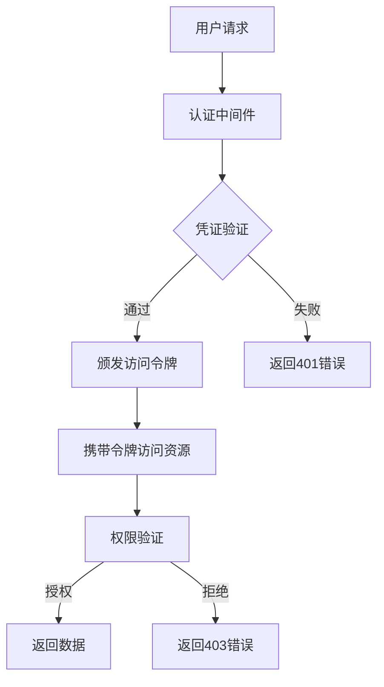
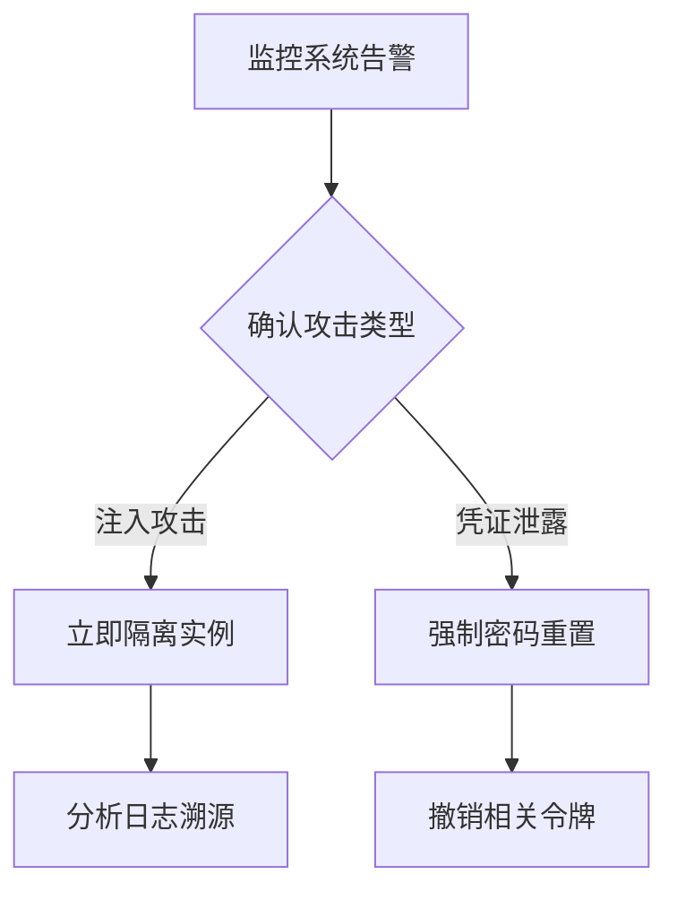
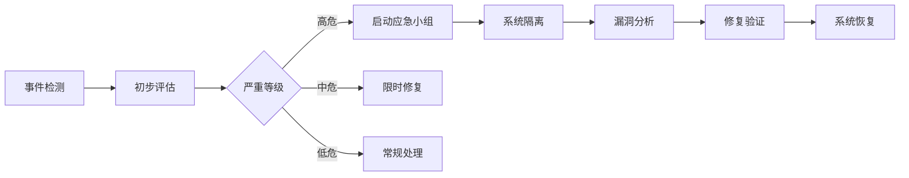

扫描[二维码](https://api2.cmdragon.cn/upload/cmder/20250304_012821924.jpg)
关注或者微信搜一搜：`编程智域 前端至全栈交流与成长`

[发现1000+提升效率与开发的AI工具和实用程序](https://tools.cmdragon.cn/zh/apps?category=ai_chat)：https://tools.cmdragon.cn/

## 1. FastAPI安全基础架构

通过内置的OAuth2和JWT支持，FastAPI提供了开箱即用的安全解决方案。典型的认证流程如下：



### JWT 认证流程

```python
from fastapi import Depends, HTTPException
from jose import JWTError, jwt
from passlib.context import CryptContext

# 配置参数
SECRET_KEY = "your-secret-key-here"
ALGORITHM = "HS256"
pwd_context = CryptContext(schemes=["bcrypt"], deprecated="auto")


def verify_password(plain_password, hashed_password):
    return pwd_context.verify(plain_password, hashed_password)


def create_access_token(data: dict):
    return jwt.encode(data, SECRET_KEY, algorithm=ALGORITHM)


async def get_current_user(token: str = Depends(oauth2_scheme)):
    try:
        payload = jwt.decode(token, SECRET_KEY, algorithms=[ALGORITHM])
        return payload.get("sub")
    except JWTError:
        raise HTTPException(status_code=401, detail="Invalid credentials")
```

（安装要求：python-jose[cryptography]==3.3.0 passlib==1.7.4）

### OAuth2 密码流

使用依赖注入系统实现权限层级：

```python
from fastapi.security import OAuth2PasswordBearer

oauth2_scheme = OAuth2PasswordBearer(tokenUrl="token")


class RoleChecker:
    def __init__(self, allowed_roles: List[str]):
        self.allowed_roles = allowed_roles

    def __call__(self, user: User = Depends(get_current_user)):
        if user.role not in self.allowed_roles:
            raise HTTPException(403, "Operation forbidden")
```

## OWASP Top5防御实现

漏洞对应表
| OWASP 风险项 | FastAPI 防护措施 |
|--------------|------------------|
| 注入攻击 | Pydantic 数据验证 + ORM 参数化查询 |
| 失效的身份认证 | JWT 签名验证 + 密码哈希存储 |
| 敏感数据泄露 | 自动生成的API文档过滤敏感字段 |
| XML 外部实体 | 默认禁用XML解析器 |
| 失效的访问控制 | 基于角色的权限依赖注入系统 |

以SQL注入防护为例的代码实现：

```python
# 安装依赖：fastapi==0.68.0 pydantic==1.10.7 sqlalchemy==1.4.36
from fastapi import Depends
from pydantic import BaseModel
from sqlalchemy import text


class QueryParams(BaseModel):
    product_id: int


@app.get("/products/")
async def get_products(
        params: QueryParams = Depends(),
        db: Session = Depends(get_db)
):
    # 使用参数化查询防御SQL注入
    result = db.execute(
        text("SELECT * FROM products WHERE id = :product_id"),
        {"product_id": params.product_id}
    )
    return result.fetchall()
```

## 3. 自动化安全工具链配置

### 工具链集成方案：

```yaml
# security_pipeline.yml
stages:
  - test
  - scan

bandit:
  stage: test
  script:
    - pip install bandit==1.7.4
    - bandit -r ./app

dependency-check:
  stage: scan
  script:
    - wget https://jeremylong.github.io/DependencyCheck/dependency-check-7.1.1-release.zip
    - ./dependency-check.sh --project "MyAPI" --scan ./src
```

### 扫描工具组合

```bash
# 代码审计
bandit -r ./ --severity-level high

# 依赖检查
safety check --full-report

# 容器扫描
trivy image --severity CRITICAL my-api:latest
```

### CI/CD 集成示例

```yaml
steps:
  - name: Security Scan
    run: |
      bandit -r ./ --format json --output bandit.json
      safety check --json > safety.json
      trivy fs --severity HIGH,CRITICAL . > trivy.txt
```

## 4. 应急响应处理机制

### 应急流程图



### 日志配置示例

```python
import logging
from fastapi import Request


@app.middleware("http")
async def log_requests(request: Request, call_next):
    logger.info(f"Request: {request.method} {request.url}")
    response = await call_next(request)
    logger.info(f"Response: {response.status_code}")
    return response
```

典型的安全事件处理流程：



课后Quiz：
Q: 当API返回422 Validation Error时，首要检查点是什么？
A: 应检查请求体是否符合Pydantic模型定义，特别是数据类型和必填字段。使用curl命令重放请求时添加-v参数查看原始请求数据。

当收到 JWTExpiredError 时应如何处理？

- A) 忽略错误继续操作
- B) 强制用户重新登录
- C) 自动延长令牌有效期

**答案：B**。根据安全最佳实践，令牌过期后必须通过正规认证流程重新获取，不能自动续期以防止会话劫持。

常见报错处理：
问题：JWT验证失败返回403
解决方案：

1. 检查令牌有效期（exp字段）
2. 验证签名算法是否匹配
3. 确认令牌携带方式正确（Authorization: Bearer模式）
4. 调试模式开启时禁用生产环境证书

余下文章内容请点击跳转至 个人博客页面 或者 扫码关注或者微信搜一搜：`编程智域 前端至全栈交流与成长`
，阅读完整的文章：[FastAPI如何玩转安全防护，让黑客望而却步？](https://blog.cmdragon.cn/posts/c1314c623211c9269f36053179a53d5c/)

## 往期文章归档：

- [如何用三层防护体系打造坚不可摧的 API 安全堡垒？ - cmdragon's Blog](https://blog.cmdragon.cn/posts/0bbb4a455ef36bf6f81ac97189586fda/#%E4%B8%80jwt-%E8%AE%A4%E8%AF%81%E8%81%94%E8%B0%83%E6%96%B9%E6%A1%88)
- [FastAPI安全加固：密钥轮换、限流策略与安全头部如何实现三重防护？ - cmdragon's Blog](https://blog.cmdragon.cn/posts/f96ba438de34dc197fd2598f91ae133d/)
- [如何在FastAPI中巧妙玩转数据脱敏，让敏感信息安全无忧？ - cmdragon's Blog](https://blog.cmdragon.cn/posts/045021f8831a03bcdf71e44cb793baf4/)
- [RBAC权限模型如何让API访问控制既安全又灵活？ - cmdragon's Blog](https://blog.cmdragon.cn/posts/9f01e838545ae8d34016c759ef461423/)
- [FastAPI中的敏感数据如何在不泄露的情况下翩翩起舞？](https://blog.cmdragon.cn/posts/88e8615e4c961e7a4f0ef31c0e41cb0b/)
- [FastAPI安全认证的终极秘籍：OAuth2与JWT如何完美融合？ - cmdragon's Blog](https://blog.cmdragon.cn/posts/17d5c40ff6c84ad652f962fed0ce46ab/)
- [如何在FastAPI中打造坚不可摧的Web安全防线？ - cmdragon's Blog](https://blog.cmdragon.cn/posts/9d6200ae7ce0a1a1a523591e3d65a82e/)
- [如何用 FastAPI 和 RBAC 打造坚不可摧的安全堡垒？ - cmdragon's Blog](https://blog.cmdragon.cn/posts/d878b5dbef959058b8098551c70594f8/)
- [FastAPI权限配置：你的系统真的安全吗？ - cmdragon's Blog](https://blog.cmdragon.cn/posts/96b6ede65030daa4613ab92da1d739a6/#%E5%BE%80%E6%9C%9F%E6%96%87%E7%AB%A0%E5%BD%92%E6%A1%A3)
- [FastAPI权限缓存：你的性能瓶颈是否藏在这只“看不见的手”里？ | cmdragon's Blog](https://blog.cmdragon.cn/posts/0c8c5a3fdaf69250ac3db7429b102625/)
- [FastAPI日志审计：你的权限系统是否真的安全无虞？ | cmdragon's Blog](https://blog.cmdragon.cn/posts/84bf7b11b342415bddb50e0521c64dfe/)
- [如何在FastAPI中打造坚不可摧的安全防线？ | cmdragon's Blog](https://blog.cmdragon.cn/posts/e2ec1e31dd5d97e0f32d2125385fd955/)
- [如何在FastAPI中实现权限隔离并让用户乖乖听话？ | cmdragon's Blog](https://blog.cmdragon.cn/posts/74777546a240b16b32196e5eb29ec8f7/)
- [如何在FastAPI中玩转权限控制与测试，让代码安全又优雅？ | cmdragon's Blog](https://blog.cmdragon.cn/posts/9dd24a9753ba15f98f24c1e5134fe40e/)
- [如何在FastAPI中打造一个既安全又灵活的权限管理系统？ | cmdragon's Blog](https://blog.cmdragon.cn/posts/277aa1628a2fa9855cdfe5f7c302bd92/)
- [FastAPI访问令牌的权限声明与作用域管理：你的API安全真的无懈可击吗？ | cmdragon's Blog](https://blog.cmdragon.cn/posts/82bae833ad460aec0965cc77b7d6f652/)
- [如何在FastAPI中构建一个既安全又灵活的多层级权限系统？ | cmdragon's Blog](https://blog.cmdragon.cn/posts/13fc113ef1dff03927d46235ad333a7f/)
- [FastAPI如何用角色权限让Web应用安全又灵活？ | cmdragon's Blog](https://blog.cmdragon.cn/posts/cc7aa0af577ae2bc0694e76886373e12/)
- [FastAPI权限验证依赖项究竟藏着什么秘密？ | cmdragon's Blog](https://blog.cmdragon.cn/posts/3e287e8b907561728ded1be34a19b22c/)
- [如何用FastAPI和Tortoise-ORM打造一个既高效又灵活的角色管理系统？ | cmdragon's Blog](https://blog.cmdragon.cn/posts/2b0a2003074eba56a6f6c57aa9690900/)
- [JWT令牌如何在FastAPI中实现安全又高效的生成与验证？ | cmdragon's Blog](https://blog.cmdragon.cn/posts/031a4b22bb8d624cf23ef593f72d1ec6/)
- [你的密码存储方式是否在向黑客招手？ | cmdragon's Blog](https://blog.cmdragon.cn/posts/5f8821250c5a4e9cc08bd08faef76c77/)
- [如何在FastAPI中轻松实现OAuth2认证并保护你的API？ | cmdragon's Blog](https://blog.cmdragon.cn/posts/c290754b532ebf91c5415aa0b30715d0/)
- [FastAPI安全机制：从OAuth2到JWT的魔法通关秘籍 | cmdragon's Blog](https://blog.cmdragon.cn/posts/30ed200ec25b55e1ba159366401ed6ee/)
- [FastAPI认证系统：从零到令牌大师的奇幻之旅 | cmdragon's Blog](https://blog.cmdragon.cn/posts/69f7189d3ff058334889eb2e02f2ea2c/)
- [FastAPI安全异常处理：从401到422的奇妙冒险 | cmdragon's Blog](https://blog.cmdragon.cn/posts/92a7a3de40eb9ce71620716632f68676/)
- [FastAPI权限迷宫：RBAC与多层级依赖的魔法通关秘籍 | cmdragon's Blog](https://blog.cmdragon.cn/posts/ee5486714707d4835d4a774696dca30a/)
- [JWT令牌：从身份证到代码防伪的奇妙之旅 | cmdragon's Blog](https://blog.cmdragon.cn/posts/a39277914464b007ac61874292578de0/)
- [FastAPI安全认证：从密码到令牌的魔法之旅 | cmdragon's Blog](https://blog.cmdragon.cn/posts/7d79b5a5c4a3adad15117a45d7976554/)
- [密码哈希：Bcrypt的魔法与盐值的秘密 | cmdragon's Blog](https://blog.cmdragon.cn/posts/f3671b2501c23bd156bfd75c5b56ce4c/)
- [用户认证的魔法配方：从模型设计到密码安全的奇幻之旅 | cmdragon's Blog](https://blog.cmdragon.cn/posts/ac5bec89ea446ce4f6b01891f640fbfe/)
- [FastAPI安全门神：OAuth2PasswordBearer的奇妙冒险 | cmdragon's Blog](https://blog.cmdragon.cn/posts/53653fa69249a339b6727107deaf2608/)
- [OAuth2密码模式：信任的甜蜜陷阱与安全指南 | cmdragon's Blog](https://blog.cmdragon.cn/posts/c27c69799af51ce0bde2ccea9d456fe4/)
- [API安全大揭秘：认证与授权的双面舞会 | cmdragon's Blog](https://blog.cmdragon.cn/posts/b443c33ca4bfb2b8fb64828fcfbcb0d1/)
- [异步日志监控：FastAPI与MongoDB的高效整合之道 | cmdragon's Blog](https://blog.cmdragon.cn/posts/91fb351897e237f4c9f800a0d540d563/)
- [FastAPI与MongoDB分片集群：异步数据路由与聚合优化 | cmdragon's Blog](https://blog.cmdragon.cn/posts/d76caa4fa21663a571b5402f6c338e4d/)

## 免费好用的热门在线工具

- [CMDragon 在线工具 - 高级AI工具箱与开发者套件 | 免费好用的在线工具](https://tools.cmdragon.cn/zh)
- [应用商店 - 发现1000+提升效率与开发的AI工具和实用程序 | 免费好用的在线工具](https://tools.cmdragon.cn/zh/apps?category=trending)
- [CMDragon 更新日志 - 最新更新、功能与改进 | 免费好用的在线工具](https://tools.cmdragon.cn/zh/changelog)
- [支持我们 - 成为赞助者 | 免费好用的在线工具](https://tools.cmdragon.cn/zh/sponsor)
- [AI文本生成图像 - 应用商店 | 免费好用的在线工具](https://tools.cmdragon.cn/zh/apps/text-to-image-ai)
- [临时邮箱 - 应用商店 | 免费好用的在线工具](https://tools.cmdragon.cn/zh/apps/temp-email)
- [二维码解析器 - 应用商店 | 免费好用的在线工具](https://tools.cmdragon.cn/zh/apps/qrcode-parser)
- [文本转思维导图 - 应用商店 | 免费好用的在线工具](https://tools.cmdragon.cn/zh/apps/text-to-mindmap)
- [正则表达式可视化工具 - 应用商店 | 免费好用的在线工具](https://tools.cmdragon.cn/zh/apps/regex-visualizer)
- [文件隐写工具 - 应用商店 | 免费好用的在线工具](https://tools.cmdragon.cn/zh/apps/steganography-tool)
- [IPTV 频道探索器 - 应用商店 | 免费好用的在线工具](https://tools.cmdragon.cn/zh/apps/iptv-explorer)
- [快传 - 应用商店 | 免费好用的在线工具](https://tools.cmdragon.cn/zh/apps/snapdrop)
- [随机抽奖工具 - 应用商店 | 免费好用的在线工具](https://tools.cmdragon.cn/zh/apps/lucky-draw)
- [动漫场景查找器 - 应用商店 | 免费好用的在线工具](https://tools.cmdragon.cn/zh/apps/anime-scene-finder)
- [时间工具箱 - 应用商店 | 免费好用的在线工具](https://tools.cmdragon.cn/zh/apps/time-toolkit)
- [网速测试 - 应用商店 | 免费好用的在线工具](https://tools.cmdragon.cn/zh/apps/speed-test)
- [AI 智能抠图工具 - 应用商店 | 免费好用的在线工具](https://tools.cmdragon.cn/zh/apps/background-remover)
- [背景替换工具 - 应用商店 | 免费好用的在线工具](https://tools.cmdragon.cn/zh/apps/background-replacer)
- [艺术二维码生成器 - 应用商店 | 免费好用的在线工具](https://tools.cmdragon.cn/zh/apps/artistic-qrcode)
- [Open Graph 元标签生成器 - 应用商店 | 免费好用的在线工具](https://tools.cmdragon.cn/zh/apps/open-graph-generator)
- [图像对比工具 - 应用商店 | 免费好用的在线工具](https://tools.cmdragon.cn/zh/apps/image-comparison)
- [图片压缩专业版 - 应用商店 | 免费好用的在线工具](https://tools.cmdragon.cn/zh/apps/image-compressor)
- [密码生成器 - 应用商店 | 免费好用的在线工具](https://tools.cmdragon.cn/zh/apps/password-generator)
- [SVG优化器 - 应用商店 | 免费好用的在线工具](https://tools.cmdragon.cn/zh/apps/svg-optimizer)
- [调色板生成器 - 应用商店 | 免费好用的在线工具](https://tools.cmdragon.cn/zh/apps/color-palette)
- [在线节拍器 - 应用商店 | 免费好用的在线工具](https://tools.cmdragon.cn/zh/apps/online-metronome)
- [IP归属地查询 - 应用商店 | 免费好用的在线工具](https://tools.cmdragon.cn/zh/apps/ip-geolocation)
- [CSS网格布局生成器 - 应用商店 | 免费好用的在线工具](https://tools.cmdragon.cn/zh/apps/css-grid-layout)
- [邮箱验证工具 - 应用商店 | 免费好用的在线工具](https://tools.cmdragon.cn/zh/apps/email-validator)
- [书法练习字帖 - 应用商店 | 免费好用的在线工具](https://tools.cmdragon.cn/zh/apps/calligraphy-practice)
- [金融计算器套件 - 应用商店 | 免费好用的在线工具](https://tools.cmdragon.cn/zh/apps/finance-calculator-suite)
- [中国亲戚关系计算器 - 应用商店 | 免费好用的在线工具](https://tools.cmdragon.cn/zh/apps/chinese-kinship-calculator)
- [Protocol Buffer 工具箱 - 应用商店 | 免费好用的在线工具](https://tools.cmdragon.cn/zh/apps/protobuf-toolkit)
- [IP归属地查询 - 应用商店 | 免费好用的在线工具](https://tools.cmdragon.cn/zh/apps/ip-geolocation)
- [图片无损放大 - 应用商店 | 免费好用的在线工具](https://tools.cmdragon.cn/zh/apps/image-upscaler)
- [文本比较工具 - 应用商店 | 免费好用的在线工具](https://tools.cmdragon.cn/zh/apps/text-compare)
- [IP批量查询工具 - 应用商店 | 免费好用的在线工具](https://tools.cmdragon.cn/zh/apps/ip-batch-lookup)
- [域名查询工具 - 应用商店 | 免费好用的在线工具](https://tools.cmdragon.cn/zh/apps/domain-finder)
- [DNS工具箱 - 应用商店 | 免费好用的在线工具](https://tools.cmdragon.cn/zh/apps/dns-toolkit)
- [网站图标生成器 - 应用商店 | 免费好用的在线工具](https://tools.cmdragon.cn/zh/apps/favicon-generator)
- [XML Sitemap](https://tools.cmdragon.cn/sitemap_index.xml)