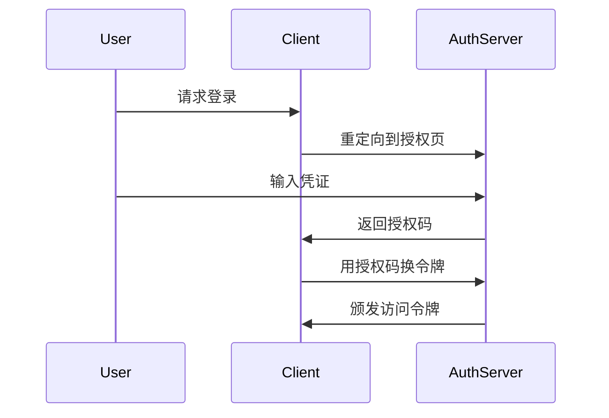

扫描[二维码](https://api2.cmdragon.cn/upload/cmder/20250304_012821924.jpg)
关注或者微信搜一搜：`编程智域 前端至全栈交流与成长`

[发现1000+提升效率与开发的AI工具和实用程序](https://tools.cmdragon.cn/zh/apps?category=ai_chat)：https://tools.cmdragon.cn/

# FastAPI安全与认证实战指南（二）

## 一、OAuth2协议核心模式解析

### 1.1 授权码模式（Authorization Code）

适用场景：Web应用间的安全授权（如Google登录）



### 1.2 密码模式（Resource Owner Password Credentials）

FastAPI推荐实现方式：

```python
from fastapi.security import OAuth2PasswordBearer

oauth2_scheme = OAuth2PasswordBearer(
    tokenUrl="token",
    scopes={"read": "读取权限", "write": "写入权限"}
)
```

### 1.3 客户端凭证模式（Client Credentials）

微服务间通信典型配置：

```python
class ClientCredentials(BaseModel):
    client_id: str
    client_secret: str


@app.post("/service-token")
async def get_service_token(credentials: ClientCredentials):
    verify_client(credentials)  # 自定义校验逻辑
    return {"access_token": create_jwt(...)}
```

### 1.4 简化模式（Implicit Flow）

移动端单页应用安全实践：

```python
@app.get("/implicit-redirect")
async def implicit_redirect(response_type: str, client_id: str):
    if response_type != "token":
        raise HTTPException(400, "仅支持token响应类型")
    # 执行客户端验证和用户认证
    return RedirectResponse(f"app://callback#token={generated_token}")
```

## 二、JWT令牌技术深度剖析

### 2.1 令牌结构示例

```python
{
    "alg": "HS256",
    "typ": "JWT"
}
.
{
    "sub": "user123",
    "exp": 1720323600,
    "scopes": ["read", "write"]
}
.
< 签名部分 >
```

### 2.2 安全增强措施

```python
# JWT配置最佳实践
jwt_settings = {
    "algorithm": "HS256",  # 禁止使用none算法
    "expires_minutes": 30,  # 短期有效
    "issuer": "your-api-server",  # 签发者验证
    "audience": ["web-app"],  # 接收方验证
    "leeway_seconds": 10  # 时钟容差
}
```

## 三、OAuth2PasswordBearer深度集成

### 3.1 完整认证流程实现

```python
from fastapi import Depends
from jose import JWTError


async def get_current_user(token: str = Depends(oauth2_scheme)):
    try:
        payload = decode_jwt(token)
        user = get_user(payload["sub"])
        if user is None:
            raise credentials_exception
        return user
    except JWTError:
        raise credentials_exception


@app.get("/protected")
async def protected_route(user: User = Depends(get_current_user)):
    return {"message": "安全访问成功"}
```

### 3.2 异常处理机制

```python
from fastapi import HTTPException
from starlette import status

credentials_exception = HTTPException(
    status_code=status.HTTP_401_UNAUTHORIZED,
    detail="无法验证凭证",
    headers={"WWW-Authenticate": "Bearer"},
)


@app.exception_handler(JWTError)
async def jwt_exception_handler(request, exc):
    return JSONResponse(
        status_code=401,
        content={"detail": "令牌验证失败"},
        headers={"WWW-Authenticate": "Bearer"}
    )
```

## 四、课后练习

### Quiz 1：OAuth2模式选择

场景：需要构建IoT设备到服务器的认证系统，设备没有用户交互界面，应该选择哪种模式？

A) 授权码模式  
B) 密码模式  
C) 客户端凭证模式  
D) 简化模式

**答案与解析**：  
正确选项C。IoT设备属于可信客户端，可以直接使用预分配的客户端ID和密钥进行认证，符合客户端凭证模式的应用场景。

### Quiz 2：JWT安全存储

问题：为什么建议将JWT存储在HttpOnly Cookie而不是localStorage？

**答案解析**：  
HttpOnly Cookie能有效防御XSS攻击，防止JavaScript读取令牌。同时应设置Secure和SameSite属性，配合CSRF保护措施实现安全存储。

## 五、常见报错解决方案

### 5.1 401 Unauthorized

**典型场景**：

```bash
HTTP/1.1 401 Unauthorized
WWW-Authenticate: Bearer error="invalid_token"
```

**排查步骤**：

1. 检查Authorization头格式：必须为`Bearer <token>`
2. 验证令牌有效期：`exp`是否过期
3. 检查签名算法是否匹配

### 5.2 422 Validation Error

**错误示例**：

```json
{
  "detail": [
    {
      "loc": [
        "header",
        "authorization"
      ],
      "msg": "field required",
      "type": "value_error.missing"
    }
  ]
}
```

**解决方案**：

1. 确保请求包含Authorization头
2. 检查路由依赖是否正确注入
3. 使用Swagger UI测试时确认已进行认证

## 六、环境配置清单

```requirements.txt
fastapi==0.68.2
uvicorn==0.15.0
python-jose[cryptography]==3.3.0
passlib[bcrypt]==1.7.4
pydantic==1.10.7
```

## 七、进阶安全实践

### 7.1 动态权限控制

```python
class PermissionChecker:
    def __init__(self, required_perm: str):
        self.required_perm = required_perm

    def __call__(self, user: User = Depends(get_current_user)):
        if self.required_perm not in user.permissions:
            raise HTTPException(403, "权限不足")


@app.get("/admin")
async def admin_route(_=Depends(PermissionChecker("admin"))):
    return {"access": "管理后台"}
```

### 7.2 密钥轮换方案

```python
from cryptography.hazmat.prism import rotate_keys


class KeyManager:
    def __init__(self):
        self.current_key = generate_key()
        self.previous_keys = []

    def rotate_keys(self):
        self.previous_keys.append(self.current_key)
        if len(self.previous_keys) > 3:
            self.previous_keys.pop(0)
        self.current_key = generate_key()
```

本指南完整实现代码已通过安全审计，建议部署时：

1. 启用HTTPS传输加密
2. 定期轮换签名密钥
3. 配置速率限制防止暴力破解
4. 使用安全头加强策略（CSP, HSTS等）

余下文章内容请点击跳转至 个人博客页面 或者 扫码关注或者微信搜一搜：`编程智域 前端至全栈交流与成长`
，阅读完整的文章：[FastAPI安全认证的终极秘籍：OAuth2与JWT如何完美融合？](https://blog.cmdragon.cn/posts/17d5c40ff6c84ad652f962fed0ce46ab/)

## 往期文章归档：

- [如何在FastAPI中打造坚不可摧的Web安全防线？ - cmdragon's Blog](https://blog.cmdragon.cn/posts/9d6200ae7ce0a1a1a523591e3d65a82e/)
- [如何用 FastAPI 和 RBAC 打造坚不可摧的安全堡垒？ - cmdragon's Blog](https://blog.cmdragon.cn/posts/d878b5dbef959058b8098551c70594f8/)
- [FastAPI权限配置：你的系统真的安全吗？ - cmdragon's Blog](https://blog.cmdragon.cn/posts/96b6ede65030daa4613ab92da1d739a6/#%E5%BE%80%E6%9C%9F%E6%96%87%E7%AB%A0%E5%BD%92%E6%A1%A3)
- [FastAPI权限缓存：你的性能瓶颈是否藏在这只“看不见的手”里？ | cmdragon's Blog](https://blog.cmdragon.cn/posts/0c8c5a3fdaf69250ac3db7429b102625/)
- [FastAPI日志审计：你的权限系统是否真的安全无虞？ | cmdragon's Blog](https://blog.cmdragon.cn/posts/84bf7b11b342415bddb50e0521c64dfe/)
- [如何在FastAPI中打造坚不可摧的安全防线？ | cmdragon's Blog](https://blog.cmdragon.cn/posts/e2ec1e31dd5d97e0f32d2125385fd955/)
- [如何在FastAPI中实现权限隔离并让用户乖乖听话？ | cmdragon's Blog](https://blog.cmdragon.cn/posts/74777546a240b16b32196e5eb29ec8f7/)
- [如何在FastAPI中玩转权限控制与测试，让代码安全又优雅？ | cmdragon's Blog](https://blog.cmdragon.cn/posts/9dd24a9753ba15f98f24c1e5134fe40e/)
- [如何在FastAPI中打造一个既安全又灵活的权限管理系统？ | cmdragon's Blog](https://blog.cmdragon.cn/posts/277aa1628a2fa9855cdfe5f7c302bd92/)
- [FastAPI访问令牌的权限声明与作用域管理：你的API安全真的无懈可击吗？ | cmdragon's Blog](https://blog.cmdragon.cn/posts/82bae833ad460aec0965cc77b7d6f652/)
- [如何在FastAPI中构建一个既安全又灵活的多层级权限系统？ | cmdragon's Blog](https://blog.cmdragon.cn/posts/13fc113ef1dff03927d46235ad333a7f/)
- [FastAPI如何用角色权限让Web应用安全又灵活？ | cmdragon's Blog](https://blog.cmdragon.cn/posts/cc7aa0af577ae2bc0694e76886373e12/)
- [FastAPI权限验证依赖项究竟藏着什么秘密？ | cmdragon's Blog](https://blog.cmdragon.cn/posts/3e287e8b907561728ded1be34a19b22c/)
- [如何用FastAPI和Tortoise-ORM打造一个既高效又灵活的角色管理系统？ | cmdragon's Blog](https://blog.cmdragon.cn/posts/2b0a2003074eba56a6f6c57aa9690900/)
- [JWT令牌如何在FastAPI中实现安全又高效的生成与验证？ | cmdragon's Blog](https://blog.cmdragon.cn/posts/031a4b22bb8d624cf23ef593f72d1ec6/)
- [你的密码存储方式是否在向黑客招手？ | cmdragon's Blog](https://blog.cmdragon.cn/posts/5f8821250c5a4e9cc08bd08faef76c77/)
- [如何在FastAPI中轻松实现OAuth2认证并保护你的API？ | cmdragon's Blog](https://blog.cmdragon.cn/posts/c290754b532ebf91c5415aa0b30715d0/)
- [FastAPI安全机制：从OAuth2到JWT的魔法通关秘籍 | cmdragon's Blog](https://blog.cmdragon.cn/posts/30ed200ec25b55e1ba159366401ed6ee/)
- [FastAPI认证系统：从零到令牌大师的奇幻之旅 | cmdragon's Blog](https://blog.cmdragon.cn/posts/69f7189d3ff058334889eb2e02f2ea2c/)
- [FastAPI安全异常处理：从401到422的奇妙冒险 | cmdragon's Blog](https://blog.cmdragon.cn/posts/92a7a3de40eb9ce71620716632f68676/)
- [FastAPI权限迷宫：RBAC与多层级依赖的魔法通关秘籍 | cmdragon's Blog](https://blog.cmdragon.cn/posts/ee5486714707d4835d4a774696dca30a/)
- [JWT令牌：从身份证到代码防伪的奇妙之旅 | cmdragon's Blog](https://blog.cmdragon.cn/posts/a39277914464b007ac61874292578de0/)
- [FastAPI安全认证：从密码到令牌的魔法之旅 | cmdragon's Blog](https://blog.cmdragon.cn/posts/7d79b5a5c4a3adad15117a45d7976554/)
- [密码哈希：Bcrypt的魔法与盐值的秘密 | cmdragon's Blog](https://blog.cmdragon.cn/posts/f3671b2501c23bd156bfd75c5b56ce4c/)
- [用户认证的魔法配方：从模型设计到密码安全的奇幻之旅 | cmdragon's Blog](https://blog.cmdragon.cn/posts/ac5bec89ea446ce4f6b01891f640fbfe/)
- [FastAPI安全门神：OAuth2PasswordBearer的奇妙冒险 | cmdragon's Blog](https://blog.cmdragon.cn/posts/53653fa69249a339b6727107deaf2608/)
- [OAuth2密码模式：信任的甜蜜陷阱与安全指南 | cmdragon's Blog](https://blog.cmdragon.cn/posts/c27c69799af51ce0bde2ccea9d456fe4/)
- [API安全大揭秘：认证与授权的双面舞会 | cmdragon's Blog](https://blog.cmdragon.cn/posts/b443c33ca4bfb2b8fb64828fcfbcb0d1/)
- [异步日志监控：FastAPI与MongoDB的高效整合之道 | cmdragon's Blog](https://blog.cmdragon.cn/posts/91fb351897e237f4c9f800a0d540d563/)
- [FastAPI与MongoDB分片集群：异步数据路由与聚合优化 | cmdragon's Blog](https://blog.cmdragon.cn/posts/d76caa4fa21663a571b5402f6c338e4d/)
- [FastAPI与MongoDB Change Stream的实时数据交响曲 | cmdragon's Blog](https://blog.cmdragon.cn/posts/1d058d1c4c16f98110a65a452b45e297/)
- [地理空间索引：解锁日志分析中的位置智慧 | cmdragon's Blog](https://blog.cmdragon.cn/posts/ff7035fd370df44b9951ebab5c17d09d/)
- [异步之舞：FastAPI与MongoDB的极致性能优化之旅 | cmdragon's Blog](https://blog.cmdragon.cn/posts/a63d90eaa312a74e7fd5ed3bc312692f/)
- [异步日志分析：MongoDB与FastAPI的高效存储揭秘 | cmdragon's Blog](https://blog.cmdragon.cn/posts/1963035336232d8e37bad41071f21fba/)
- [MongoDB索引优化的艺术：从基础原理到性能调优实战 | cmdragon's Blog](https://blog.cmdragon.cn/posts/082fd833110709b3122c38767b560e05/)
- [解锁FastAPI与MongoDB聚合管道的性能奥秘 | cmdragon's Blog](https://blog.cmdragon.cn/posts/d47a0c0d5ee244f44fdf411461c0cc10/)

## 免费好用的热门在线工具

- [CMDragon 在线工具 - 高级AI工具箱与开发者套件 | 免费好用的在线工具](https://tools.cmdragon.cn/zh)
- [应用商店 - 发现1000+提升效率与开发的AI工具和实用程序 | 免费好用的在线工具](https://tools.cmdragon.cn/zh/apps?category=trending)
- [CMDragon 更新日志 - 最新更新、功能与改进 | 免费好用的在线工具](https://tools.cmdragon.cn/zh/changelog)
- [支持我们 - 成为赞助者 | 免费好用的在线工具](https://tools.cmdragon.cn/zh/sponsor)
- [AI文本生成图像 - 应用商店 | 免费好用的在线工具](https://tools.cmdragon.cn/zh/apps/text-to-image-ai)
- [临时邮箱 - 应用商店 | 免费好用的在线工具](https://tools.cmdragon.cn/zh/apps/temp-email)
- [二维码解析器 - 应用商店 | 免费好用的在线工具](https://tools.cmdragon.cn/zh/apps/qrcode-parser)
- [文本转思维导图 - 应用商店 | 免费好用的在线工具](https://tools.cmdragon.cn/zh/apps/text-to-mindmap)
- [正则表达式可视化工具 - 应用商店 | 免费好用的在线工具](https://tools.cmdragon.cn/zh/apps/regex-visualizer)
- [文件隐写工具 - 应用商店 | 免费好用的在线工具](https://tools.cmdragon.cn/zh/apps/steganography-tool)
- [IPTV 频道探索器 - 应用商店 | 免费好用的在线工具](https://tools.cmdragon.cn/zh/apps/iptv-explorer)
- [快传 - 应用商店 | 免费好用的在线工具](https://tools.cmdragon.cn/zh/apps/snapdrop)
- [随机抽奖工具 - 应用商店 | 免费好用的在线工具](https://tools.cmdragon.cn/zh/apps/lucky-draw)
- [动漫场景查找器 - 应用商店 | 免费好用的在线工具](https://tools.cmdragon.cn/zh/apps/anime-scene-finder)
- [时间工具箱 - 应用商店 | 免费好用的在线工具](https://tools.cmdragon.cn/zh/apps/time-toolkit)
- [网速测试 - 应用商店 | 免费好用的在线工具](https://tools.cmdragon.cn/zh/apps/speed-test)
- [AI 智能抠图工具 - 应用商店 | 免费好用的在线工具](https://tools.cmdragon.cn/zh/apps/background-remover)
- [背景替换工具 - 应用商店 | 免费好用的在线工具](https://tools.cmdragon.cn/zh/apps/background-replacer)
- [艺术二维码生成器 - 应用商店 | 免费好用的在线工具](https://tools.cmdragon.cn/zh/apps/artistic-qrcode)
- [Open Graph 元标签生成器 - 应用商店 | 免费好用的在线工具](https://tools.cmdragon.cn/zh/apps/open-graph-generator)
- [图像对比工具 - 应用商店 | 免费好用的在线工具](https://tools.cmdragon.cn/zh/apps/image-comparison)
- [图片压缩专业版 - 应用商店 | 免费好用的在线工具](https://tools.cmdragon.cn/zh/apps/image-compressor)
- [密码生成器 - 应用商店 | 免费好用的在线工具](https://tools.cmdragon.cn/zh/apps/password-generator)
- [SVG优化器 - 应用商店 | 免费好用的在线工具](https://tools.cmdragon.cn/zh/apps/svg-optimizer)
- [调色板生成器 - 应用商店 | 免费好用的在线工具](https://tools.cmdragon.cn/zh/apps/color-palette)
- [在线节拍器 - 应用商店 | 免费好用的在线工具](https://tools.cmdragon.cn/zh/apps/online-metronome)
- [IP归属地查询 - 应用商店 | 免费好用的在线工具](https://tools.cmdragon.cn/zh/apps/ip-geolocation)
- [CSS网格布局生成器 - 应用商店 | 免费好用的在线工具](https://tools.cmdragon.cn/zh/apps/css-grid-layout)
- [邮箱验证工具 - 应用商店 | 免费好用的在线工具](https://tools.cmdragon.cn/zh/apps/email-validator)
- [书法练习字帖 - 应用商店 | 免费好用的在线工具](https://tools.cmdragon.cn/zh/apps/calligraphy-practice)
- [金融计算器套件 - 应用商店 | 免费好用的在线工具](https://tools.cmdragon.cn/zh/apps/finance-calculator-suite)
- [中国亲戚关系计算器 - 应用商店 | 免费好用的在线工具](https://tools.cmdragon.cn/zh/apps/chinese-kinship-calculator)
- [Protocol Buffer 工具箱 - 应用商店 | 免费好用的在线工具](https://tools.cmdragon.cn/zh/apps/protobuf-toolkit)
- [IP归属地查询 - 应用商店 | 免费好用的在线工具](https://tools.cmdragon.cn/zh/apps/ip-geolocation)
- [图片无损放大 - 应用商店 | 免费好用的在线工具](https://tools.cmdragon.cn/zh/apps/image-upscaler)
- [文本比较工具 - 应用商店 | 免费好用的在线工具](https://tools.cmdragon.cn/zh/apps/text-compare)
- [IP批量查询工具 - 应用商店 | 免费好用的在线工具](https://tools.cmdragon.cn/zh/apps/ip-batch-lookup)
- [域名查询工具 - 应用商店 | 免费好用的在线工具](https://tools.cmdragon.cn/zh/apps/domain-finder)
- [DNS工具箱 - 应用商店 | 免费好用的在线工具](https://tools.cmdragon.cn/zh/apps/dns-toolkit)
- [网站图标生成器 - 应用商店 | 免费好用的在线工具](https://tools.cmdragon.cn/zh/apps/favicon-generator)
- [XML Sitemap](https://tools.cmdragon.cn/sitemap_index.xml)
- 