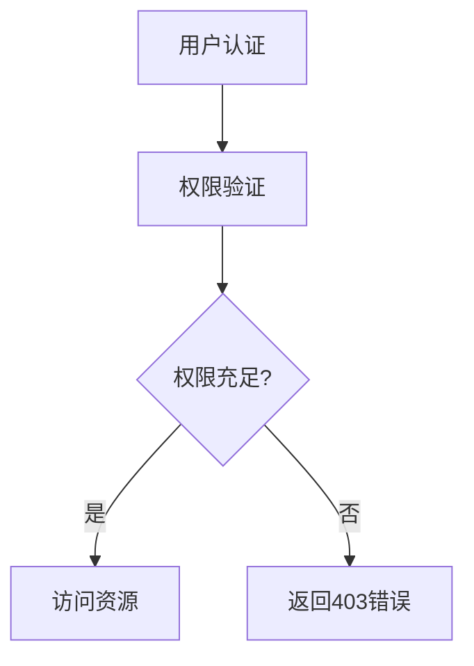

扫描[二维码](https://api2.cmdragon.cn/upload/cmder/20250304_012821924.jpg)
关注或者微信搜一搜：`编程智域 前端至全栈交流与成长`

[发现1000+提升效率与开发的AI工具和实用程序](https://tools.cmdragon.cn/zh/apps?category=ai_chat)：https://tools.cmdragon.cn/

# 第一章：FastAPI生产环境权限配置基础

## 1.1 权限管理系统核心要素

权限管理的本质是控制用户对系统资源的访问权限。在FastAPI中，完整的权限系统需要包含以下要素：




## 1.2 生产环境安全要求

满足企业级应用的安全标准需要：

1. HTTPS强制启用
2. 强密码策略（最少8字符，包含大小写+数字）
3. 登录失败锁定机制
4. 敏感操作日志记录
5. JWT令牌过期时间不超过1小时

## 1.3 权限验证流程实现

使用依赖注入实现权限验证层：

```python
from fastapi import Depends, HTTPException, status
from pydantic import BaseModel


class User(BaseModel):
    username: str
    permissions: list[str]


async def get_current_user(token: str = Depends(oauth2_scheme)):
    # 实际生产环境需要替换为真正的解码逻辑
    user = decode_jwt(token)
    return User(**user)


def check_permission(required_perms: list[str]):
    async def dependency(current_user: User = Depends(get_current_user)):
        missing = [perm for perm in required_perms
                   if perm not in current_user.permissions]
        if missing:
            raise HTTPException(
                status_code=status.HTTP_403_FORBIDDEN,
                detail=f"缺少权限: {', '.join(missing)}"
            )
        return current_user

    return dependency
```

代码依赖：

- fastapi==0.103.1
- pydantic==1.10.7
- python-jose[cryptography]==3.3.0

## 1.4 角色权限模型设计

推荐使用RBAC（基于角色的访问控制）模型：

```python
from enum import Enum


class Role(str, Enum):
    ADMIN = "admin"
    EDITOR = "editor"
    VIEWER = "viewer"


role_permissions = {
    Role.ADMIN: ["*"],
    Role.EDITOR: ["content.create", "content.edit"],
    Role.VIEWER: ["content.read"]
}


class UserWithRole(User):
    role: Role

    @property
    def permissions(self):
        return role_permissions.get(self.role, [])
```

## 1.5 动态权限配置实例

实现可配置的权限管理系统：

```python
from sqlmodel import Field, Session, SQLModel


class Permission(SQLModel, table=True):
    id: int | None = Field(default=None, primary_key=True)
    name: str = Field(unique=True)
    description: str


class RolePermission(SQLModel, table=True):
    role_id: int = Field(foreign_key="role.id", primary_key=True)
    permission_id: int = Field(foreign_key="permission.id", primary_key=True)
```

配置接口示例：

```python
@app.post("/roles/{role_id}/permissions")
async def add_role_permission(
        role_id: int,
        perm_id: int,
        db: Session = Depends(get_db)
):
    db.add(RolePermission(role_id=role_id, permission_id=perm_id))
    db.commit()
    return {"message": "权限添加成功"}
```

---

# 第二章：权限验证实践案例

## 2.1 文件下载权限控制

实现基于组织架构的权限验证：

```python
def check_department(department_id: int):
    async def dependency(
            current_user: User = Depends(get_current_user),
            db: Session = Depends(get_db)
    ):
        if not db.query(DepartmentMember).filter_by(
                user_id=current_user.id,
                department_id=department_id
        ).first():
            raise HTTPException(403, "不属于该部门")
        return current_user

    return dependency


@app.get("/files/{file_id}")
async def download_file(
        file_id: str,
        _: None = Depends(check_permission(["files.download"])),
        user: User = Depends(check_department(1024))
):
    return FileResponse(...)
```

---

## 课后Quiz

1. 用户获得ADMIN角色但未分配具体权限时，系统会如何处理？
   A) 允许所有操作
   B) 禁止所有操作
   C) 根据默认配置决定
   D) 抛出服务器错误

   正确答案：B  
   解析：代码中`role_permissions.get(self.role, [])`使用空列表作为默认值，ADMIN角色在字典中有定义，但如果没有对应的权限分配，用户实际不会有任何权限。

2. 如何防止垂直越权攻击？
   A) 加密所有API响应
   B) 每次操作验证当前用户权限
   C) 隐藏管理接口URL
   D) 使用HTTPS协议

   正确答案：B  
   解析：垂直越权指低权限用户获取高权限操作，需要每次在服务端校验请求者的实际权限，不能依赖客户端传递的参数。

---

## 常见报错处理

**问题1：403 Forbidden错误**

```json
{
  "detail": "缺少权限: orders.delete"
}
```

解决方案：

1. 检查用户角色权限配置
2. 验证JWT令牌是否过期
3. 确认接口要求的权限标识符是否匹配

**问题2：422 Validation Error**

```json
{
  "detail": [
    {
      "loc": [
        "header",
        "Authorization"
      ],
      "msg": "field required",
      "type": "value_error.missing"
    }
  ]
}
```

解决方案：

1. 检查请求头是否包含Authorization
2. 确认Bearer令牌格式正确（注意空格）
3. 使用最新版pydantic（>=1.9.0）

**预防建议：**

- 在开发阶段启用`FASTAPI_DEBUG=1`查看详细错误
- 使用自动化测试覆盖所有权限分支
- 定期审计权限分配记录

余下文章内容请点击跳转至 个人博客页面 或者 扫码关注或者微信搜一搜：`编程智域 前端至全栈交流与成长`
，阅读完整的文章：[FastAPI权限配置：你的系统真的安全吗？](https://blog.cmdragon.cn/posts/96b6ede65030daa4613ab92da1d739a6/)

## 往期文章归档：

- [FastAPI权限缓存：你的性能瓶颈是否藏在这只“看不见的手”里？ | cmdragon's Blog](https://blog.cmdragon.cn/posts/a5d09d34ffbc/)
- [FastAPI日志审计：你的权限系统是否真的安全无虞？ | cmdragon's Blog](https://blog.cmdragon.cn/posts/0776eef5e04c/)
- [如何在FastAPI中打造坚不可摧的安全防线？ | cmdragon's Blog](https://blog.cmdragon.cn/posts/26b37bfc567e/)
- [如何在FastAPI中实现权限隔离并让用户乖乖听话？ | cmdragon's Blog](https://blog.cmdragon.cn/posts/72dfb9bb0b03/)
- [如何在FastAPI中玩转权限控制与测试，让代码安全又优雅？ | cmdragon's Blog](https://blog.cmdragon.cn/posts/b23c94a25a6a/)
- [如何在FastAPI中打造一个既安全又灵活的权限管理系统？ | cmdragon's Blog](https://blog.cmdragon.cn/posts/b88ed4a6f8c4/)
- [FastAPI访问令牌的权限声明与作用域管理：你的API安全真的无懈可击吗？ | cmdragon's Blog](https://blog.cmdragon.cn/posts/58925f436129/)
- [如何在FastAPI中构建一个既安全又灵活的多层级权限系统？ | cmdragon's Blog](https://blog.cmdragon.cn/posts/3c30ceb7d7fa/)
- [FastAPI如何用角色权限让Web应用安全又灵活？ | cmdragon's Blog](https://blog.cmdragon.cn/posts/3f8813fdf899/)
- [FastAPI权限验证依赖项究竟藏着什么秘密？ | cmdragon's Blog](https://blog.cmdragon.cn/posts/a918f4d412db/)
- [如何用FastAPI和Tortoise-ORM打造一个既高效又灵活的角色管理系统？ | cmdragon's Blog](https://blog.cmdragon.cn/posts/c8ac5399cf26/)
- [JWT令牌如何在FastAPI中实现安全又高效的生成与验证？ | cmdragon's Blog](https://blog.cmdragon.cn/posts/79b35f91fefe/)
- [你的密码存储方式是否在向黑客招手？ | cmdragon's Blog](https://blog.cmdragon.cn/posts/5eaec1519e8c/)
- [如何在FastAPI中轻松实现OAuth2认证并保护你的API？ | cmdragon's Blog](https://blog.cmdragon.cn/posts/a1070c09af14/)
- [FastAPI安全机制：从OAuth2到JWT的魔法通关秘籍 | cmdragon's Blog](https://blog.cmdragon.cn/posts/62ff5d35e235/)
- [FastAPI认证系统：从零到令牌大师的奇幻之旅 | cmdragon's Blog](https://blog.cmdragon.cn/posts/209b68f4f80b/)
- [FastAPI安全异常处理：从401到422的奇妙冒险 | cmdragon's Blog](https://blog.cmdragon.cn/posts/48d0eea47030/)
- [FastAPI权限迷宫：RBAC与多层级依赖的魔法通关秘籍 | cmdragon's Blog](https://blog.cmdragon.cn/posts/ac15f0972638/)
- [JWT令牌：从身份证到代码防伪的奇妙之旅 | cmdragon's Blog](https://blog.cmdragon.cn/posts/ec3aa76fc0de/)
- [FastAPI安全认证：从密码到令牌的魔法之旅 | cmdragon's Blog](https://blog.cmdragon.cn/posts/4541d035d084/)
- [密码哈希：Bcrypt的魔法与盐值的秘密 | cmdragon's Blog](https://blog.cmdragon.cn/posts/e1b940e13b4d/)
- [用户认证的魔法配方：从模型设计到密码安全的奇幻之旅 | cmdragon's Blog](https://blog.cmdragon.cn/posts/15de786fd044/)
- [FastAPI安全门神：OAuth2PasswordBearer的奇妙冒险 | cmdragon's Blog](https://blog.cmdragon.cn/posts/bbb2f2716edb/)
- [OAuth2密码模式：信任的甜蜜陷阱与安全指南 | cmdragon's Blog](https://blog.cmdragon.cn/posts/4054bb761a12/)
- [API安全大揭秘：认证与授权的双面舞会 | cmdragon's Blog](https://blog.cmdragon.cn/posts/547a7e3d7ac7/)
- [异步日志监控：FastAPI与MongoDB的高效整合之道 | cmdragon's Blog](https://blog.cmdragon.cn/posts/4a29b618aa59/)
- [FastAPI与MongoDB分片集群：异步数据路由与聚合优化 | cmdragon's Blog](https://blog.cmdragon.cn/posts/6455cdef0c41/)
- [FastAPI与MongoDB Change Stream的实时数据交响曲 | cmdragon's Blog](https://blog.cmdragon.cn/posts/3c81964d922c/)
- [地理空间索引：解锁日志分析中的位置智慧 | cmdragon's Blog](https://blog.cmdragon.cn/posts/b933afc93ab1/)
- [异步之舞：FastAPI与MongoDB的极致性能优化之旅 | cmdragon's Blog](https://blog.cmdragon.cn/posts/73a07166228e/)
- [异步日志分析：MongoDB与FastAPI的高效存储揭秘 | cmdragon's Blog](https://blog.cmdragon.cn/posts/f243ecf59662/)
- [MongoDB索引优化的艺术：从基础原理到性能调优实战 | cmdragon's Blog](https://blog.cmdragon.cn/posts/2565cdc59f74/)
- [解锁FastAPI与MongoDB聚合管道的性能奥秘 | cmdragon's Blog](https://blog.cmdragon.cn/posts/714772e1fbe0/)
- [异步之舞：Motor驱动与MongoDB的CRUD交响曲 | cmdragon's Blog](https://blog.cmdragon.cn/posts/bd24c2bf486f/)
- [异步之舞：FastAPI与MongoDB的深度协奏 | cmdragon's Blog](https://blog.cmdragon.cn/posts/8d4b0186aaf6/)
- [数据库迁移的艺术：FastAPI生产环境中的灰度发布与回滚策略 | cmdragon's Blog](https://blog.cmdragon.cn/posts/67c49b3ab489/)
- [XML Sitemap](https://tools.cmdragon.cn/sitemap_index.xml)
- 