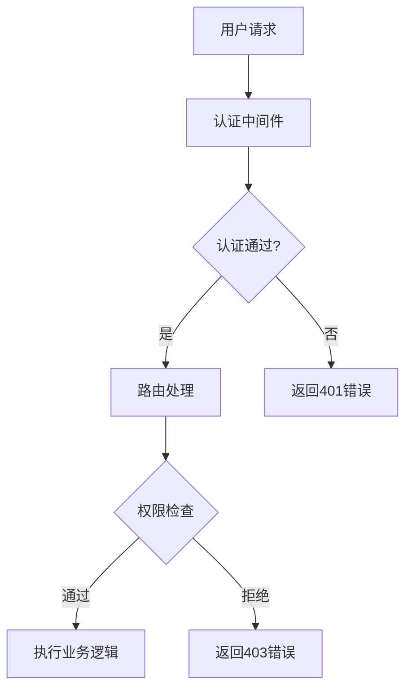

扫描[二维码](https://api2.cmdragon.cn/upload/cmder/20250304_012821924.jpg)
关注或者微信搜一搜：`编程智域 前端至全栈交流与成长`

[探索数千个预构建的 AI 应用，开启你的下一个伟大创意](https://tools.cmdragon.cn/zh/apps?category=ai_chat)：https://tools.cmdragon.cn/

# FastAPI权限验证依赖项深度解析

## 一、权限验证的重要性

在Web开发中，权限验证是保护系统安全的基石。FastAPI通过Dependency Injection（依赖注入）机制提供了优雅的权限控制解决方案。就像大型商场的安检通道，权限系统需要做到：

1. 快速验证用户身份
2. 精确控制访问范围
3. 灵活适应不同场景
4. 提供清晰的错误反馈

## 二、FastAPI依赖注入原理

FastAPI的依赖注入系统类似于流水线生产，每个环节都可以添加质量检测点。当请求到达路由时：


```python
from fastapi import Depends


async def common_parameters(q: str = None, skip: int = 0, limit: int = 100):
    return {"q": q, "skip": skip, "limit": limit}


@app.get("/items/")
async def read_items(commons: dict = Depends(common_parameters)):
    return commons
```

## 三、权限验证核心组件

### 3.1 OAuth2与JWT基础

```python
from fastapi.security import OAuth2PasswordBearer

oauth2_scheme = OAuth2PasswordBearer(tokenUrl="token")


class User(BaseModel):
    username: str
    email: str | None = None
    disabled: bool | None = None


class TokenData(BaseModel):
    username: str | None = None
```

### 3.2 用户认证模块

```python
from jose import JWTError, jwt
from passlib.context import CryptContext

SECRET_KEY = "your-secret-key"
ALGORITHM = "HS256"

pwd_context = CryptContext(schemes=["bcrypt"], deprecated="auto")


def verify_password(plain_password: str, hashed_password: str):
    return pwd_context.verify(plain_password, hashed_password)


def get_password_hash(password: str):
    return pwd_context.hash(password)
```

## 四、创建权限依赖项

### 4.1 基础权限验证器

```python
from fastapi import HTTPException, status


async def get_current_user(token: str = Depends(oauth2_scheme)):
    credentials_exception = HTTPException(
        status_code=status.HTTP_401_UNAUTHORIZED,
        detail="无法验证凭证",
        headers={"WWW-Authenticate": "Bearer"},
    )
    try:
        payload = jwt.decode(token, SECRET_KEY, algorithms=[ALGORITHM])
        username: str = payload.get("sub")
        if username is None:
            raise credentials_exception
        token_data = TokenData(username=username)
    except JWTError:
        raise credentials_exception
    user = get_user(fake_users_db, username=token_data.username)
    if user is None:
        raise credentials_exception
    return user
```

### 4.2 角色权限验证

```python
class RoleChecker:
    def __init__(self, allowed_roles: list):
        self.allowed_roles = allowed_roles

    def __call__(self, user: User = Depends(get_current_user)):
        if user.role not in self.allowed_roles:
            raise HTTPException(
                status_code=status.HTTP_403_FORBIDDEN,
                detail="权限不足"
            )
        return user


admin_permission = RoleChecker(["admin"])
editor_permission = RoleChecker(["editor", "admin"])
```

## 五、实际应用案例

### 5.1 管理员专用接口

```python
@app.get("/admin/dashboard", dependencies=[Depends(admin_permission)])
async def admin_dashboard():
    return {"message": "欢迎来到管理控制台"}
```

### 5.2 多角色访问控制

```python
@app.post("/articles/")
async def create_article(
        user: User = Depends(editor_permission),
        article: ArticleCreate
):
    return {
        "message": "文章创建成功",
        "author": user.username,
        "content": article.content
    }
```

## 六、最佳实践指南

1. 采用分层验证架构
2. 使用HTTPS传输敏感数据
3. 定期轮换加密密钥
4. 记录访问日志
5. 实施速率限制
6. 使用pydantic进行数据验证



## 课后Quiz

1. 当JWT令牌过期时，系统应该返回什么HTTP状态码？
   a) 400  
   b) 401  
   c) 403  
   d) 500

   答案：b) 401。JWT过期属于认证失败，应返回401 Unauthorized状态码。

2. 如何防止用户角色被篡改？
   a) 使用HTTPS  
   b) 将角色信息存储在JWT payload中  
   c) 每次请求查询数据库验证角色  
   d) 使用对称加密

   正确答案：c。虽然会影响性能，但能保证数据实时性。建议结合缓存优化。

## 常见报错解决方案

### 报错1：422 Validation Error

**表现**：

```json
{
  "detail": [
    {
      "loc": [
        "header",
        "authorization"
      ],
      "msg": "field required",
      "type": "value_error.missing"
    }
  ]
}
```

**解决方法**：

1. 检查请求头是否包含Authorization字段
2. 验证Bearer令牌格式是否正确
3. 检查路由依赖项是否正确应用

### 报错2：401 Unauthorized

**可能原因**：

- 未提供认证令牌
- 令牌已过期
- 令牌签名验证失败

**调试步骤**：

1. 使用jwt.io调试器检查令牌
2. 确认SECRET_KEY配置一致
3. 检查令牌有效期设置

### 报错3：403 Forbidden

**预防措施**：

- 在权限依赖项中增加详细的日志记录
- 实现用户权限变更实时通知机制
- 在前端界面动态隐藏无权限操作

---

**运行环境要求**：

```requirements
fastapi==0.95.2
pydantic==1.10.7
python-jose[cryptography]==3.3.0
passlib[bcrypt]==1.7.4
uvicorn==0.22.0
```

安装命令：

```bash
pip install fastapi uvicorn python-jose[cryptography] passlib[bcrypt]
```

通过本文的全面讲解，您已经掌握了FastAPI权限验证的核心机制。建议结合实际项目需求，灵活组合各种验证方式，构建多层次的API安全防护体系。

余下文章内容请点击跳转至 个人博客页面 或者 扫码关注或者微信搜一搜：`编程智域 前端至全栈交流与成长`，阅读完整的文章：

## 往期文章归档：

- [如何用FastAPI和Tortoise-ORM打造一个既高效又灵活的角色管理系统？ | cmdragon's Blog](https://blog.cmdragon.cn/posts/2b0a2003074eba56a6f6c57aa9690900/)
- [JWT令牌如何在FastAPI中实现安全又高效的生成与验证？ | cmdragon's Blog](https://blog.cmdragon.cn/posts/031a4b22bb8d624cf23ef593f72d1ec6/)
- [你的密码存储方式是否在向黑客招手？ | cmdragon's Blog](https://blog.cmdragon.cn/posts/5f8821250c5a4e9cc08bd08faef76c77/)
- [如何在FastAPI中轻松实现OAuth2认证并保护你的API？ | cmdragon's Blog](https://blog.cmdragon.cn/posts/c290754b532ebf91c5415aa0b30715d0/)
- [FastAPI安全机制：从OAuth2到JWT的魔法通关秘籍 | cmdragon's Blog](https://blog.cmdragon.cn/posts/30ed200ec25b55e1ba159366401ed6ee/)
- [FastAPI认证系统：从零到令牌大师的奇幻之旅 | cmdragon's Blog](https://blog.cmdragon.cn/posts/69f7189d3ff058334889eb2e02f2ea2c/)
- [FastAPI安全异常处理：从401到422的奇妙冒险 | cmdragon's Blog](https://blog.cmdragon.cn/posts/92a7a3de40eb9ce71620716632f68676/)
- [FastAPI权限迷宫：RBAC与多层级依赖的魔法通关秘籍 | cmdragon's Blog](https://blog.cmdragon.cn/posts/ee5486714707d4835d4a774696dca30a/)
- [JWT令牌：从身份证到代码防伪的奇妙之旅 | cmdragon's Blog](https://blog.cmdragon.cn/posts/a39277914464b007ac61874292578de0/)
- [FastAPI安全认证：从密码到令牌的魔法之旅 | cmdragon's Blog](https://blog.cmdragon.cn/posts/7d79b5a5c4a3adad15117a45d7976554/)
- [密码哈希：Bcrypt的魔法与盐值的秘密 | cmdragon's Blog](https://blog.cmdragon.cn/posts/f3671b2501c23bd156bfd75c5b56ce4c/)
- [用户认证的魔法配方：从模型设计到密码安全的奇幻之旅 | cmdragon's Blog](https://blog.cmdragon.cn/posts/ac5bec89ea446ce4f6b01891f640fbfe/)
- [FastAPI安全门神：OAuth2PasswordBearer的奇妙冒险 | cmdragon's Blog](https://blog.cmdragon.cn/posts/53653fa69249a339b6727107deaf2608/)
- [OAuth2密码模式：信任的甜蜜陷阱与安全指南 | cmdragon's Blog](https://blog.cmdragon.cn/posts/c27c69799af51ce0bde2ccea9d456fe4/)
- [API安全大揭秘：认证与授权的双面舞会 | cmdragon's Blog](https://blog.cmdragon.cn/posts/b443c33ca4bfb2b8fb64828fcfbcb0d1/)
- [异步日志监控：FastAPI与MongoDB的高效整合之道 | cmdragon's Blog](https://blog.cmdragon.cn/posts/91fb351897e237f4c9f800a0d540d563/)
- [FastAPI与MongoDB分片集群：异步数据路由与聚合优化 | cmdragon's Blog](https://blog.cmdragon.cn/posts/d76caa4fa21663a571b5402f6c338e4d/)
- [FastAPI与MongoDB Change Stream的实时数据交响曲 | cmdragon's Blog](https://blog.cmdragon.cn/posts/1d058d1c4c16f98110a65a452b45e297/)
- [地理空间索引：解锁日志分析中的位置智慧 | cmdragon's Blog](https://blog.cmdragon.cn/posts/ff7035fd370df44b9951ebab5c17d09d/)
- [异步之舞：FastAPI与MongoDB的极致性能优化之旅 | cmdragon's Blog](https://blog.cmdragon.cn/posts/a63d90eaa312a74e7fd5ed3bc312692f/)
- [异步日志分析：MongoDB与FastAPI的高效存储揭秘 | cmdragon's Blog](https://blog.cmdragon.cn/posts/1963035336232d8e37bad41071f21fba/)
- [MongoDB索引优化的艺术：从基础原理到性能调优实战 | cmdragon's Blog](https://blog.cmdragon.cn/posts/082fd833110709b3122c38767b560e05/)
- [解锁FastAPI与MongoDB聚合管道的性能奥秘 | cmdragon's Blog](https://blog.cmdragon.cn/posts/d47a0c0d5ee244f44fdf411461c0cc10/)
- [异步之舞：Motor驱动与MongoDB的CRUD交响曲 | cmdragon's Blog](https://blog.cmdragon.cn/posts/8951a96002e90534fea707cbc0ebe102/)
- [异步之舞：FastAPI与MongoDB的深度协奏 | cmdragon's Blog](https://blog.cmdragon.cn/posts/e68559a6001cd5ce6e2dda2469030aef/)
- [数据库迁移的艺术：FastAPI生产环境中的灰度发布与回滚策略 | cmdragon's Blog](https://blog.cmdragon.cn/posts/5821c3226dc3d4b3c8dfd6dbcc405a57/)
- [数据库迁移的艺术：团队协作中的冲突预防与解决之道 | cmdragon's Blog](https://blog.cmdragon.cn/posts/a7c01d932f1eeb0bade6f7ff6bb3327a/)
- [驾驭FastAPI多数据库：从读写分离到跨库事务的艺术 | cmdragon's Blog](https://blog.cmdragon.cn/posts/82c823f30695c4f6a2bbd95931894efe/)
- [数据库事务隔离与Alembic数据恢复的实战艺术 | cmdragon's Blog](https://blog.cmdragon.cn/posts/fa80b06b9f4ffd6c564533d90eb5880d/)
- [FastAPI与Alembic：数据库迁移的隐秘艺术 | cmdragon's Blog](https://blog.cmdragon.cn/posts/74f3348d6729c1bfe7cdde6ac5885633/)
- [飞行中的引擎更换：生产环境数据库迁移的艺术与科学 | cmdragon's Blog](https://blog.cmdragon.cn/posts/1c688674c3fa827553fcf0df2921704c/)
- [Alembic迁移脚本冲突的智能检测与优雅合并之道 | cmdragon's Blog](https://blog.cmdragon.cn/posts/547a5fe6da9ffe075425ff2528812991/)
- [多数据库迁移的艺术：Alembic在复杂环境中的精妙应用 | cmdragon's Blog](https://blog.cmdragon.cn/posts/3bcf24764e240d3cc8f0ef128cdf59c5/)
- [数据库事务回滚：FastAPI中的存档与读档大法 | cmdragon's Blog](https://blog.cmdragon.cn/posts/61f400974ef7e1af22b578822f89237c/)
- [Alembic迁移脚本：让数据库变身时间旅行者 | cmdragon's Blog](https://blog.cmdragon.cn/posts/4cbe05929a9b90555dc214eec17131c7/)
- [数据库连接池：从银行柜台到代码世界的奇妙旅程 | cmdragon's Blog](https://blog.cmdragon.cn/posts/1d808e4e97f59c12d2e5cf3302f3e1a7/)

## 免费好用的热门在线工具

- [CMDragon 在线工具 - 高级AI工具箱与开发者套件 | 免费好用的在线工具](https://tools.cmdragon.cn/zh)
- [应用商店 - 发现1000+提升效率与开发的AI工具和实用程序 | 免费好用的在线工具](https://tools.cmdragon.cn/zh/apps?category=trending)
- [CMDragon 更新日志 - 最新更新、功能与改进 | 免费好用的在线工具](https://tools.cmdragon.cn/zh/changelog)
- [支持我们 - 成为赞助者 | 免费好用的在线工具](https://tools.cmdragon.cn/zh/sponsor)
- [AI文本生成图像 - 应用商店 | 免费好用的在线工具](https://tools.cmdragon.cn/zh/apps/text-to-image-ai)
- [临时邮箱 - 应用商店 | 免费好用的在线工具](https://tools.cmdragon.cn/zh/apps/temp-email)
- [二维码解析器 - 应用商店 | 免费好用的在线工具](https://tools.cmdragon.cn/zh/apps/qrcode-parser)
- [文本转思维导图 - 应用商店 | 免费好用的在线工具](https://tools.cmdragon.cn/zh/apps/text-to-mindmap)
- [正则表达式可视化工具 - 应用商店 | 免费好用的在线工具](https://tools.cmdragon.cn/zh/apps/regex-visualizer)
- [文件隐写工具 - 应用商店 | 免费好用的在线工具](https://tools.cmdragon.cn/zh/apps/steganography-tool)
- [IPTV 频道探索器 - 应用商店 | 免费好用的在线工具](https://tools.cmdragon.cn/zh/apps/iptv-explorer)
- [快传 - 应用商店 | 免费好用的在线工具](https://tools.cmdragon.cn/zh/apps/snapdrop)
- [随机抽奖工具 - 应用商店 | 免费好用的在线工具](https://tools.cmdragon.cn/zh/apps/lucky-draw)
- [动漫场景查找器 - 应用商店 | 免费好用的在线工具](https://tools.cmdragon.cn/zh/apps/anime-scene-finder)
- [时间工具箱 - 应用商店 | 免费好用的在线工具](https://tools.cmdragon.cn/zh/apps/time-toolkit)
- [网速测试 - 应用商店 | 免费好用的在线工具](https://tools.cmdragon.cn/zh/apps/speed-test)
- [AI 智能抠图工具 - 应用商店 | 免费好用的在线工具](https://tools.cmdragon.cn/zh/apps/background-remover)
- [背景替换工具 - 应用商店 | 免费好用的在线工具](https://tools.cmdragon.cn/zh/apps/background-replacer)
- [艺术二维码生成器 - 应用商店 | 免费好用的在线工具](https://tools.cmdragon.cn/zh/apps/artistic-qrcode)
- [Open Graph 元标签生成器 - 应用商店 | 免费好用的在线工具](https://tools.cmdragon.cn/zh/apps/open-graph-generator)
- [图像对比工具 - 应用商店 | 免费好用的在线工具](https://tools.cmdragon.cn/zh/apps/image-comparison)
- [图片压缩专业版 - 应用商店 | 免费好用的在线工具](https://tools.cmdragon.cn/zh/apps/image-compressor)
- [密码生成器 - 应用商店 | 免费好用的在线工具](https://tools.cmdragon.cn/zh/apps/password-generator)
- [SVG优化器 - 应用商店 | 免费好用的在线工具](https://tools.cmdragon.cn/zh/apps/svg-optimizer)
- [调色板生成器 - 应用商店 | 免费好用的在线工具](https://tools.cmdragon.cn/zh/apps/color-palette)
- [在线节拍器 - 应用商店 | 免费好用的在线工具](https://tools.cmdragon.cn/zh/apps/online-metronome)
- [IP归属地查询 - 应用商店 | 免费好用的在线工具](https://tools.cmdragon.cn/zh/apps/ip-geolocation)
- [CSS网格布局生成器 - 应用商店 | 免费好用的在线工具](https://tools.cmdragon.cn/zh/apps/css-grid-layout)
- [邮箱验证工具 - 应用商店 | 免费好用的在线工具](https://tools.cmdragon.cn/zh/apps/email-validator)
- [书法练习字帖 - 应用商店 | 免费好用的在线工具](https://tools.cmdragon.cn/zh/apps/calligraphy-practice)
- [金融计算器套件 - 应用商店 | 免费好用的在线工具](https://tools.cmdragon.cn/zh/apps/finance-calculator-suite)
- [中国亲戚关系计算器 - 应用商店 | 免费好用的在线工具](https://tools.cmdragon.cn/zh/apps/chinese-kinship-calculator)
- [Protocol Buffer 工具箱 - 应用商店 | 免费好用的在线工具](https://tools.cmdragon.cn/zh/apps/protobuf-toolkit)
- [IP归属地查询 - 应用商店 | 免费好用的在线工具](https://tools.cmdragon.cn/zh/apps/ip-geolocation)
- [图片无损放大 - 应用商店 | 免费好用的在线工具](https://tools.cmdragon.cn/zh/apps/image-upscaler)
- [文本比较工具 - 应用商店 | 免费好用的在线工具](https://tools.cmdragon.cn/zh/apps/text-compare)
- [IP批量查询工具 - 应用商店 | 免费好用的在线工具](https://tools.cmdragon.cn/zh/apps/ip-batch-lookup)
- [域名查询工具 - 应用商店 | 免费好用的在线工具](https://tools.cmdragon.cn/zh/apps/domain-finder)
- [DNS工具箱 - 应用商店 | 免费好用的在线工具](https://tools.cmdragon.cn/zh/apps/dns-toolkit)
- [网站图标生成器 - 应用商店 | 免费好用的在线工具](https://tools.cmdragon.cn/zh/apps/favicon-generator)
- [XML Sitemap](https://tools.cmdragon.cn/sitemap_index.xml)
- 