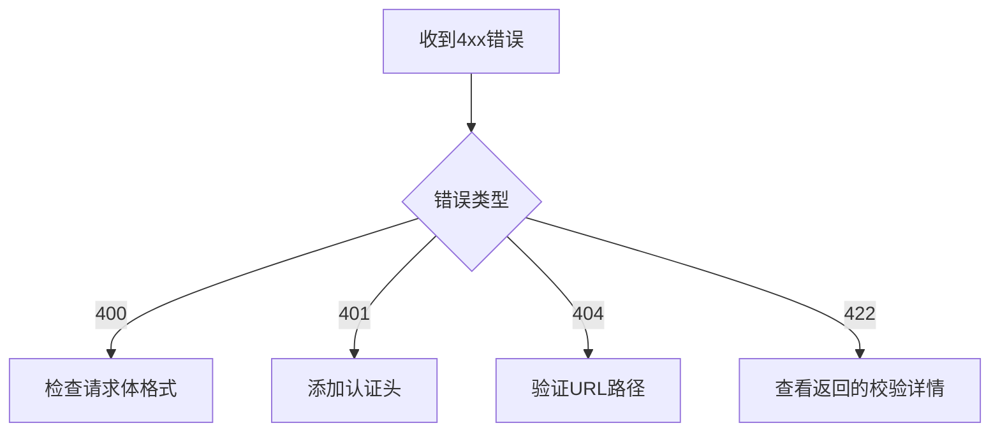

扫描[二维码](https://api2.cmdragon.cn/upload/cmder/20250304_012821924.jpg)
关注或者微信搜一搜：`编程智域 前端至全栈交流与成长`

📦 本系列第二篇通过**披萨店创业**的完整案例，手把手教你：

- 用外卖订单理解HTTP协议细节
- 5个RESTful设计常见误区与修正方案
- 从零搭建支持**用户/订单/库存管理**的完整API
- 错误排查工具箱（含11种常见问题速查表）

---

#### 第一章：HTTP协议就像披萨外卖（场景化学习）

**1.1 订单生命周期对照表**  
| 外卖步骤 | HTTP对应概念 | 示例 |  
|------------------|--------------------|----------------------|  
| 顾客下单 | POST请求 | `POST /orders`       |  
| 打印小票 | Header元数据 | `Content-Type: application/json` |  
| 后厨制作 | 服务器处理逻辑 | 数据库写入操作 |  
| 外卖异常通知 | 4xx/5xx状态码 | `404 披萨缺货`       |

**1.2 必知必会的5个状态码**

```python
@app.post("/orders")
async def create_order():
    try:
        # 处理订单逻辑
        return JSONResponse(201, headers={"Location": "/orders/1001"})
    except OutOfStock:
        return JSONResponse(409, content={"error": "玛格丽特披萨库存不足"})
```

---

#### 第二章：RESTful设计七大黄金法则

**2.1 错误 vs 正确设计对比**

```python
# 错误：动词导向 ❌
@app.post("/getUserOrders")
def get_orders(): ...


# 正确：名词导向 ✅  
@app.get("/users/{user_id}/orders")
def get_orders(user_id: int): ...
```

**2.2 超媒体API实战（HATEOAS）**

```json
// 订单创建响应
{
  "id": 1001,
  "status": "烤制中",
  "_links": {
    "self": {
      "href": "/orders/1001",
      "method": "GET"
    },
    "cancel": {
      "href": "/orders/1001",
      "method": "DELETE"
    }
  }
}
```

---

#### 第三章：从零搭建披萨店API 🧑🍳

**3.1 完整API架构**

```python
from fastapi import FastAPI
from pydantic import BaseModel

app = FastAPI()


class Pizza(BaseModel):
    name: str
    price: float
    size: Literal["S", "M", "L"]


# 菜单管理
@app.get("/pizzas")
async def list_pizzas(): ...


@app.post("/pizzas")
async def create_pizza(pizza: Pizza): ...


# 订单系统
@app.post("/orders")
async def create_order(pizza_ids: list[int]): ...
```

**3.2 自动化文档生成**  
访问 `http://localhost:8000/docs` 查看实时API文档：


---

#### 第四章：错误处理大师课

**4.1 422错误全场景复现**

```python
# 案例：忘记必填参数
@app.post("/pizzas")
async def create_pizza(pizza: Pizza):


# 如果客户端未传price字段...

# 客户端收到响应：
{
    "detail": [
        {
            "loc": ["body", "price"],
            "msg": "field required",
            "type": "value_error.missing"
        }
    ]
}
```

**4.2 错误排查流程图**



---

#### 第五章：安全加固与性能优化

**5.1 防御披萨注入攻击**

```python
# 危险写法 ❌
def get_order(raw_id: str):
    query = f"SELECT * FROM orders WHERE id = {raw_id}"


# 安全写法 ✅  
def get_order_safe(order_id: int):
    query = "SELECT * FROM orders WHERE id = :id"
    params = {"id": order_id}
```

**5.2 缓存优化实战**

```python
from fastapi import Request
from fastapi_cache import FastAPICache
from fastapi_cache.decorator import cache


@app.get("/pizzas/{pizza_id}")
@cache(expire=60)  # 缓存60秒
async def get_pizza(pizza_id: int):
    return db.query(Pizza).filter(Pizza.id == pizza_id).first()
```

---

### 课后实战工坊

**任务1：扩展配送功能**

```python
# 你的挑战：
@app.get("/orders/{order_id}/tracking")
async def get_delivery_status(order_id: int):
    # 返回配送状态和骑手位置
    pass
```

**任务2：设计促销系统**

```python
# 需求：
# - 创建促销活动（POST /promotions）
# - 限制每个用户参与次数
# - 过期活动自动关闭
```

---

### 结语

您已完成从API新手到合格开发者的蜕变。现在，用 `python -m uvicorn main:app --reload` 启动您的披萨店API帝国吧！ 🚀

---


余下文章内容请点击跳转至 个人博客页面 或者 扫码关注或者微信搜一搜：`编程智域 前端至全栈交流与成长`，阅读完整的文章：

## 往期文章归档：

- [从零构建你的第一个RESTful API：HTTP协议与API设计超图解指南 🌐 | cmdragon's Blog](https://blog.cmdragon.cn/posts/1960fe96ab7bb621305c9524cc451a2f/)
- [Python异步编程进阶指南：破解高并发系统的七重封印 | cmdragon's Blog](https://blog.cmdragon.cn/posts/6163781e0bba17626978fadf63b3e92e/)
- [Python异步编程终极指南：用协程与事件循环重构你的高并发系统 | cmdragon's Blog](https://blog.cmdragon.cn/posts/bac9c0badd47defc03ac5508af4b6e1a/)
- [Python类型提示完全指南：用类型安全重构你的代码，提升10倍开发效率 | cmdragon's Blog](https://blog.cmdragon.cn/posts/ca8d996ad2a9a8a8175899872ebcba85/)
- [三大平台云数据库生态服务对决 | cmdragon's Blog](https://blog.cmdragon.cn/posts/acbd74fc659aaa3d2e0c76387bc3e2d5/)
- [分布式数据库解析 | cmdragon's Blog](https://blog.cmdragon.cn/posts/4c553fe22df1e15c19d37a7dc10c5b3a/)
- [深入解析NoSQL数据库：从文档存储到图数据库的全场景实践 | cmdragon's Blog](https://blog.cmdragon.cn/posts/deed11eed0f84c915ed9e9d5aad6c06d/)
- [数据库审计与智能监控：从日志分析到异常检测 | cmdragon's Blog](https://blog.cmdragon.cn/posts/9c2a135562a18261d70cc5637df435e5/)
- [数据库加密全解析：从传输到存储的安全实践 | cmdragon's Blog](https://blog.cmdragon.cn/posts/123dc22a37df8d53292d1269e39dbbc0/)
- [数据库安全实战：访问控制与行级权限管理 | cmdragon's Blog](https://blog.cmdragon.cn/posts/a49721363d1cea8f5fac980120f52242/)
- [数据库扩展之道：分区、分片与大表优化实战 | cmdragon's Blog](https://blog.cmdragon.cn/posts/ed72acd868f765d0ffbced2236b90190/)
- [查询优化：提升数据库性能的实用技巧 | cmdragon's Blog](https://blog.cmdragon.cn/posts/c2b225e3d0b1e9de613fde47b1d4cacb/)
- [性能优化与调优：全面解析数据库索引 | cmdragon's Blog](https://blog.cmdragon.cn/posts/8dece2eb47ac87272320e579cc6f8591/)
- [存储过程与触发器：提高数据库性能与安全性的利器 | cmdragon's Blog](https://blog.cmdragon.cn/posts/712adcfc99736718e1182040d70fd36b/)
- [数据操作与事务：确保数据一致性的关键 | cmdragon's Blog](https://blog.cmdragon.cn/posts/aff107a909f04dc52a887b45e9bd2484/)
- [深入掌握 SQL 深度应用：复杂查询的艺术与技巧 | cmdragon's Blog](https://blog.cmdragon.cn/posts/0f0a929119a4799c8ea1e087e592c545/)
- [彻底理解数据库设计原则：生命周期、约束与反范式的应用 | cmdragon's Blog](https://blog.cmdragon.cn/posts/934686b6ed93e241883a74eaf236bc96/)
- [深入剖析实体-关系模型（ER 图）：理论与实践全解析 | cmdragon's Blog](https://blog.cmdragon.cn/posts/ec68b3f706bd0db1585b4d150de54100/)
- [数据库范式详解：从第一范式到第五范式 | cmdragon's Blog](https://blog.cmdragon.cn/posts/2b268e76c15d9640a08fed80fccfc562/)
- [PostgreSQL：数据库迁移与版本控制 | cmdragon's Blog](https://blog.cmdragon.cn/posts/649f515b93a6caee9dc38f1249e9216e/)
- [Node.js 与 PostgreSQL 集成：深入 pg 模块的应用与实践 | cmdragon's Blog](https://blog.cmdragon.cn/posts/4798cc064cc3585a3819636b3c23271b/)
- [Python 与 PostgreSQL 集成：深入 psycopg2 的应用与实践 | cmdragon's Blog](https://blog.cmdragon.cn/posts/e533225633ac9f276b7771c03e1ba5e0/)
- [应用中的 PostgreSQL项目案例 | cmdragon's Blog](https://blog.cmdragon.cn/posts/415ac1ac3cb9593b00d398c26b40c768/)
- [数据库安全管理中的权限控制：保护数据资产的关键措施 | cmdragon's Blog](https://blog.cmdragon.cn/posts/42a3ec4c7e9cdded4e3c4db24fb4dad8/)
- [数据库安全管理中的用户和角色管理：打造安全高效的数据环境 | cmdragon's Blog](https://blog.cmdragon.cn/posts/92d56b1325c898ad3efc89cb2b42d84d/)
- [数据库查询优化：提升性能的关键实践 | cmdragon's Blog](https://blog.cmdragon.cn/posts/b87998b03d2638a19ecf589691b6f0ae/)
- [数据库物理备份：保障数据完整性和业务连续性的关键策略 | cmdragon's Blog](https://blog.cmdragon.cn/posts/5399d4194db9a94b2649763cb81284de/)
- [PostgreSQL 数据备份与恢复：掌握 pg_dump 和 pg_restore 的最佳实践 | cmdragon's Blog](https://blog.cmdragon.cn/posts/8a8458533590f193798bc31bfbcb0944/)
- [索引的性能影响：优化数据库查询与存储的关键 | cmdragon's Blog](https://blog.cmdragon.cn/posts/29b4baf97a92b0c02393f258124ca713/)
- [深入探讨数据库索引类型：B-tree、Hash、GIN与GiST的对比与应用 | cmdragon's Blog](https://blog.cmdragon.cn/posts/0095ca05c7ea7fbeec5f3a9990bd5264/)
- [深入探讨触发器的创建与应用：数据库自动化管理的强大工具 | cmdragon's Blog](https://blog.cmdragon.cn/posts/5ea59ab7a93ecbdb4baea9dec29a6010/)
- [深入探讨存储过程的创建与应用：提高数据库管理效率的关键工具 | cmdragon's Blog](https://blog.cmdragon.cn/posts/570cd68087f5895415ab3f94980ecc84/)
- [深入探讨视图更新：提升数据库灵活性的关键技术 | cmdragon's Blog](https://blog.cmdragon.cn/posts/625cecdc44e4c4e7b520ddb3012635d1/)
- [深入理解视图的创建与删除：数据库管理中的高级功能 | cmdragon's Blog](https://blog.cmdragon.cn/posts/c5b46d10b7686bbe57b20cd9e181c56b/)
- [深入理解检查约束：确保数据质量的重要工具 | cmdragon's Blog](https://blog.cmdragon.cn/posts/309f74bd85c733fb7a2cd79990d7af9b/)
-

## 免费好用的热门在线工具

- [CMDragon 在线工具 - 高级AI工具箱与开发者套件 | 免费好用的在线工具](https://tools.cmdragon.cn/zh)
- [应用商店 - 发现1000+提升效率与开发的AI工具和实用程序 | 免费好用的在线工具](https://tools.cmdragon.cn/zh/apps?category=trending)
- [CMDragon 更新日志 - 最新更新、功能与改进 | 免费好用的在线工具](https://tools.cmdragon.cn/zh/changelog)
- [支持我们 - 成为赞助者 | 免费好用的在线工具](https://tools.cmdragon.cn/zh/sponsor)
- [AI文本生成图像 - 应用商店 | 免费好用的在线工具](https://tools.cmdragon.cn/zh/apps/text-to-image-ai)
- [临时邮箱 - 应用商店 | 免费好用的在线工具](https://tools.cmdragon.cn/zh/apps/temp-email)
- [二维码解析器 - 应用商店 | 免费好用的在线工具](https://tools.cmdragon.cn/zh/apps/qrcode-parser)
- [文本转思维导图 - 应用商店 | 免费好用的在线工具](https://tools.cmdragon.cn/zh/apps/text-to-mindmap)
- [正则表达式可视化工具 - 应用商店 | 免费好用的在线工具](https://tools.cmdragon.cn/zh/apps/regex-visualizer)
- [文件隐写工具 - 应用商店 | 免费好用的在线工具](https://tools.cmdragon.cn/zh/apps/steganography-tool)
- [IPTV 频道探索器 - 应用商店 | 免费好用的在线工具](https://tools.cmdragon.cn/zh/apps/iptv-explorer)
- [快传 - 应用商店 | 免费好用的在线工具](https://tools.cmdragon.cn/zh/apps/snapdrop)
- [随机抽奖工具 - 应用商店 | 免费好用的在线工具](https://tools.cmdragon.cn/zh/apps/lucky-draw)
- [动漫场景查找器 - 应用商店 | 免费好用的在线工具](https://tools.cmdragon.cn/zh/apps/anime-scene-finder)
- [时间工具箱 - 应用商店 | 免费好用的在线工具](https://tools.cmdragon.cn/zh/apps/time-toolkit)
- [网速测试 - 应用商店 | 免费好用的在线工具](https://tools.cmdragon.cn/zh/apps/speed-test)
- [AI 智能抠图工具 - 应用商店 | 免费好用的在线工具](https://tools.cmdragon.cn/zh/apps/background-remover)
- [背景替换工具 - 应用商店 | 免费好用的在线工具](https://tools.cmdragon.cn/zh/apps/background-replacer)
- [艺术二维码生成器 - 应用商店 | 免费好用的在线工具](https://tools.cmdragon.cn/zh/apps/artistic-qrcode)
- [Open Graph 元标签生成器 - 应用商店 | 免费好用的在线工具](https://tools.cmdragon.cn/zh/apps/open-graph-generator)
- [图像对比工具 - 应用商店 | 免费好用的在线工具](https://tools.cmdragon.cn/zh/apps/image-comparison)
- [图片压缩专业版 - 应用商店 | 免费好用的在线工具](https://tools.cmdragon.cn/zh/apps/image-compressor)
- [密码生成器 - 应用商店 | 免费好用的在线工具](https://tools.cmdragon.cn/zh/apps/password-generator)
- [SVG优化器 - 应用商店 | 免费好用的在线工具](https://tools.cmdragon.cn/zh/apps/svg-optimizer)
- [调色板生成器 - 应用商店 | 免费好用的在线工具](https://tools.cmdragon.cn/zh/apps/color-palette)
- [在线节拍器 - 应用商店 | 免费好用的在线工具](https://tools.cmdragon.cn/zh/apps/online-metronome)
- [IP归属地查询 - 应用商店 | 免费好用的在线工具](https://tools.cmdragon.cn/zh/apps/ip-geolocation)
- [CSS网格布局生成器 - 应用商店 | 免费好用的在线工具](https://tools.cmdragon.cn/zh/apps/css-grid-layout)
- [邮箱验证工具 - 应用商店 | 免费好用的在线工具](https://tools.cmdragon.cn/zh/apps/email-validator)
- [书法练习字帖 - 应用商店 | 免费好用的在线工具](https://tools.cmdragon.cn/zh/apps/calligraphy-practice)
- [金融计算器套件 - 应用商店 | 免费好用的在线工具](https://tools.cmdragon.cn/zh/apps/finance-calculator-suite)
- [中国亲戚关系计算器 - 应用商店 | 免费好用的在线工具](https://tools.cmdragon.cn/zh/apps/chinese-kinship-calculator)
- [Protocol Buffer 工具箱 - 应用商店 | 免费好用的在线工具](https://tools.cmdragon.cn/zh/apps/protobuf-toolkit)
- [IP归属地查询 - 应用商店 | 免费好用的在线工具](https://tools.cmdragon.cn/zh/apps/ip-geolocation)
- [图片无损放大 - 应用商店 | 免费好用的在线工具](https://tools.cmdragon.cn/zh/apps/image-upscaler)
- [文本比较工具 - 应用商店 | 免费好用的在线工具](https://tools.cmdragon.cn/zh/apps/text-compare)
- [IP批量查询工具 - 应用商店 | 免费好用的在线工具](https://tools.cmdragon.cn/zh/apps/ip-batch-lookup)
- [域名查询工具 - 应用商店 | 免费好用的在线工具](https://tools.cmdragon.cn/zh/apps/domain-finder)
- [DNS工具箱 - 应用商店 | 免费好用的在线工具](https://tools.cmdragon.cn/zh/apps/dns-toolkit)
- [网站图标生成器 - 应用商店 | 免费好用的在线工具](https://tools.cmdragon.cn/zh/apps/favicon-generator)
- [XML Sitemap](https://tools.cmdragon.cn/sitemap_index.xml)