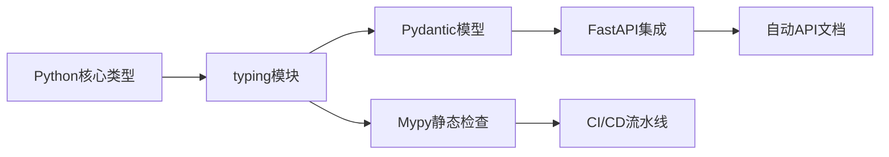

扫描[二维码](https://api2.cmdragon.cn/upload/cmder/20250304_012821924.jpg)关注或者微信搜一搜：`编程智域 前端至全栈交流与成长`

 
🔥 深入解析类型系统的底层原理与工程实践。你将掌握：  
- 类型注解的7种高级写法（含泛型/嵌套类型/异步类型）  
- Pydantic与FastAPI的深度类型集成技巧  
- 10个常见类型错误的诊断与修复方案  
- 类型驱动开发（TDD）在大型项目中的落地实践  


#### 🚀 第一章：类型革命——为什么你的代码需要类型提示？  
**1.1 从血泪案例看动态类型陷阱**  
```python  
# 线上事故复盘：类型错误导致的数据污染  
def calculate_tax(income):  
    return income * 0.2 + 500  

# 调用时传入字符串参数  
print(calculate_tax("100000"))  # 返回"100000000.0"，静默错误！  
```  
✅ **类型提示解决方案**：  
```python  
def calculate_tax(income: int | float) -> float:  
    return float(income) * 0.2 + 500  
```  
📌 **优势对比**：  

| 指标        | 无类型提示 | 有类型提示 |  
|-------------|------------|------------|  
| 错误发现时机 | 运行时     | 编码时     |  
| 代码可读性   | 低         | 自文档化   |  
| 重构安全性   | 高风险     | IDE保障    |  

**1.2 类型生态系统全景图**  


---

#### 🛠 第二章：类型语法精要——从青铜到王者  
**2.1 基础类型三阶训练**  
```python  
# 青铜：简单注解  
def greet(name: str) -> str:  
    return f"Hello {name}"

# 白银：联合类型与可选参数  
from typing import Union, Optional  
def parse_input(value: Union[int, str]) -> Optional[float]:  
    try:  
        return float(value)  
    except ValueError:  
        return None  

# 王者：类型别名与回调函数  
from typing import TypeAlias, Callable  
Vector = TypeAlias("Vector", list[float])  
OnSuccess = Callable[[Vector], None]  
def process_data(data: Vector, callback: OnSuccess) -> None:  
    # ...处理逻辑...  
    callback(normalized_data)  
```  

**2.2 泛型编程深度解析**  
```python  
from typing import Generic, TypeVar, Iterable  
T = TypeVar('T', bound=Comparable)  

class PriorityQueue(Generic[T]):  
    def __init__(self, items: Iterable[T]) -> None:  
        self._items = sorted(items)  

    def pop(self) -> T:  
        return self._items.pop(0)  

# 使用示例  
pq_int = PriorityQueue([5, 2, 8])  
pq_str = PriorityQueue(["apple", "banana"])  # 自动类型推导  
```  
🔍 **设计原理**：  
- 通过`TypeVar`定义类型变量  
- `bound`参数约束允许的类型范围  
- 实现通用数据结构的类型安全  

---

#### 🧩 第三章：嵌套类型与领域建模  
**3.1 复杂数据结构建模**  
```python  
from typing import TypedDict, Literal  
from datetime import datetime  

class GeoPoint(TypedDict):  
    lat: float  
    lng: float  
    precision: Literal["low", "medium", "high"]  

class UserActivity(TypedDict):  
    user_id: int  
    locations: list[GeoPoint]  
    last_active: datetime  

def analyze_activity(activity: UserActivity) -> dict[str, int]:  
    # 实现分析逻辑...  
```  
📊 **类型可视化**：  
```json  
{  
  "user_id": 123,  
  "locations": [  
    {"lat": 40.7128, "lng": -74.0060, "precision": "high"},  
    // ...更多坐标点  
  ],  
  "last_active": "2023-08-20T14:30:00"  
}  
```  

**3.2 与Pydantic的化学反应**  
```python  
from pydantic import BaseModel, conint, EmailStr  
from typing import Annotated  

class Address(BaseModel):  
    street: str  
    city: str  
    zip_code: Annotated[str, Field(pattern=r"^\d{6}$")]  

class UserProfile(BaseModel):  
    name: str  
    age: conint(gt=0)  
    email: EmailStr  
    addresses: list[Address]  
```  
✅ **验证过程**：  
1. 自动转换输入数据类型  
2. 递归验证嵌套模型  
3. 生成JSON Schema文档  

---

#### 🛡 第四章：类型安全防御——从SQL注入到数据污染  
**4.1 参数化查询的类型屏障**  
```python  
from typing import Annotated  
from fastapi import Query  

@app.get("/search")  
def safe_search(  
    keyword: Annotated[str, Query(min_length=2)]  
) -> list[Product]:  
    # 正确做法  
    query = "SELECT * FROM products WHERE name LIKE :name"  
    params = {"name": f"%{keyword}%"}  
    results = db.execute(query, params)  
    return parse_products(results)  
```  
❌ **危险写法**：  
```python  
def unsafe_search(keyword: str):  
    # SQL注入漏洞！  
    db.execute(f"SELECT * FROM products WHERE name = '{keyword}'")  
```  

**4.2 课后实战任务**  
1. 将以下危险代码改造为类型安全版本：  
   ```python  
   def user_login(username: str, raw_password: str):  
       query = f"SELECT * FROM users WHERE username='{username}' AND password='{raw_password}'"  
       return db.execute(query)  
   ```  
2. 使用Pydantic模型验证密码复杂度  

---

#### 🚨 第五章：错误诊疗室——从报错到精通  
**5.1 422 Validation Error全解**  
```python  
# 错误触发场景  
@app.post("/users")  
def create_user(user: UserProfile):  
    ...  

# 发送非法请求体  
{  
  "name": "Alice",  
  "age": -5,  
  "email": "invalid-email",  
  "addresses": [{"street": "Main St", "city": "NYC"}]  
}  
```  
🔧 **排查步骤**：  
1. 查看Swagger文档验证规则  
2. 使用`try: user = UserProfile(**data)`捕获异常  
3. 检查错误详情中的`loc`和`msg`字段  

**5.2 Mypy错误代码**  

| 错误代码 | 含义                  | 修复示例                  |  
|----------|-----------------------|--------------------------|  
| error: Missing return statement | 函数缺少返回语句       | 添加`return`或声明`-> None` |  
| error: Incompatible types in assignment | 类型不匹配       | 检查变量赋值的一致性       |  

---

### 结语  
现在，您可以将任意Python代码升级为类型安全的工业级实现。记住：优秀的开发者不是不会犯错，而是通过工具让错误无处遁形！


余下文章内容请点击跳转至 个人博客页面 或者 扫码关注或者微信搜一搜：`编程智域 前端至全栈交流与成长`，阅读完整的文章：

## 往期文章归档：

- [三大平台云数据库生态服务对决 | cmdragon's Blog](https://blog.cmdragon.cn/posts/d0b1b6a9f135/)
- [分布式数据库解析 | cmdragon's Blog](https://blog.cmdragon.cn/posts/91aae808d87e/)
- [深入解析NoSQL数据库：从文档存储到图数据库的全场景实践 | cmdragon's Blog](https://blog.cmdragon.cn/posts/5fcc2532e318/)
- [数据库审计与智能监控：从日志分析到异常检测 | cmdragon's Blog](https://blog.cmdragon.cn/posts/c971b2302602/)
- [数据库加密全解析：从传输到存储的安全实践 | cmdragon's Blog](https://blog.cmdragon.cn/posts/735fa4090f0b/)
- [数据库安全实战：访问控制与行级权限管理 | cmdragon's Blog](https://blog.cmdragon.cn/posts/5c01d5c0a63b/)
- [数据库扩展之道：分区、分片与大表优化实战 | cmdragon's Blog](https://blog.cmdragon.cn/posts/7f71048cd61c/)
- [查询优化：提升数据库性能的实用技巧 | cmdragon's Blog](https://blog.cmdragon.cn/posts/8e5e3ffe33dd/)
- [性能优化与调优：全面解析数据库索引 | cmdragon's Blog](https://blog.cmdragon.cn/posts/3c6ba213efe2/)
- [存储过程与触发器：提高数据库性能与安全性的利器 | cmdragon's Blog](https://blog.cmdragon.cn/posts/84376403bdf0/)
- [数据操作与事务：确保数据一致性的关键 | cmdragon's Blog](https://blog.cmdragon.cn/posts/f357e8ef59f1/)
- [深入掌握 SQL 深度应用：复杂查询的艺术与技巧 | cmdragon's Blog](https://blog.cmdragon.cn/posts/87c82dea0024/)
- [彻底理解数据库设计原则：生命周期、约束与反范式的应用 | cmdragon's Blog](https://blog.cmdragon.cn/posts/3f3203c3e56b/)
- [深入剖析实体-关系模型（ER 图）：理论与实践全解析 | cmdragon's Blog](https://blog.cmdragon.cn/posts/91e1bf521e8c/)
- [数据库范式详解：从第一范式到第五范式 | cmdragon's Blog](https://blog.cmdragon.cn/posts/05264e28f9f8/)
- [PostgreSQL：数据库迁移与版本控制 | cmdragon's Blog](https://blog.cmdragon.cn/posts/a58cca68755e/)
- [Node.js 与 PostgreSQL 集成：深入 pg 模块的应用与实践 | cmdragon's Blog](https://blog.cmdragon.cn/posts/d5b4e82e959a/)
- [Python 与 PostgreSQL 集成：深入 psycopg2 的应用与实践 | cmdragon's Blog](https://blog.cmdragon.cn/posts/9aae8e2f1414/)
- [应用中的 PostgreSQL项目案例 | cmdragon's Blog](https://blog.cmdragon.cn/posts/287f56043db8/)
- [数据库安全管理中的权限控制：保护数据资产的关键措施 | cmdragon's Blog](https://blog.cmdragon.cn/posts/5995b8f15678/)
- [数据库安全管理中的用户和角色管理：打造安全高效的数据环境 | cmdragon's Blog](https://blog.cmdragon.cn/posts/c0cd4cbaa201/)
- [数据库查询优化：提升性能的关键实践 | cmdragon's Blog](https://blog.cmdragon.cn/posts/3ab8c2f85479/)
- [数据库物理备份：保障数据完整性和业务连续性的关键策略 | cmdragon's Blog](https://blog.cmdragon.cn/posts/7e3da86fa38b/)
- [PostgreSQL 数据备份与恢复：掌握 pg_dump 和 pg_restore 的最佳实践 | cmdragon's Blog](https://blog.cmdragon.cn/posts/2190f85925ce/)
- [索引的性能影响：优化数据库查询与存储的关键 | cmdragon's Blog](https://blog.cmdragon.cn/posts/076f666ba145/)
- [深入探讨数据库索引类型：B-tree、Hash、GIN与GiST的对比与应用 | cmdragon's Blog](https://blog.cmdragon.cn/posts/7f7df47953c4/)
- [深入探讨触发器的创建与应用：数据库自动化管理的强大工具 | cmdragon's Blog](https://blog.cmdragon.cn/posts/5765e6b13d4e/)
- [深入探讨存储过程的创建与应用：提高数据库管理效率的关键工具 | cmdragon's Blog](https://blog.cmdragon.cn/posts/98a999d55ec8/)
- [深入探讨视图更新：提升数据库灵活性的关键技术 | cmdragon's Blog](https://blog.cmdragon.cn/posts/6e90926327b9/)
- [深入理解视图的创建与删除：数据库管理中的高级功能 | cmdragon's Blog](https://blog.cmdragon.cn/posts/9b26b52722c6/)
- [深入理解检查约束：确保数据质量的重要工具 | cmdragon's Blog](https://blog.cmdragon.cn/posts/16ef025755f4/)
- [深入理解第一范式（1NF）：数据库设计中的基础与实践 | cmdragon's Blog](https://blog.cmdragon.cn/posts/2502f62a9269/)
- [深度剖析 GROUP BY 和 HAVING 子句：优化 SQL 查询的利器 | cmdragon's Blog](https://blog.cmdragon.cn/posts/f25d0953b788/)
- [深入探讨聚合函数（COUNT, SUM, AVG, MAX, MIN）：分析和总结数据的新视野 | cmdragon's Blog](https://blog.cmdragon.cn/posts/3b32add59228/)
- [深入解析子查询（SUBQUERY）：增强 SQL 查询灵活性的强大工具 | cmdragon's Blog](https://blog.cmdragon.cn/posts/bd54a350919b/)
-
