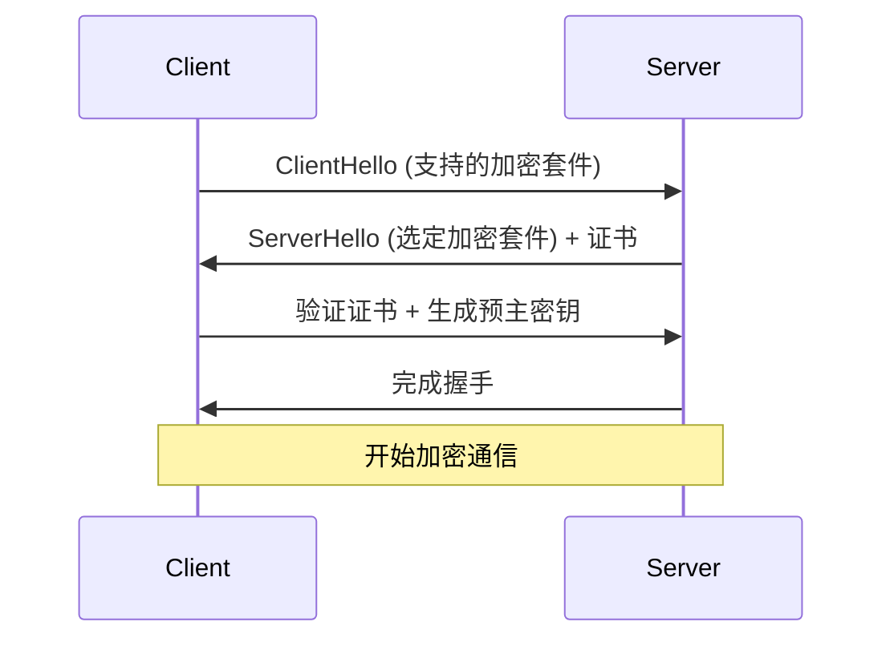

扫描[二维码](https://api2.cmdragon.cn/upload/cmder/20250304_012821924.jpg)
关注或者微信搜一搜：`编程智域 前端至全栈交流与成长`

[发现1000+提升效率与开发的AI工具和实用程序](https://tools.cmdragon.cn/zh/apps?category=ai_chat)：https://tools.cmdragon.cn/

# 第一章：基础安全框架认知

## 一、Web 安全三要素

### 1.1 机密性（Confidentiality）

**原理说明**  
数据在传输和存储过程中仅对授权方可见，通过加密算法实现数据保护。FastAPI 默认支持 HTTPS 协议，使用 TLS 加密通信信道。

**FastAPI 实践**

```python
# 安装依赖
# uvicorn[standard]==0.17.6
# cryptography==38.0.4

from fastapi import FastAPI
import ssl

app = FastAPI()

# HTTPS配置示例
ssl_context = ssl.SSLContext(ssl.PROTOCOL_TLS_SERVER)
ssl_context.load_cert_chain("domain.crt", keyfile="domain.key")


@app.get("/secure-data")
async def get_secure_data():
    return {"message": "This data is encrypted via HTTPS"}
```

### 1.2 完整性（Integrity）

**实现方式**  
使用哈希校验和数字签名确保数据未被篡改。FastAPI 通过 Pydantic 模型进行请求数据验证。

**数据验证示例**

```python
# pydantic==1.10.7
from pydantic import BaseModel


class Transaction(BaseModel):
    amount: float
    recipient: str
    signature: str  # 数字签名字段


@app.post("/transfer")
async def fund_transfer(tx: Transaction):
    # 验证签名逻辑
    if not validate_signature(tx.signature):
        raise HTTPException(400, "Invalid transaction signature")
    return {"status": "completed"}
```

### 1.3 可用性（Availability）

**防护策略**  
通过请求速率限制保障服务稳定。使用 Redis 实现分布式限流。

```python
# fastapi-limiter==0.1.5
# redis==4.5.4
from fastapi import Request
from fastapi_limiter import Limiter
from fastapi_limiter.depends import RateLimiter

limiter = Limiter(key_func=lambda: "global")
app.state.limiter = limiter


@app.get("/api/data")
@limiter.limit("10/minute")
async def get_data(request: Request):
    return {"data": "Important resource"}
```

## 二、HTTPS 传输层加密

### 2.1 TLS 握手流程



### 2.2 证书配置实战

```bash
# 生成自签名证书
openssl req -x509 -newkey rsa:4096 -nodes -out domain.crt -keyout domain.key -days 365
```

## 三、安全威胁防御

### 3.1 XSS 防护

**场景示例**  
用户评论输入 `<script>alert(1)</script>` 时的防御

```python
from fastapi import HTTPException
from html import escape


@app.post("/comments")
async def create_comment(content: str):
    # 自动转义HTML字符
    sanitized_content = escape(content)
    save_to_db(sanitized_content)
    return {"status": "created"}
```

### 3.2 CSRF 防护

**令牌验证实现**

```python
# fastapi-csrf-protect==0.1.1
from fastapi_csrf_protect import CsrfProtect


@CsrfProtect.load_config
def get_csrf_config():
    return {"secret_key": "SECRET_KEY"}


@app.post("/transfer")
async def bank_transfer(
        request: Request,
        csrf_protect: CsrfProtect = Depends()
):
    csrf_protect.validate(request)
    # 执行业务逻辑
```

### 3.3 SQL 注入防护

**ORM 安全实践**

```python
# SQLAlchemy==1.4.39
from sqlalchemy import text

# 危险写法（易受注入攻击）
stmt = text(f"SELECT * FROM users WHERE name = '{name}'")

# 安全写法（参数化查询）
safe_stmt = text("SELECT * FROM users WHERE name = :name").bindparams(name=name)
```

## 课后Quiz

**问题1**  
当收到包含``的用户输入时，如何处理最安全？
A) 直接存入数据库  
B) 使用HTML转义  
C) 截断超过50字符的内容

**答案解析**  
正确答案B。通过html.escape()将特殊字符转换为实体（如`&lt;`），可有效防止浏览器执行恶意脚本。

## 常见报错解决

**报错422 Validation Error**  
*产生原因*：  
请求体不符合Pydantic模型定义的数据类型

*解决方案*：

1. 检查请求头`Content-Type: application/json`
2. 使用Swagger文档测试接口
3. 打印模型校验错误详情：

```python
@app.exception_handler(RequestValidationError)
async def validation_handler(request, exc):
    print(f"Validation error: {exc.errors()}")
```

余下文章内容请点击跳转至 个人博客页面 或者 扫码关注或者微信搜一搜：`编程智域 前端至全栈交流与成长`
，阅读完整的文章：[如何在FastAPI中打造坚不可摧的Web安全防线？](https://blog.cmdragon.cn/posts/9d6200ae7ce0a1a1a523591e3d65a82e/)

## 往期文章归档：

- [如何用 FastAPI 和 RBAC 打造坚不可摧的安全堡垒？ - cmdragon's Blog](https://blog.cmdragon.cn/posts/d878b5dbef959058b8098551c70594f8/)
- [FastAPI权限配置：你的系统真的安全吗？ - cmdragon's Blog](https://blog.cmdragon.cn/posts/96b6ede65030daa4613ab92da1d739a6/#%E5%BE%80%E6%9C%9F%E6%96%87%E7%AB%A0%E5%BD%92%E6%A1%A3)
- [FastAPI权限缓存：你的性能瓶颈是否藏在这只“看不见的手”里？ | cmdragon's Blog](https://blog.cmdragon.cn/posts/0c8c5a3fdaf69250ac3db7429b102625/)
- [FastAPI日志审计：你的权限系统是否真的安全无虞？ | cmdragon's Blog](https://blog.cmdragon.cn/posts/84bf7b11b342415bddb50e0521c64dfe/)
- [如何在FastAPI中打造坚不可摧的安全防线？ | cmdragon's Blog](https://blog.cmdragon.cn/posts/e2ec1e31dd5d97e0f32d2125385fd955/)
- [如何在FastAPI中实现权限隔离并让用户乖乖听话？ | cmdragon's Blog](https://blog.cmdragon.cn/posts/74777546a240b16b32196e5eb29ec8f7/)
- [如何在FastAPI中玩转权限控制与测试，让代码安全又优雅？ | cmdragon's Blog](https://blog.cmdragon.cn/posts/9dd24a9753ba15f98f24c1e5134fe40e/)
- [如何在FastAPI中打造一个既安全又灵活的权限管理系统？ | cmdragon's Blog](https://blog.cmdragon.cn/posts/277aa1628a2fa9855cdfe5f7c302bd92/)
- [FastAPI访问令牌的权限声明与作用域管理：你的API安全真的无懈可击吗？ | cmdragon's Blog](https://blog.cmdragon.cn/posts/82bae833ad460aec0965cc77b7d6f652/)
- [如何在FastAPI中构建一个既安全又灵活的多层级权限系统？ | cmdragon's Blog](https://blog.cmdragon.cn/posts/13fc113ef1dff03927d46235ad333a7f/)
- [FastAPI如何用角色权限让Web应用安全又灵活？ | cmdragon's Blog](https://blog.cmdragon.cn/posts/cc7aa0af577ae2bc0694e76886373e12/)
- [FastAPI权限验证依赖项究竟藏着什么秘密？ | cmdragon's Blog](https://blog.cmdragon.cn/posts/3e287e8b907561728ded1be34a19b22c/)
- [如何用FastAPI和Tortoise-ORM打造一个既高效又灵活的角色管理系统？ | cmdragon's Blog](https://blog.cmdragon.cn/posts/2b0a2003074eba56a6f6c57aa9690900/)
- [JWT令牌如何在FastAPI中实现安全又高效的生成与验证？ | cmdragon's Blog](https://blog.cmdragon.cn/posts/031a4b22bb8d624cf23ef593f72d1ec6/)
- [你的密码存储方式是否在向黑客招手？ | cmdragon's Blog](https://blog.cmdragon.cn/posts/5f8821250c5a4e9cc08bd08faef76c77/)
- [如何在FastAPI中轻松实现OAuth2认证并保护你的API？ | cmdragon's Blog](https://blog.cmdragon.cn/posts/c290754b532ebf91c5415aa0b30715d0/)
- [FastAPI安全机制：从OAuth2到JWT的魔法通关秘籍 | cmdragon's Blog](https://blog.cmdragon.cn/posts/30ed200ec25b55e1ba159366401ed6ee/)
- [FastAPI认证系统：从零到令牌大师的奇幻之旅 | cmdragon's Blog](https://blog.cmdragon.cn/posts/69f7189d3ff058334889eb2e02f2ea2c/)
- [FastAPI安全异常处理：从401到422的奇妙冒险 | cmdragon's Blog](https://blog.cmdragon.cn/posts/92a7a3de40eb9ce71620716632f68676/)
- [FastAPI权限迷宫：RBAC与多层级依赖的魔法通关秘籍 | cmdragon's Blog](https://blog.cmdragon.cn/posts/ee5486714707d4835d4a774696dca30a/)
- [JWT令牌：从身份证到代码防伪的奇妙之旅 | cmdragon's Blog](https://blog.cmdragon.cn/posts/a39277914464b007ac61874292578de0/)
- [FastAPI安全认证：从密码到令牌的魔法之旅 | cmdragon's Blog](https://blog.cmdragon.cn/posts/7d79b5a5c4a3adad15117a45d7976554/)
- [密码哈希：Bcrypt的魔法与盐值的秘密 | cmdragon's Blog](https://blog.cmdragon.cn/posts/f3671b2501c23bd156bfd75c5b56ce4c/)
- [用户认证的魔法配方：从模型设计到密码安全的奇幻之旅 | cmdragon's Blog](https://blog.cmdragon.cn/posts/ac5bec89ea446ce4f6b01891f640fbfe/)
- [FastAPI安全门神：OAuth2PasswordBearer的奇妙冒险 | cmdragon's Blog](https://blog.cmdragon.cn/posts/53653fa69249a339b6727107deaf2608/)
- [OAuth2密码模式：信任的甜蜜陷阱与安全指南 | cmdragon's Blog](https://blog.cmdragon.cn/posts/c27c69799af51ce0bde2ccea9d456fe4/)
- [API安全大揭秘：认证与授权的双面舞会 | cmdragon's Blog](https://blog.cmdragon.cn/posts/b443c33ca4bfb2b8fb64828fcfbcb0d1/)
- [异步日志监控：FastAPI与MongoDB的高效整合之道 | cmdragon's Blog](https://blog.cmdragon.cn/posts/91fb351897e237f4c9f800a0d540d563/)
- [FastAPI与MongoDB分片集群：异步数据路由与聚合优化 | cmdragon's Blog](https://blog.cmdragon.cn/posts/d76caa4fa21663a571b5402f6c338e4d/)
- [FastAPI与MongoDB Change Stream的实时数据交响曲 | cmdragon's Blog](https://blog.cmdragon.cn/posts/1d058d1c4c16f98110a65a452b45e297/)
- [地理空间索引：解锁日志分析中的位置智慧 | cmdragon's Blog](https://blog.cmdragon.cn/posts/ff7035fd370df44b9951ebab5c17d09d/)
- [异步之舞：FastAPI与MongoDB的极致性能优化之旅 | cmdragon's Blog](https://blog.cmdragon.cn/posts/a63d90eaa312a74e7fd5ed3bc312692f/)
- [异步日志分析：MongoDB与FastAPI的高效存储揭秘 | cmdragon's Blog](https://blog.cmdragon.cn/posts/1963035336232d8e37bad41071f21fba/)
- [MongoDB索引优化的艺术：从基础原理到性能调优实战 | cmdragon's Blog](https://blog.cmdragon.cn/posts/082fd833110709b3122c38767b560e05/)
- [解锁FastAPI与MongoDB聚合管道的性能奥秘 | cmdragon's Blog](https://blog.cmdragon.cn/posts/d47a0c0d5ee244f44fdf411461c0cc10/)
- [异步之舞：Motor驱动与MongoDB的CRUD交响曲 | cmdragon's Blog](https://blog.cmdragon.cn/posts/8951a96002e90534fea707cbc0ebe102/)
- [XML Sitemap](https://tools.cmdragon.cn/sitemap_index.xml)
- 