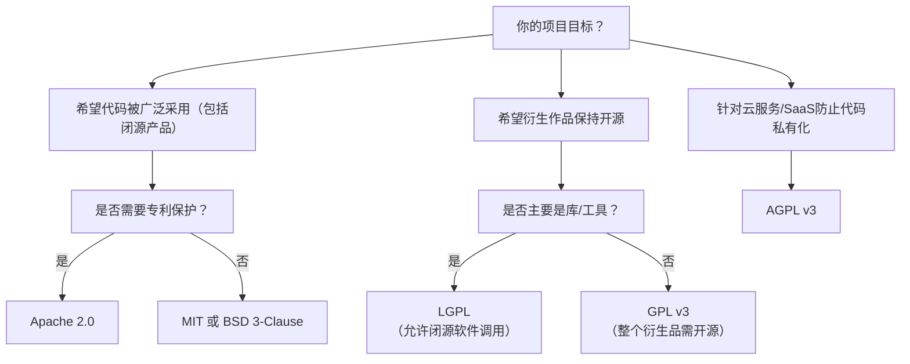

## 📌 核心开源协议对比表（按宽松程度排序）

| **协议**      | **传染性**      | **商业使用** | **修改要求**                | **专利授权**       | **兼容性**               | **典型代表**               |
|---------------|----------------|--------------|-----------------------------|--------------------|--------------------------|----------------------------|
| **MIT**       | ❌ 无           | ✅ 允许       | ➖ 仅保留版权声明            | ❌ 无              | ⭐⭐⭐⭐⭐ (最高)         | React, Vue.js, Rails       |
| **Apache 2.0**| ❌ 无           | ✅ 允许       | ➕ 保留版权+许可证+NOTICE文件 | ✅ 明确专利授权     | ⭐⭐⭐⭐ (不兼容GPLv2)    | Android, Kubernetes        |
| **BSD 3-Clause**| ❌ 无         | ✅ 允许       | ➕ 禁止用作者名推广衍生品     | ❌ 无              | ⭐⭐⭐⭐⭐                | Nginx, Redis               |
| **LGPL**      | ⚠️ **弱传染**   | ✅ 允许       | ➕ 修改部分需开源，动态链接闭源可接受 | ➖ GPLv3版本含专利 | ⚠️ 复杂（依赖版本）     | FFmpeg, GTK                |
| **GPL v2**    | ⚠️ **强传染**   | ✅ 允许       | ➕ 衍生作品**必须开源**       | ❌ 无              | ❌ 与Apache 2.0不兼容    | Linux内核, Git             |
| **GPL v3**    | ⚠️ **强传染**   | ✅ 允许       | ➕ 衍生作品**必须开源**       | ✅ 明确专利授权     | ⚠️ 与Apache 2.0兼容      | Bash, WordPress (部分组件) |
| **AGPL v3**   | ⚠️ **超强传染** | ✅ 允许       | ➕ **网络服务也必须开源**      | ✅ 明确专利授权     | ⚠️ 与GPLv3兼容          | MongoDB (旧版), Nextcloud  |

---

### 🔍 关键维度解析

1. **传染性（Copyleft 强度）**  
   - **无传染（MIT/BSD/Apache）**：允许闭源衍生产品（如微软VS Code基于MIT的Electron）。  
   - **弱传染（LGPL）**：修改库文件需开源，但允许闭源软件**动态链接**该库（常见于商业软件集成开源库）。  
   - **强传染（GPL）**：**任何包含GPL代码的衍生作品必须开源**（如Linux衍生系统必须开源）。  
   - **网络传染（AGPL）**：**云服务/SaaS若使用AGPL代码，必须公开修改后的源码**（针对规避开源的云厂商）。

2. **专利条款**  
   - **Apache 2.0/GPLv3/AGPLv3**：明确授予用户专利使用权，禁止专利诉讼（企业首选）。  
   - **MIT/BSD/GPLv2**：无专利条款，使用者可能面临潜在专利风险。

3. **商业友好度**  
   - **宽松协议（MIT/Apache/BSD）**：最受商业公司欢迎，可自由用于闭源产品。  
   - **GPL系列**：要求衍生品开源，可能限制商业闭源策略（但Red Hat等企业通过服务模式盈利）。

4. **兼容性问题**  
   - **GPLv2与Apache 2.0不兼容**：含Apache代码的项目不能使用GPLv2库。  
   - **GPLv3与Apache 2.0兼容**：可混合使用（如Linux内核拒绝GPLv3以避免专利约束）。

---

### 🧩 如何选择？决策树

---

### 🛡️ 特别场景建议

1. **企业级项目**  
   - 优先选 **Apache 2.0**（专利保护+商业友好），避免GPL传染风险。  
   - 若依赖GPL库，需隔离为独立进程（如MySQL客户端通过网络API交互）。

2. **开源库/框架**  
   - **MIT/Apache 2.0**：最大化采用率（如React选MIT）。  
   - **LGPL**：希望商业软件使用但保持库本身开源（如FFmpeg）。

3. **云服务项目**  
   - **AGPL v3**：防止云厂商私有化你的代码（如MongoDB从AGPL转向SSPL）。  
   - 注意：AGPL可能降低商业合作意愿。

4. **GPL注意事项**  
   - **GPL≠禁止收费**：可销售GPL软件（但用户有权再分发）。  
   - **静态链接GPL库**：整个程序需GPL化（动态链接可规避，但需谨慎）。

---

### ⚠️ 常见误区
- **“MIT最自由”**：正确，但缺乏专利保护（Apache 2.0更安全）。  
- **“GPL禁止商用”**：错误！允许销售服务（如GPL的Red Hat RHEL）。  
- **“修改BSD代码无需声明”**：错误！BSD要求保留原始版权声明。

---

### 🔗 权威参考
- **OSI官网**：[opensource.org/licenses](https://opensource.org/licenses)（所有OSI认证协议列表）  
- **选择指南**：[choosealicense.com](https://choosealicense.com)（交互式选择工具）  

> 💡 **终极建议**：  
> - **个人/小项目**：选 **MIT**（极简，最易被接受）。  
> - **企业/有专利顾虑**：选 **Apache 2.0**（平衡自由与保护）。  
> - **强制开源衍生品**：选 **GPLv3**（现代强传染+专利条款）。  
> - **云服务项目**：慎重评估 **AGPL v3**（可能影响商业生态）。