## 📌 核心开源协议对比表（按宽松程度排序）

| **协议**      | **传染性**      | **商业使用** | **修改要求**                | **专利授权**       | **兼容性**               | **典型代表**               |
|---------------|----------------|--------------|-----------------------------|--------------------|--------------------------|----------------------------|
| **MIT**       | ❌ 无           | ✅ 允许       | ➖ 仅保留版权声明            | ❌ 无              | ⭐⭐⭐⭐⭐ (最高)         | React, Vue.js, Rails       |
| **Apache 2.0**| ❌ 无           | ✅ 允许       | ➕ 保留版权+许可证+NOTICE文件 | ✅ 明确专利授权     | ⭐⭐⭐⭐ (不兼容GPLv2)    | Android, Kubernetes        |
| **BSD 3-Clause**| ❌ 无         | ✅ 允许       | ➕ 禁止用作者名推广衍生品     | ❌ 无              | ⭐⭐⭐⭐⭐                | Nginx, Redis               |
| **LGPL**      | ⚠️ **弱传染**   | ✅ 允许       | ➕ 修改部分需开源，动态链接闭源可接受 | ➖ GPLv3版本含专利 | ⚠️ 复杂（依赖版本）     | FFmpeg, GTK                |
| **GPL v2**    | ⚠️ **强传染**   | ✅ 允许       | ➕ 衍生作品**必须开源**       | ❌ 无              | ❌ 与Apache 2.0不兼容    | Linux内核, Git             |
| **GPL v3**    | ⚠️ **强传染**   | ✅ 允许       | ➕ 衍生作品**必须开源**       | ✅ 明确专利授权     | ⚠️ 与Apache 2.0兼容      | Bash, WordPress (部分组件) |
| **AGPL v3**   | ⚠️ **超强传染** | ✅ 允许       | ➕ **网络服务也必须开源**      | ✅ 明确专利授权     | ⚠️ 与GPLv3兼容          | MongoDB (旧版), Nextcloud  |

---

### 🔍 关键维度解析

1. **传染性（Copyleft 强度）**  
   - **无传染（MIT/BSD/Apache）**：允许闭源衍生产品（如微软VS Code基于MIT的Electron）。  
   - **弱传染（LGPL）**：修改库文件需开源，但允许闭源软件**动态链接**该库（常见于商业软件集成开源库）。  
   - **强传染（GPL）**：**任何包含GPL代码的衍生作品必须开源**（如Linux衍生系统必须开源）。  
   - **网络传染（AGPL）**：**云服务/SaaS若使用AGPL代码，必须公开修改后的源码**（针对规避开源的云厂商）。

2. **专利条款**  
   - **Apache 2.0/GPLv3/AGPLv3**：明确授予用户专利使用权，禁止专利诉讼（企业首选）。  
   - **MIT/BSD/GPLv2**：无专利条款，使用者可能面临潜在专利风险。

3. **商业友好度**  
   - **宽松协议（MIT/Apache/BSD）**：最受商业公司欢迎，可自由用于闭源产品。  
   - **GPL系列**：要求衍生品开源，可能限制商业闭源策略（但Red Hat等企业通过服务模式盈利）。

4. **兼容性问题**  
   - **GPLv2与Apache 2.0不兼容**：含Apache代码的项目不能使用GPLv2库。  
   - **GPLv3与Apache 2.0兼容**：可混合使用（如Linux内核拒绝GPLv3以避免专利约束）。

---

### 🧩 如何选择？决策树

```mermaid
graph TD
    A["你的项目目标？"] 
    A --> B["希望代码被广泛采用（包括闭源产品）"]
    A --> C["希望衍生作品保持开源"]
    A --> D["针对云服务/SaaS防止代码私有化"]
    
    B --> E["是否需要专利保护？"]
    E --> |是|F[" Apache 2.0"]
    E --> |否| G["MIT 或 BSD 3-Clause"]
    
    C --> H["是否主要是库/工具？"]
    H --> |是| I["LGPL<br>（允许闭源软件调用）"]
    H --> |否| J["GPL v3<br>（整个衍生品需开源）"]
    
    D --> K["AGPL v3"]
```

---

### 🛡️ 特别场景建议

1. **企业级项目**  
   - 优先选 **Apache 2.0**（专利保护+商业友好），避免GPL传染风险。  
   - 若依赖GPL库，需隔离为独立进程（如MySQL客户端通过网络API交互）。

2. **开源库/框架**  
   - **MIT/Apache 2.0**：最大化采用率（如React选MIT）。  
   - **LGPL**：希望商业软件使用但保持库本身开源（如FFmpeg）。

3. **云服务项目**  
   - **AGPL v3**：防止云厂商私有化你的代码（如MongoDB从AGPL转向SSPL）。  
   - 注意：AGPL可能降低商业合作意愿。

4. **GPL注意事项**  
   - **GPL≠禁止收费**：可销售GPL软件（但用户有权再分发）。  
   - **静态链接GPL库**：整个程序需GPL化（动态链接可规避，但需谨慎）。

---

### ⚠️ 常见误区
- **“MIT最自由”**：正确，但缺乏专利保护（Apache 2.0更安全）。  
- **“GPL禁止商用”**：错误！允许销售服务（如GPL的Red Hat RHEL）。  
- **“修改BSD代码无需声明”**：错误！BSD要求保留原始版权声明。

---

### 🔗 权威参考
- **OSI官网**：[opensource.org/licenses](https://opensource.org/licenses)（所有OSI认证协议列表）  
- **选择指南**：[choosealicense.com](https://choosealicense.com)（交互式选择工具）  

> 💡 **终极建议**：  
> - **个人/小项目**：选 **MIT**（极简，最易被接受）。  
> - **企业/有专利顾虑**：选 **Apache 2.0**（平衡自由与保护）。  
> - **强制开源衍生品**：选 **GPLv3**（现代强传染+专利条款）。  
> - **云服务项目**：慎重评估 **AGPL v3**（可能影响商业生态）。

## 免费好用的热门在线工具

- [CMDragon 在线工具 - 高级AI工具箱与开发者套件 | 免费好用的在线工具](https://tools.cmdragon.cn/zh)
- [应用商店 - 发现1000+提升效率与开发的AI工具和实用程序 | 免费好用的在线工具](https://tools.cmdragon.cn/zh/apps?category=trending)
- [CMDragon 更新日志 - 最新更新、功能与改进 | 免费好用的在线工具](https://tools.cmdragon.cn/zh/changelog)
- [支持我们 - 成为赞助者 | 免费好用的在线工具](https://tools.cmdragon.cn/zh/sponsor)
- [AI文本生成图像 - 应用商店 | 免费好用的在线工具](https://tools.cmdragon.cn/zh/apps/text-to-image-ai)
- [临时邮箱 - 应用商店 | 免费好用的在线工具](https://tools.cmdragon.cn/zh/apps/temp-email)
- [二维码解析器 - 应用商店 | 免费好用的在线工具](https://tools.cmdragon.cn/zh/apps/qrcode-parser)
- [文本转思维导图 - 应用商店 | 免费好用的在线工具](https://tools.cmdragon.cn/zh/apps/text-to-mindmap)
- [正则表达式可视化工具 - 应用商店 | 免费好用的在线工具](https://tools.cmdragon.cn/zh/apps/regex-visualizer)
- [文件隐写工具 - 应用商店 | 免费好用的在线工具](https://tools.cmdragon.cn/zh/apps/steganography-tool)
- [IPTV 频道探索器 - 应用商店 | 免费好用的在线工具](https://tools.cmdragon.cn/zh/apps/iptv-explorer)
- [快传 - 应用商店 | 免费好用的在线工具](https://tools.cmdragon.cn/zh/apps/snapdrop)
- [随机抽奖工具 - 应用商店 | 免费好用的在线工具](https://tools.cmdragon.cn/zh/apps/lucky-draw)
- [动漫场景查找器 - 应用商店 | 免费好用的在线工具](https://tools.cmdragon.cn/zh/apps/anime-scene-finder)
- [时间工具箱 - 应用商店 | 免费好用的在线工具](https://tools.cmdragon.cn/zh/apps/time-toolkit)
- [网速测试 - 应用商店 | 免费好用的在线工具](https://tools.cmdragon.cn/zh/apps/speed-test)
- [AI 智能抠图工具 - 应用商店 | 免费好用的在线工具](https://tools.cmdragon.cn/zh/apps/background-remover)
- [背景替换工具 - 应用商店 | 免费好用的在线工具](https://tools.cmdragon.cn/zh/apps/background-replacer)
- [艺术二维码生成器 - 应用商店 | 免费好用的在线工具](https://tools.cmdragon.cn/zh/apps/artistic-qrcode)
- [Open Graph 元标签生成器 - 应用商店 | 免费好用的在线工具](https://tools.cmdragon.cn/zh/apps/open-graph-generator)
- [图像对比工具 - 应用商店 | 免费好用的在线工具](https://tools.cmdragon.cn/zh/apps/image-comparison)
- [图片压缩专业版 - 应用商店 | 免费好用的在线工具](https://tools.cmdragon.cn/zh/apps/image-compressor)
- [密码生成器 - 应用商店 | 免费好用的在线工具](https://tools.cmdragon.cn/zh/apps/password-generator)
- [SVG优化器 - 应用商店 | 免费好用的在线工具](https://tools.cmdragon.cn/zh/apps/svg-optimizer)
- [调色板生成器 - 应用商店 | 免费好用的在线工具](https://tools.cmdragon.cn/zh/apps/color-palette)
- [在线节拍器 - 应用商店 | 免费好用的在线工具](https://tools.cmdragon.cn/zh/apps/online-metronome)
- [IP归属地查询 - 应用商店 | 免费好用的在线工具](https://tools.cmdragon.cn/zh/apps/ip-geolocation)
- [CSS网格布局生成器 - 应用商店 | 免费好用的在线工具](https://tools.cmdragon.cn/zh/apps/css-grid-layout)
- [邮箱验证工具 - 应用商店 | 免费好用的在线工具](https://tools.cmdragon.cn/zh/apps/email-validator)
- [书法练习字帖 - 应用商店 | 免费好用的在线工具](https://tools.cmdragon.cn/zh/apps/calligraphy-practice)
- [金融计算器套件 - 应用商店 | 免费好用的在线工具](https://tools.cmdragon.cn/zh/apps/finance-calculator-suite)
- [中国亲戚关系计算器 - 应用商店 | 免费好用的在线工具](https://tools.cmdragon.cn/zh/apps/chinese-kinship-calculator)
- [Protocol Buffer 工具箱 - 应用商店 | 免费好用的在线工具](https://tools.cmdragon.cn/zh/apps/protobuf-toolkit)
- [图片无损放大 - 应用商店 | 免费好用的在线工具](https://tools.cmdragon.cn/zh/apps/image-upscaler)
- [文本比较工具 - 应用商店 | 免费好用的在线工具](https://tools.cmdragon.cn/zh/apps/text-compare)
- [IP批量查询工具 - 应用商店 | 免费好用的在线工具](https://tools.cmdragon.cn/zh/apps/ip-batch-lookup)
- [域名查询工具 - 应用商店 | 免费好用的在线工具](https://tools.cmdragon.cn/zh/apps/domain-finder)
- [DNS工具箱 - 应用商店 | 免费好用的在线工具](https://tools.cmdragon.cn/zh/apps/dns-toolkit)
- [网站图标生成器 - 应用商店 | 免费好用的在线工具](https://tools.cmdragon.cn/zh/apps/favicon-generator)
- [XML Sitemap](https://tools.cmdragon.cn/sitemap_index.xml)
