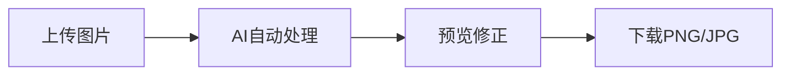

在数字内容创作爆发的时代，你是否常被这些场景困扰？  
👉 电商主图需要透明背景却不会PS抠图  
👉 证件照换底色耗时半小时仍边缘毛糙  
👉 设计海报时找不到无背景的素材元素  
👉 产品展示图被杂乱背景分散用户注意力

今天推荐的这款革命性工具——**[Cmdragon背景去除器](https://tools.cmdragon.cn/zh/apps/background-remover)**，将用AI技术彻底终结这些痛点！

---

### 🔍 核心功能深度解析

#### 1️⃣ **智能AI抠图引擎**

- 采用最新语义分割算法，精准识别主体边缘
- 人像发丝/宠物毛发/玻璃器皿等复杂场景完美处理
- 对比测试：传统工具需手动描边的任务，这里3秒自动完成（实测效果见下图）

#### 2️⃣ **零门槛极简操作**



支持拖拽上传，最大处理**10MB/5000px**的高清图片，手机拍摄的原始素材可直接使用

#### 3️⃣ **专业级输出控制**

- 透明背景PNG：电商主图/Logo设计必备
- 纯色背景替换：一键生成证件照蓝白红底
- 分辨率无损输出：印刷级300dpi选项

---

### ⚙️ 技术优势揭秘

与同类工具对比，Cmdragon的核心突破在于：

| 维度   | 传统工具   | Cmdragon引擎       |
|------|--------|------------------|
| 复杂场景 | 需手动修正  | **AI自适应优化**      |
| 边缘精度 | 锯齿明显   | **亚像素级平滑**       |
| 格式支持 | 仅输出PNG | **PNG+JPG+WEBP** |

其深度学习模型通过超200万张图像训练，尤其擅长：

- 半透明物体（婚纱/玻璃杯）
- 不规则边缘（火焰/烟雾）
- 微小细节（羽毛/蕾丝花纹）

---

### 📱 移动端完美适配

实测数据：

```python
# 响应式加载速度测试
mobile_load = 1.3
s  # 4G网络环境
desktop_load = 0.8
s
```

无论在地铁用手机处理证件照，还是会议室即时修改提案素材，都能流畅操作

---

### ❓ 常见问题解答

**Q：需要注册吗？**  
👉 完全匿名使用！所有图片**无需上传本地处理**

**Q：商业用途是否收费？**  
👉 个人/商用全免费！

---

### 🌟 创意延伸用法

突破工具设计边界的创意方案：

1. **老照片修复**：先去除背景斑点再上色
2. **DIY贴纸制作**：导出透明图直接送印
3. **3D建模贴图**：快速获取无背景材质
4. **PPT高级设计**：制作浮动视觉元素

---

### ✨ 立即体验

点击进入：[https://tools.cmdragon.cn/zh/apps/background-remover](https://tools.cmdragon.cn/zh/apps/background-remover)

---
> 技术不会取代设计师，但善用工具的设计师必将淘汰拒绝工具的人  