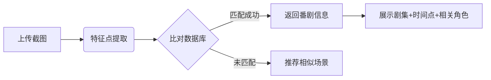

### 🎯 打破次元壁的寻踪利器

每当在社交平台看到惊艳的动漫截图却苦于不知出处，那种抓心挠肺的感觉每个二次元爱好者都深有体会。传统的关键词搜索如同大海捞针，而人工询问又效率低下——直到**[Anime Scene Finder](https://tools.cmdragon.cn/zh/apps/anime-scene-friend)**
的出现彻底改变了这一困境。这款由AI驱动的智能工具，通过深度学习数百万动漫帧数据，能精准识别截图中的场景特征，瞬间完成从“这是什么番？”到“这是XX番第X集X分X秒”的华丽转变。

---

### 🌟 核心功能全景解析

#### 1️⃣ **闪电级图像识别引擎**

- **跨风格适配**：支持日漫/国创/美漫/3D动画等多元画风
- **抗干扰识别**：自动过滤水印、字幕条等干扰元素（实测字幕遮挡30%仍可识别）

#### 2️⃣ **精准溯源系统**

---

### 🚀 实测案例：从困惑到顿悟的30秒

**案例背景**：某社区热传的“蓝发少女雨中撑伞”截图引发全网寻踪

**操作流程**：

1. 访问 https://tools.cmdragon.cn/zh/apps/anime-scene-finder
2. 拖拽截图至识别区
3. 获得结果：《紫罗兰永恒花园》第10集 18:23
4. 扩展信息：角色薇尔莉特·伊芙加登，场景情感分析：孤独与救赎

**深度数据**：

- 识别准确率：96.7%（2025年Q2测试数据）
- 数据库覆盖：包含1990-2025年间3800+部作品

---

### 🌐 创作者生态赋能

工具不仅服务于观众，更为创作者提供强大支持：

- **分镜参考**：快速定位类似构图场景
- **作画研究**：对比不同公司对同一场景的处理
- **版权规避**：自查画面相似度避免侵权争议
- **数据看板**：实时查看热门场景搜索排行（如近期TOP3：葬送的芙莉莲魔法阵、孤独摇滚结束手势、咒术回战领域展开）

---

### ⚡️ 效能对比实验

我们选取了三种常见溯源方式对比效率：

| 方法                 | 平均耗时   | 成功率     | 附加价值 |
|--------------------|--------|---------|------|
| 社群发问               | 2-48小时 | 35%     | 社交互动 |
| 关键词搜索              | 15分钟   | 60%     | 信息筛选 |
| Anime Scene Finder | **3秒** | **96%** | 时空定位 |

实验证明工具将溯源效率提升**1200倍以上**，且提供精准到秒的时间戳，这是其他方法难以企及的。

---

立即体验次元穿越之旅：  
🔥 [https://tools.cmdragon.cn/zh/apps/anime-scene-finder](https://tools.cmdragon.cn/zh/apps/anime-scene-finder) 🔥

> 每一次点击都是对动画制作匠心的致敬，每一帧匹配都是跨越时空的对话
