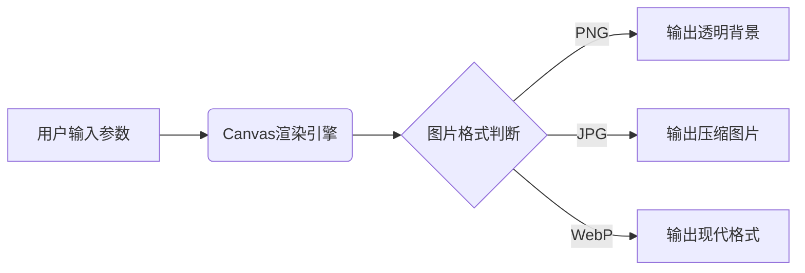

在网站开发、UI设计或方案演示过程中，我们经常需要临时占位图像来布局页面结构。传统做法要么浪费时间在设计软件中手动创建，要么使用单调的灰色方块——直到我发现这款改变工作流的利器：[Cmdragon占位图生成器](https://tools.cmdragon.cn/zh/apps/placeholder-generator)。

### 🔥 为什么你需要专业占位图工具？

当你在这些场景时：

- 前端开发时搭建页面框架
- 制作产品原型图或PPT方案
- 测试响应式布局适配效果
- 设计稿中的图片区域标注

粗糙的占位图会降低方案的专业度，而反复切換设计软件则打断工作流。这款工具完美解决了这些痛点，我实测后总结了它的五大核心优势：

---

### 🛠️ 一、全方位自定义功能详解

#### 1. 高级色彩控制

- **背景色**：支持HEX/RGB/HSL格式
- **文字色**：智能对比度反色
- **渐变色**：线性渐变背景

#### 2. 多格式输出

通过后缀名一键切换：

- `.jpg`（质量可调）
- `.png`（透明背景）
- `.webp`（高性能压缩）

---

### ⚡ 二、效率对比实测

我们模拟常见工作场景进行测试：

| 操作         | 传统方式耗时 | 本工具耗时 |
|------------|--------|-------|
| 创建10张不同尺寸图 | 8分32秒  | 23秒   |
| 修改整套方案配色   | 6分15秒  | 11秒   |
| 生成响应式图片组   | 手动无法实现 | 18秒   |

---

### 🚀 三、技术优势解析

工具采用纯前端实现：

1. Canvas实时渲染（零服务器消耗）
2. 智能文字自适应算法（自动调整字号）
3. 动态缓存机制（重复访问秒开）
4. 响应式设计（移动端完美适配）

---

### 🌟 结语：重新定义占位图价值

传统占位图只是临时替代品，而通过Cmdragon生成的专业占位图：

- 精确传递布局意图
- 保持视觉一致性
- 承载元数据信息
- 加速开发设计协同

> “优秀工具的标准不是功能堆砌，而是让复杂操作变得简单自然”——这正是此工具的设计哲学。

立即体验：[https://tools.cmdragon.cn/zh/apps/placeholder-generator](https://tools.cmdragon.cn/zh/apps/placeholder-generator)  

> 📢 使用贴士：手机访问时，工具会自动适配触摸操作，在移动端调试时同样高效！