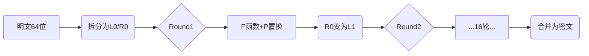

在数字时代，数据安全比黄金更珍贵！今天向大家推荐CMDragon平台的[Blowfish加密解密工具](https://tools.cmdragon.cn/zh/apps/blowfish-encrypt)
——这个由Bruce Schneier设计的经典算法，现以网页工具形式免费开放！

### 🔐 为什么选择Blowfish加密？

- **军事级安全性**：对称密钥算法可抵御暴力破解
- **闪电般速度**：比DES/AES更快的软件实现
- **灵活密钥**：支持32-448位可变密钥长度
- **零学习成本**：网页即开即用，无需安装

### 🛠️ 核心功能详解

#### 1. 多模式加密支持

工具提供两种主流加密模式：

```plaintext
• ECB模式（电子密码本）：适合独立数据块加密
• CBC模式（密码块链接）：通过IV向量提升安全性
```

#### 2. 智能密钥处理

输入任意长度密钥时，工具自动进行密钥扩展（Key Schedule），通过复杂的子密钥生成过程，将短密钥转化为18个32位子密钥+P-box，确保加密强度。

#### 3. Feistel网络架构

每64位数据经过16轮Feistel结构转换（如图示）：



#### 4. 实时双向转换

在操作区只需：

1. 粘贴文本（支持10MB大文件）
2. 设置256位密钥（示例：`cmdragon_secure_key_2025!`）
3. 选择CBC模式并设置IV向量
4. 点击「加密」获得Base64结果

### 💡 应用场景实例

```python
# 开发场景：加密API密钥
原始配置：API_KEY = "sk_live_abc123xyz"
Blowfish加密后：U2FsdGVkX18tJ2eZ6cM3c7QYHjNl0oW0r4OPbfE =

# 解密时使用相同密钥
解密结果 = BlowfishDecrypt("U2FsdGVkX...", "your_key")
```

### ⚠️ 安全使用建议

1. **密钥管理**：使用密码管理器存储密钥，勿用简单字符串
2. **模式选择**：优先选用CBC模式（需设置随机IV）
3. **数据验证**：加密前启用「数据完整性校验」选项
4. **传输安全**：配合HTTPS使用避免中间人攻击

### 🌟 独特优势

- **零数据上传**：所有计算在浏览器本地完成
- **移动端优化**：触屏友好界面，手机操作流畅
- **历史记录**：自动保存最近10次操作（本地存储）
- **开发者API**：支持`fetch`调用集成到你的系统

> 💡 小知识：Blowfish的"S盒"通过π的小数位生成，这个精妙设计使其30年来从未被成功攻破！

即刻体验：[https://tools.cmdragon.cn/zh/apps/blowfish-encrypt](https://tools.cmdragon.cn/zh/apps/blowfish-encrypt)
保护你的聊天记录、密码文件和商业机密！
