*Snapdrop 多设备文件传输实时演示*

在日常工作生活中，你是否遇到过这些困扰：

- 手机照片传到电脑需要数据线
- 同事临时要文件却找不到U盘
- 苹果安卓设备互传束手无策
- 微信文件大小限制令人抓狂

）只需三步即可完成传输：

1. 所有设备访问 [https://tools.cmdragon.cn/zh/apps/snapdrop](https://tools.cmdragon.cn/zh/apps/snapdrop)
2. 自动识别局域网内在线设备
3. 拖拽文件到目标设备图标，秒级完成传输

## ✨ 核心优势解析

### 1. 零门槛极简操作

- **无需注册/登录**：打开网页即用
- **无文件大小限制**：实测传输 5GB 视频文件仅需 2 分钟
- **全格式支持**：图片/视频/文档/应用安装包通吃

### 2. 军工级安全保障

```mermaid
graph LR
A[发送端] -- 端到端加密 --> B(WebRTC 通道)
B -- 动态密钥 --> C[接收端]
```



- 数据**永不经过服务器**（传输过程可抓包验证）
- 基于浏览器的沙箱隔离机制
- 自动销毁传输链接（每次刷新生成新会话）

### 3. 全平台兼容实测

| 设备组合           | 传输速度   | 稳定性   |
|----------------|--------|-------|
| Win → Mac      | 58MB/s | ⭐⭐⭐⭐⭐ |
| Android → iPad | 32MB/s | ⭐⭐⭐⭐  |
| iPhone → WinPC | 28MB/s | ⭐⭐⭐⭐  |

## ⚠️ 注意事项

- 确保所有设备在**同一局域网**（企业级路由器需关闭 AP 隔离）
- 使用 Chrome/Firefox 等现代浏览器
- 传输大文件时保持屏幕常亮

## 🌐 技术原理揭秘

采用 WebRTC + Node.js 的技术架构：

```javascript
// WebRTC 建立连接核心代码
peerConnection = new RTCPeerConnection(configuration)
peerConnection.ondatachannel = event => {
    receiveChannel = event.channel
    receiveChannel.onmessage = handleReceiveMessage
}
```

通过 STUN 服务器完成 NAT 穿透，配合 IndexedDB 实现离线缓存，整个传输过程完全 P2P 化。

---

## 免费好用的热门在线工具

- [CMDragon 在线工具 - 高级AI工具箱与开发者套件 | 免费好用的在线工具](https/tools.cmdragon.cn/zh)
- [应用商店 - 发现1000+提升效率与开发的AI工具和实用程序 | 免费好用的在线工具](https/tools.cmdragon.cn/zh/apps?category=trending)
- [CMDragon 更新日志 - 最新更新、功能与改进 | 免费好用的在线工具](https/tools.cmdragon.cn/zh/changelog)
- [支持我们 - 成为赞助者 | 免费好用的在线工具](https/tools.cmdragon.cn/zh/sponsor)
- [AI文本生成图像 - 应用商店 | 免费好用的在线工具](https/tools.cmdragon.cn/zh/apps/text-to-image-ai)
- [临时邮箱 - 应用商店 | 免费好用的在线工具](https/tools.cmdragon.cn/zh/apps/temp-email)
- [二维码解析器 - 应用商店 | 免费好用的在线工具](https/tools.cmdragon.cn/zh/apps/qrcode-parser)
- [文本转思维导图 - 应用商店 | 免费好用的在线工具](https/tools.cmdragon.cn/zh/apps/text-to-mindmap)
- [正则表达式可视化工具 - 应用商店 | 免费好用的在线工具](https/tools.cmdragon.cn/zh/apps/regex-visualizer)
- [文件隐写工具 - 应用商店 | 免费好用的在线工具](https/tools.cmdragon.cn/zh/apps/steganography-tool)
- [IPTV 频道探索器 - 应用商店 | 免费好用的在线工具](https/tools.cmdragon.cn/zh/apps/iptv-explorer)
- [快传 - 应用商店 | 免费好用的在线工具](https/tools.cmdragon.cn/zh/apps/snapdrop)
- [随机抽奖工具 - 应用商店 | 免费好用的在线工具](https/tools.cmdragon.cn/zh/apps/lucky-draw)
- [动漫场景查找器 - 应用商店 | 免费好用的在线工具](https/tools.cmdragon.cn/zh/apps/anime-scene-finder)
- [时间工具箱 - 应用商店 | 免费好用的在线工具](https/tools.cmdragon.cn/zh/apps/time-toolkit)
- [网速测试 - 应用商店 | 免费好用的在线工具](https/tools.cmdragon.cn/zh/apps/speed-test)
- [AI 智能抠图工具 - 应用商店 | 免费好用的在线工具](https/tools.cmdragon.cn/zh/apps/background-remover)
- [背景替换工具 - 应用商店 | 免费好用的在线工具](https/tools.cmdragon.cn/zh/apps/background-replacer)
- [艺术二维码生成器 - 应用商店 | 免费好用的在线工具](https/tools.cmdragon.cn/zh/apps/artistic-qrcode)
- [Open Graph 元标签生成器 - 应用商店 | 免费好用的在线工具](https/tools.cmdragon.cn/zh/apps/open-graph-generator)
- [图像对比工具 - 应用商店 | 免费好用的在线工具](https/tools.cmdragon.cn/zh/apps/image-comparison)
- [图片压缩专业版 - 应用商店 | 免费好用的在线工具](https/tools.cmdragon.cn/zh/apps/image-compressor)
- [密码生成器 - 应用商店 | 免费好用的在线工具](https/tools.cmdragon.cn/zh/apps/password-generator)
- [SVG优化器 - 应用商店 | 免费好用的在线工具](https/tools.cmdragon.cn/zh/apps/svg-optimizer)
- [调色板生成器 - 应用商店 | 免费好用的在线工具](https/tools.cmdragon.cn/zh/apps/color-palette)
- [在线节拍器 - 应用商店 | 免费好用的在线工具](https/tools.cmdragon.cn/zh/apps/online-metronome)
- [IP归属地查询 - 应用商店 | 免费好用的在线工具](https/tools.cmdragon.cn/zh/apps/ip-geolocation)
- [CSS网格布局生成器 - 应用商店 | 免费好用的在线工具](https/tools.cmdragon.cn/zh/apps/css-grid-layout)
- [邮箱验证工具 - 应用商店 | 免费好用的在线工具](https/tools.cmdragon.cn/zh/apps/email-validator)
- [书法练习字帖 - 应用商店 | 免费好用的在线工具](https/tools.cmdragon.cn/zh/apps/calligraphy-practice)
- [金融计算器套件 - 应用商店 | 免费好用的在线工具](https/tools.cmdragon.cn/zh/apps/finance-calculator-suite)
- [中国亲戚关系计算器 - 应用商店 | 免费好用的在线工具](https/tools.cmdragon.cn/zh/apps/chinese-kinship-calculator)
- [Protocol Buffer 工具箱 - 应用商店 | 免费好用的在线工具](https/tools.cmdragon.cn/zh/apps/protobuf-toolkit)
- [图片无损放大 - 应用商店 | 免费好用的在线工具](https/tools.cmdragon.cn/zh/apps/image-upscaler)
- [文本比较工具 - 应用商店 | 免费好用的在线工具](https/tools.cmdragon.cn/zh/apps/text-compare)
- [IP批量查询工具 - 应用商店 | 免费好用的在线工具](https/tools.cmdragon.cn/zh/apps/ip-batch-lookup)
- [域名查询工具 - 应用商店 | 免费好用的在线工具](https/tools.cmdragon.cn/zh/apps/domain-finder)
- [DNS工具箱 - 应用商店 | 免费好用的在线工具](https/tools.cmdragon.cn/zh/apps/dns-toolkit)
- [网站图标生成器 - 应用商店 | 免费好用的在线工具](https/tools.cmdragon.cn/zh/apps/favicon-generator)
- [XML Sitemap](https/tools.cmdragon.cn/sitemap_index.xml)