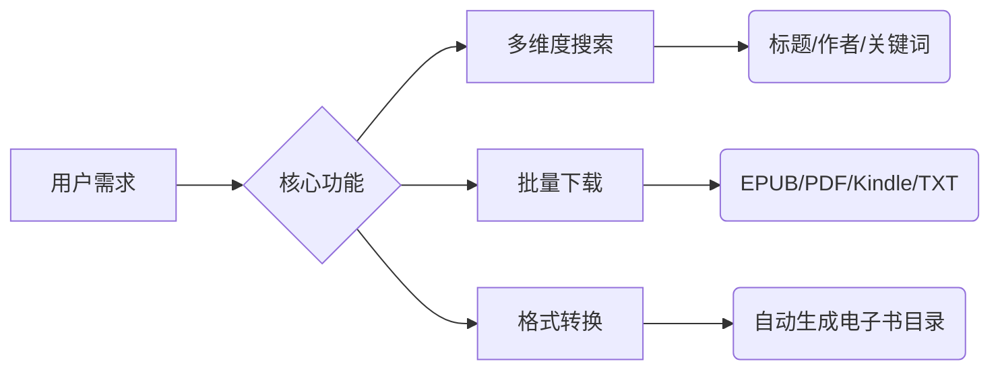

在数字阅读时代，**古腾堡计划（Project Gutenberg）**
犹如一座藏有60,000+免费电子书的宝库，收录了莎士比亚全集、《傲慢与偏见》等经典著作。但如何高效挖掘这些资源？[Gutenberg Explorer](https://tools.cmdragon.cn/zh/apps/gutenberg-explorer)
正是为此诞生的神兵利器！

### 为什么需要电子书探索工具？

传统访问古腾堡官网常遇三大痛点：

1. 原始界面搜索功能简陋，筛选选项有限
2. 下载格式选择流程繁琐（需多次跳转页面）
3. 无法按语言/人气/更新日期智能排序

**Gutenberg Explorer 的解决方案**：



### 五大核心功能详解

1. **智能搜索引擎**
    - 支持布尔运算符：`"战争与和平" AND 托尔斯泰 NOT 改编版`
    - 多语言筛选：一键过滤中文/英文/法语等36种语言资源
    - 案例：搜索`science fiction before:1900`可找到19世纪的科幻先驱作品

2. **书籍预览系统**
   ```python
   # 技术实现原理示例
   def generate_preview(book_id):
       metadata = get_gutenberg_metadata(book_id)  # 获取元数据
       cover = render_cover(metadata['title'], metadata['author'])
       first_chapter = extract_chapter(book_id, chapter=1)
       return {'cover': cover, 'preview': first_chapter}
   ```
   在下载前可预览首章内容与封面设计，避免误下劣质扫描版

3. **批量下载管理器**
    - 全选多本书籍后自动打包为ZIP
    - 支持跨格式转换：同时下载EPUB+PDF双版本
    - 后台任务队列：大文件下载不怕中断

4. **个性化书库**
    - 创建专属收藏夹（如“诺奖作家全集”）
    - 订阅作者更新：当新增契诃夫作品时自动邮件通知
    - 阅读进度云同步（需登录CMDragon账号）

5. **学术引用工具**
   ```markdown
   书名: 《双城记》
   作者: 查尔斯·狄更斯
   永久链接: https://www.gutenberg.org/ebooks/98/  
   引用格式: 
     MLA: Dickens, Charles. A Tale of Two Cities. Project Gutenberg, 1994. Web.
     APA: Dickens, C. (1994). A Tale of Two Cities. Project Gutenberg.
   ```
   自动生成符合学术规范的引用信息，论文写作必备

### 实战操作指南

**场景：获取法国文学经典**

1. 在语言筛选中勾选`French`
2. 按`下载量`排序找到Top10
3. 勾选雨果《悲惨世界》和福楼拜《包法利夫人》
4. 点击`下载选中项`选择EPUB格式
5. 等待10秒后获得ZIP压缩包

**高级技巧**：

- 使用`id:[编号]`直接定位书籍，如`id:1342`直达《傲慢与偏见》
- 开启`深夜模式`降低蓝光刺激
- 右键封面图可导出高清海报（适合读书会分享）

### 与其他工具联动

1. **文本转电子书**：用[CMDragon文本工具](https/tools.cmdragon.cn/zh)处理TXT文件后导入
2. **跨设备同步**：通过[快传](https/tools.cmdragon.cn/zh/apps/snapdrop)发送到手机
3. **制作有声书**：搭配[AI语音合成](https/tools.cmdragon.cn/zh/apps/text-to-speech)功能

### 常见问题解答

❓ **是否侵犯版权？**  
所有资源均属公共领域（出版95年以上），完全合法

❓ **为什么有些书缺封面？**  
点击`生成封面`按钮使用AI自动创建

❓ **下载速度慢怎么办？**  
尝试切换CDN节点（工具右下角设置）

### 数据价值透视

根据2025年第一季度统计：

- 最受欢迎语言：英语(68%) > 中文(12%) > 法语(7%)
- 每日下载峰值：世界读书日达89,142次
- 用户最爱Top3：
    1. 《福尔摩斯探案集》
    2. 《孙子兵法》英译本
    3. 《小王子》多语言版

### 结语：知识无界，阅读自由

Gutenberg Explorer 消除了获取人类智慧结晶的壁垒。无论您是在地铁通勤的上班族、偏远地区的学生，还是囊中羞涩的书虫，现在只需打开浏览器，就能随身携带一座世界级图书馆。立即体验这个改变阅读方式的革命性工具：

➡️ [Gutenberg Explorer 在线工具](https://tools.cmdragon.cn/zh/apps/gutenberg-explorer) ⬅️

## 免费好用的热门在线工具

- [CMDragon 在线工具 - 高级AI工具箱与开发者套件 | 免费好用的在线工具](https/tools.cmdragon.cn/zh)
- [应用商店 - 发现1000+提升效率与开发的AI工具和实用程序 | 免费好用的在线工具](https/tools.cmdragon.cn/zh/apps?category=trending)
- [CMDragon 更新日志 - 最新更新、功能与改进 | 免费好用的在线工具](https/tools.cmdragon.cn/zh/changelog)
- [支持我们 - 成为赞助者 | 免费好用的在线工具](https/tools.cmdragon.cn/zh/sponsor)
- [AI文本生成图像 - 应用商店 | 免费好用的在线工具](https/tools.cmdragon.cn/zh/apps/text-to-image-ai)
- [临时邮箱 - 应用商店 | 免费好用的在线工具](https/tools.cmdragon.cn/zh/apps/temp-email)
- [二维码解析器 - 应用商店 | 免费好用的在线工具](https/tools.cmdragon.cn/zh/apps/qrcode-parser)
- [文本转思维导图 - 应用商店 | 免费好用的在线工具](https/tools.cmdragon.cn/zh/apps/text-to-mindmap)
- [正则表达式可视化工具 - 应用商店 | 免费好用的在线工具](https/tools.cmdragon.cn/zh/apps/regex-visualizer)
- [文件隐写工具 - 应用商店 | 免费好用的在线工具](https/tools.cmdragon.cn/zh/apps/steganography-tool)
- [IPTV 频道探索器 - 应用商店 | 免费好用的在线工具](https/tools.cmdragon.cn/zh/apps/iptv-explorer)
- [快传 - 应用商店 | 免费好用的在线工具](https/tools.cmdragon.cn/zh/apps/snapdrop)
- [随机抽奖工具 - 应用商店 | 免费好用的在线工具](https/tools.cmdragon.cn/zh/apps/lucky-draw)
- [动漫场景查找器 - 应用商店 | 免费好用的在线工具](https/tools.cmdragon.cn/zh/apps/anime-scene-finder)
- [时间工具箱 - 应用商店 | 免费好用的在线工具](https/tools.cmdragon.cn/zh/apps/time-toolkit)
- [网速测试 - 应用商店 | 免费好用的在线工具](https/tools.cmdragon.cn/zh/apps/speed-test)
- [AI 智能抠图工具 - 应用商店 | 免费好用的在线工具](https/tools.cmdragon.cn/zh/apps/background-remover)
- [背景替换工具 - 应用商店 | 免费好用的在线工具](https/tools.cmdragon.cn/zh/apps/background-replacer)
- [艺术二维码生成器 - 应用商店 | 免费好用的在线工具](https/tools.cmdragon.cn/zh/apps/artistic-qrcode)
- [Open Graph 元标签生成器 - 应用商店 | 免费好用的在线工具](https/tools.cmdragon.cn/zh/apps/open-graph-generator)
- [图像对比工具 - 应用商店 | 免费好用的在线工具](https/tools.cmdragon.cn/zh/apps/image-comparison)
- [图片压缩专业版 - 应用商店 | 免费好用的在线工具](https/tools.cmdragon.cn/zh/apps/image-compressor)
- [密码生成器 - 应用商店 | 免费好用的在线工具](https/tools.cmdragon.cn/zh/apps/password-generator)
- [SVG优化器 - 应用商店 | 免费好用的在线工具](https/tools.cmdragon.cn/zh/apps/svg-optimizer)
- [调色板生成器 - 应用商店 | 免费好用的在线工具](https/tools.cmdragon.cn/zh/apps/color-palette)
- [在线节拍器 - 应用商店 | 免费好用的在线工具](https/tools.cmdragon.cn/zh/apps/online-metronome)
- [IP归属地查询 - 应用商店 | 免费好用的在线工具](https/tools.cmdragon.cn/zh/apps/ip-geolocation)
- [CSS网格布局生成器 - 应用商店 | 免费好用的在线工具](https/tools.cmdragon.cn/zh/apps/css-grid-layout)
- [邮箱验证工具 - 应用商店 | 免费好用的在线工具](https/tools.cmdragon.cn/zh/apps/email-validator)
- [书法练习字帖 - 应用商店 | 免费好用的在线工具](https/tools.cmdragon.cn/zh/apps/calligraphy-practice)
- [金融计算器套件 - 应用商店 | 免费好用的在线工具](https/tools.cmdragon.cn/zh/apps/finance-calculator-suite)
- [中国亲戚关系计算器 - 应用商店 | 免费好用的在线工具](https/tools.cmdragon.cn/zh/apps/chinese-kinship-calculator)
- [Protocol Buffer 工具箱 - 应用商店 | 免费好用的在线工具](https/tools.cmdragon.cn/zh/apps/protobuf-toolkit)
- [图片无损放大 - 应用商店 | 免费好用的在线工具](https/tools.cmdragon.cn/zh/apps/image-upscaler)
- [文本比较工具 - 应用商店 | 免费好用的在线工具](https/tools.cmdragon.cn/zh/apps/text-compare)
- [IP批量查询工具 - 应用商店 | 免费好用的在线工具](https/tools.cmdragon.cn/zh/apps/ip-batch-lookup)
- [域名查询工具 - 应用商店 | 免费好用的在线工具](https/tools.cmdragon.cn/zh/apps/domain-finder)
- [DNS工具箱 - 应用商店 | 免费好用的在线工具](https/tools.cmdragon.cn/zh/apps/dns-toolkit)
- [网站图标生成器 - 应用商店 | 免费好用的在线工具](https/tools.cmdragon.cn/zh/apps/favicon-generator)
- [XML Sitemap](https/tools.cmdragon.cn/sitemap_index.xml)
