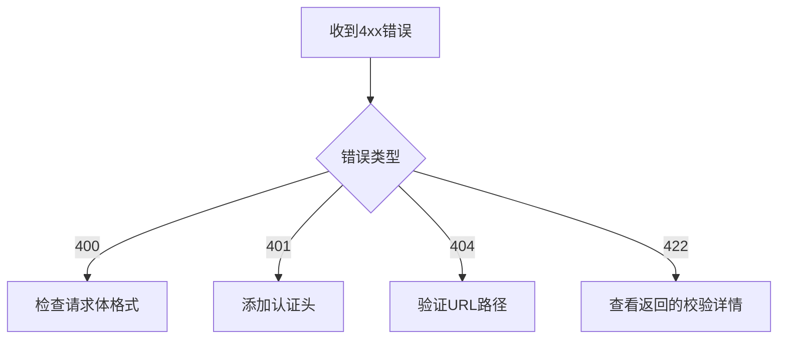

扫描[二维码](https://static.amd794.com/blog/images/cmdragon_cn.png)关注或者微信搜一搜：`编程智域 前端至全栈交流与成长`


📦 本系列第二篇通过**披萨店创业**的完整案例，手把手教你：  
- 用外卖订单理解HTTP协议细节  
- 5个RESTful设计常见误区与修正方案  
- 从零搭建支持**用户/订单/库存管理**的完整API  
- 错误排查工具箱（含11种常见问题速查表）  

---


#### 第一章：HTTP协议就像披萨外卖（场景化学习）  

**1.1 订单生命周期对照表**  
| 外卖步骤         | HTTP对应概念        | 示例                 |  
|------------------|--------------------|----------------------|  
| 顾客下单         | POST请求           | `POST /orders`       |  
| 打印小票         | Header元数据       | `Content-Type: application/json` |  
| 后厨制作         | 服务器处理逻辑      | 数据库写入操作       |  
| 外卖异常通知     | 4xx/5xx状态码      | `404 披萨缺货`       |  

**1.2 必知必会的5个状态码**  
```python
@app.post("/orders")
async def create_order():
    try:
        # 处理订单逻辑
        return JSONResponse(201, headers={"Location": "/orders/1001"})
    except OutOfStock:
        return JSONResponse(409, content={"error": "玛格丽特披萨库存不足"})
```

---

#### 第二章：RESTful设计七大黄金法则  
**2.1 错误 vs 正确设计对比**  
```python
# 错误：动词导向 ❌
@app.post("/getUserOrders")
def get_orders(): ...

# 正确：名词导向 ✅  
@app.get("/users/{user_id}/orders")
def get_orders(user_id: int): ...
```

**2.2 超媒体API实战（HATEOAS）**  
```json
// 订单创建响应
{
  "id": 1001,
  "status": "烤制中",
  "_links": {
    "self": {"href": "/orders/1001", "method": "GET"},
    "cancel": {"href": "/orders/1001", "method": "DELETE"}
  }
}
```

---

#### 第三章：从零搭建披萨店API 🧑🍳  
**3.1 完整API架构**  
```python
from fastapi import FastAPI
from pydantic import BaseModel

app = FastAPI()

class Pizza(BaseModel):
    name: str
    price: float
    size: Literal["S", "M", "L"]

# 菜单管理
@app.get("/pizzas")
async def list_pizzas(): ...

@app.post("/pizzas")
async def create_pizza(pizza: Pizza): ...

# 订单系统
@app.post("/orders")
async def create_order(pizza_ids: list[int]): ...
```

**3.2 自动化文档生成**  
访问 `http://localhost:8000/docs` 查看实时API文档：


---

#### 第四章：错误处理大师课  
**4.1 422错误全场景复现**  
```python
# 案例：忘记必填参数
@app.post("/pizzas")
async def create_pizza(pizza: Pizza):
    # 如果客户端未传price字段...
    
# 客户端收到响应：
{
  "detail": [
    {
      "loc": ["body", "price"],
      "msg": "field required",
      "type": "value_error.missing"
    }
  ]
}
```

**4.2 错误排查流程图**  


---

#### 第五章：安全加固与性能优化  
**5.1 防御披萨注入攻击**  
```python
# 危险写法 ❌
def get_order(raw_id: str):
    query = f"SELECT * FROM orders WHERE id = {raw_id}"
    
# 安全写法 ✅  
def get_order_safe(order_id: int):
    query = "SELECT * FROM orders WHERE id = :id"
    params = {"id": order_id}
```

**5.2 缓存优化实战**  
```python
from fastapi import Request
from fastapi_cache import FastAPICache
from fastapi_cache.decorator import cache

@app.get("/pizzas/{pizza_id}")
@cache(expire=60)  # 缓存60秒
async def get_pizza(pizza_id: int):
    return db.query(Pizza).filter(Pizza.id == pizza_id).first()
```

---

### 课后实战工坊  
**任务1：扩展配送功能**  
```python
# 你的挑战：
@app.get("/orders/{order_id}/tracking")
async def get_delivery_status(order_id: int):
    # 返回配送状态和骑手位置
    pass
```

**任务2：设计促销系统**  
```python
# 需求：
# - 创建促销活动（POST /promotions）
# - 限制每个用户参与次数
# - 过期活动自动关闭
```

---

### 结语  
您已完成从API新手到合格开发者的蜕变。现在，用 `python -m uvicorn main:app --reload` 启动您的披萨店API帝国吧！ 🚀

---


余下文章内容请点击跳转至 个人博客页面 或者 扫码关注或者微信搜一搜：`编程智域 前端至全栈交流与成长`，阅读完整的文章：

## 往期文章归档：

- [从零构建你的第一个RESTful API：HTTP协议与API设计超图解指南 🌐 | cmdragon's Blog](https://blog.cmdragon.cn/posts/e5078a4d6fad/)
- [Python异步编程进阶指南：破解高并发系统的七重封印 | cmdragon's Blog](https://blog.cmdragon.cn/posts/f49972bd19a6/)
- [Python异步编程终极指南：用协程与事件循环重构你的高并发系统 | cmdragon's Blog](https://blog.cmdragon.cn/posts/b279dbab11eb/)
- [Python类型提示完全指南：用类型安全重构你的代码，提升10倍开发效率 | cmdragon's Blog](https://blog.cmdragon.cn/posts/8f8db75c315d/)
- [三大平台云数据库生态服务对决 | cmdragon's Blog](https://blog.cmdragon.cn/posts/d0b1b6a9f135/)
- [分布式数据库解析 | cmdragon's Blog](https://blog.cmdragon.cn/posts/91aae808d87e/)
- [深入解析NoSQL数据库：从文档存储到图数据库的全场景实践 | cmdragon's Blog](https://blog.cmdragon.cn/posts/5fcc2532e318/)
- [数据库审计与智能监控：从日志分析到异常检测 | cmdragon's Blog](https://blog.cmdragon.cn/posts/c971b2302602/)
- [数据库加密全解析：从传输到存储的安全实践 | cmdragon's Blog](https://blog.cmdragon.cn/posts/735fa4090f0b/)
- [数据库安全实战：访问控制与行级权限管理 | cmdragon's Blog](https://blog.cmdragon.cn/posts/5c01d5c0a63b/)
- [数据库扩展之道：分区、分片与大表优化实战 | cmdragon's Blog](https://blog.cmdragon.cn/posts/7f71048cd61c/)
- [查询优化：提升数据库性能的实用技巧 | cmdragon's Blog](https://blog.cmdragon.cn/posts/8e5e3ffe33dd/)
- [性能优化与调优：全面解析数据库索引 | cmdragon's Blog](https://blog.cmdragon.cn/posts/3c6ba213efe2/)
- [存储过程与触发器：提高数据库性能与安全性的利器 | cmdragon's Blog](https://blog.cmdragon.cn/posts/84376403bdf0/)
- [数据操作与事务：确保数据一致性的关键 | cmdragon's Blog](https://blog.cmdragon.cn/posts/f357e8ef59f1/)
- [深入掌握 SQL 深度应用：复杂查询的艺术与技巧 | cmdragon's Blog](https://blog.cmdragon.cn/posts/87c82dea0024/)
- [彻底理解数据库设计原则：生命周期、约束与反范式的应用 | cmdragon's Blog](https://blog.cmdragon.cn/posts/3f3203c3e56b/)
- [深入剖析实体-关系模型（ER 图）：理论与实践全解析 | cmdragon's Blog](https://blog.cmdragon.cn/posts/91e1bf521e8c/)
- [数据库范式详解：从第一范式到第五范式 | cmdragon's Blog](https://blog.cmdragon.cn/posts/05264e28f9f8/)
- [PostgreSQL：数据库迁移与版本控制 | cmdragon's Blog](https://blog.cmdragon.cn/posts/a58cca68755e/)
- [Node.js 与 PostgreSQL 集成：深入 pg 模块的应用与实践 | cmdragon's Blog](https://blog.cmdragon.cn/posts/d5b4e82e959a/)
- [Python 与 PostgreSQL 集成：深入 psycopg2 的应用与实践 | cmdragon's Blog](https://blog.cmdragon.cn/posts/9aae8e2f1414/)
- [应用中的 PostgreSQL项目案例 | cmdragon's Blog](https://blog.cmdragon.cn/posts/287f56043db8/)
- [数据库安全管理中的权限控制：保护数据资产的关键措施 | cmdragon's Blog](https://blog.cmdragon.cn/posts/5995b8f15678/)
- [数据库安全管理中的用户和角色管理：打造安全高效的数据环境 | cmdragon's Blog](https://blog.cmdragon.cn/posts/c0cd4cbaa201/)
- [数据库查询优化：提升性能的关键实践 | cmdragon's Blog](https://blog.cmdragon.cn/posts/3ab8c2f85479/)
- [数据库物理备份：保障数据完整性和业务连续性的关键策略 | cmdragon's Blog](https://blog.cmdragon.cn/posts/7e3da86fa38b/)
- [PostgreSQL 数据备份与恢复：掌握 pg_dump 和 pg_restore 的最佳实践 | cmdragon's Blog](https://blog.cmdragon.cn/posts/2190f85925ce/)
- [索引的性能影响：优化数据库查询与存储的关键 | cmdragon's Blog](https://blog.cmdragon.cn/posts/076f666ba145/)
- [深入探讨数据库索引类型：B-tree、Hash、GIN与GiST的对比与应用 | cmdragon's Blog](https://blog.cmdragon.cn/posts/7f7df47953c4/)
- [深入探讨触发器的创建与应用：数据库自动化管理的强大工具 | cmdragon's Blog](https://blog.cmdragon.cn/posts/5765e6b13d4e/)
- [深入探讨存储过程的创建与应用：提高数据库管理效率的关键工具 | cmdragon's Blog](https://blog.cmdragon.cn/posts/98a999d55ec8/)
- [深入探讨视图更新：提升数据库灵活性的关键技术 | cmdragon's Blog](https://blog.cmdragon.cn/posts/6e90926327b9/)
- [深入理解视图的创建与删除：数据库管理中的高级功能 | cmdragon's Blog](https://blog.cmdragon.cn/posts/9b26b52722c6/)
- [深入理解检查约束：确保数据质量的重要工具 | cmdragon's Blog](https://blog.cmdragon.cn/posts/16ef025755f4/)
-


