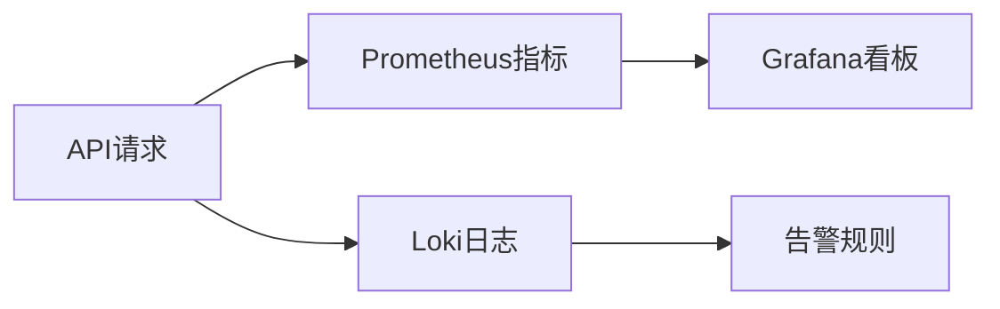

扫描[二维码](https://static.amd794.com/blog/images/cmdragon_cn.png)关注或者微信搜一搜：`编程智域 前端至全栈交流与成长`

🏭 本文作为系列终章，通过**物流管理系统**的案例，揭秘API开发的完整流程。你将掌握：

- 深度解读**28个HTTP协议进阶特性**（ETag/CORS/内容协商）
- 实现**RBAC权限系统**与**OAuth2授权中心**
- 设计支持**千万级数据**的分页/过滤/排序方案
- 用**OpenTelemetry**实现API全链路监控

#### 第一章：高阶HTTP协议工程化

**1.1 缓存控制终极方案**

```python  
from fastapi import Header


@app.get("/products/{id}")
async def get_product(
        id: int,
        if_none_match: str = Header(None)
):
    current_etag = f"W/{hash(data)}"
    if if_none_match == current_etag:
        return Response(304)
    return JSONResponse(
        content=data,
        headers={"ETag": current_etag}
    )  
```  

**1.2 跨域资源共享（CORS）配置**

```python  
from fastapi.middleware.cors import CORSMiddleware

app.add_middleware(
    CORSMiddleware,
    allow_origins=["https://your-app.com"],
    allow_methods=["*"],
    allow_headers=["*"],
    max_age=86400
)  
```  

---

#### 第二章：企业级RESTful设计模式

**2.1 超媒体API架构演进**

```json  
// 订单状态流转  
{
  "_embedded": {
    "items": [
      {
        "product_id": 101,
        "_links": {
          "product": {
            "href": "/products/101"
          }
        }
      }
    ]
  },
  "_links": {
    "next": {
      "href": "/orders?page=2"
    },
    "payment": {
      "href": "/orders/1001/payment"
    }
  }
}  
```  

**2.2 版本控制策略对比**

| 方案   | URL路径        | 请求头                                   | 媒体类型                                  |  
|------|--------------|---------------------------------------|---------------------------------------|  
| 示例   | `/v1/orders` | `Accept: application/vnd.api.v1+json` | `application/vnd.api+json; version=1` |  
| 适用场景 | 快速迭代         | 精确控制                                  | 无URL污染                                |  

---

#### 第三章：百万级数据API实战

**3.1 游标分页优化**

```python  
async def list_orders(
        after: str = None,
        before: str = None,
        limit: int = 100
):
    query = "SELECT id FROM orders"
    if after:
        query += f" WHERE id > {after}"
    elif before:
        query += f" WHERE id < {before}"
    query += f" ORDER BY id DESC LIMIT {limit}"  
```  

**3.2 复合过滤引擎**

```python  
class OrderFilter(BaseModel):
    status: Optional[OrderStatus]
    min_total: Optional[float]
    created_after: Optional[datetime]


@app.get("/orders")
async def search_orders(filter: OrderFilter):
    query = build_filter_query(filter)  
```  

---

#### 第四章：全链路可观测性

**4.1 OpenTelemetry集成**

```python  
from opentelemetry import trace
from opentelemetry.instrumentation.fastapi import FastAPIInstrumentor

tracer = trace.get_tracer(__name__)
FastAPIInstrumentor.instrument_app(app)


async def process_order():
    with tracer.start_as_current_span("order-processing"):
    # 跟踪关键业务逻辑  
```  

**4.2 监控看板配置**



---

### 课后超级挑战

**任务：设计跨境物流API**

```python  
# 要求：  
# 1. 支持多语言错误消息  
# 2. 实现海关申报自动化  
# 3. 货物状态实时推送（WebSocket）  
# 4. 分布式事务处理  
@app.websocket("/shipments/{id}/tracking")
async def track_shipment(websocket: WebSocket):
    await websocket.accept()
    while True:
        location = get_realtime_location()
        await websocket.send_json(location)  
```  

---

### 结语

您已掌握从协议原理到落地的完整知识体系。现在，您设计的API将具备支撑百万用户的能力！立即开启您的高并发之旅吧！ 🚀

余下文章内容请点击跳转至 个人博客页面 或者 扫码关注或者微信搜一搜：`编程智域 前端至全栈交流与成长`，阅读完整的文章：

## 往期文章归档：

- [HTTP协议与RESTful API实战手册（二）：用披萨店故事说透API设计奥秘 🍕 | cmdragon's Blog](https://blog.cmdragon.cn/posts/074086de21be/)
- [从零构建你的第一个RESTful API：HTTP协议与API设计超图解指南 🌐 | cmdragon's Blog](https://blog.cmdragon.cn/posts/e5078a4d6fad/)
- [Python异步编程进阶指南：破解高并发系统的七重封印 | cmdragon's Blog](https://blog.cmdragon.cn/posts/f49972bd19a6/)
- [Python异步编程终极指南：用协程与事件循环重构你的高并发系统 | cmdragon's Blog](https://blog.cmdragon.cn/posts/b279dbab11eb/)
- [Python类型提示完全指南：用类型安全重构你的代码，提升10倍开发效率 | cmdragon's Blog](https://blog.cmdragon.cn/posts/8f8db75c315d/)
- [三大平台云数据库生态服务对决 | cmdragon's Blog](https://blog.cmdragon.cn/posts/d0b1b6a9f135/)
- [分布式数据库解析 | cmdragon's Blog](https://blog.cmdragon.cn/posts/91aae808d87e/)
- [深入解析NoSQL数据库：从文档存储到图数据库的全场景实践 | cmdragon's Blog](https://blog.cmdragon.cn/posts/5fcc2532e318/)
- [数据库审计与智能监控：从日志分析到异常检测 | cmdragon's Blog](https://blog.cmdragon.cn/posts/c971b2302602/)
- [数据库加密全解析：从传输到存储的安全实践 | cmdragon's Blog](https://blog.cmdragon.cn/posts/735fa4090f0b/)
- [数据库安全实战：访问控制与行级权限管理 | cmdragon's Blog](https://blog.cmdragon.cn/posts/5c01d5c0a63b/)
- [数据库扩展之道：分区、分片与大表优化实战 | cmdragon's Blog](https://blog.cmdragon.cn/posts/7f71048cd61c/)
- [查询优化：提升数据库性能的实用技巧 | cmdragon's Blog](https://blog.cmdragon.cn/posts/8e5e3ffe33dd/)
- [性能优化与调优：全面解析数据库索引 | cmdragon's Blog](https://blog.cmdragon.cn/posts/3c6ba213efe2/)
- [存储过程与触发器：提高数据库性能与安全性的利器 | cmdragon's Blog](https://blog.cmdragon.cn/posts/84376403bdf0/)
- [数据操作与事务：确保数据一致性的关键 | cmdragon's Blog](https://blog.cmdragon.cn/posts/f357e8ef59f1/)
- [深入掌握 SQL 深度应用：复杂查询的艺术与技巧 | cmdragon's Blog](https://blog.cmdragon.cn/posts/87c82dea0024/)
- [彻底理解数据库设计原则：生命周期、约束与反范式的应用 | cmdragon's Blog](https://blog.cmdragon.cn/posts/3f3203c3e56b/)
- [深入剖析实体-关系模型（ER 图）：理论与实践全解析 | cmdragon's Blog](https://blog.cmdragon.cn/posts/91e1bf521e8c/)
- [数据库范式详解：从第一范式到第五范式 | cmdragon's Blog](https://blog.cmdragon.cn/posts/05264e28f9f8/)
- [PostgreSQL：数据库迁移与版本控制 | cmdragon's Blog](https://blog.cmdragon.cn/posts/a58cca68755e/)
- [Node.js 与 PostgreSQL 集成：深入 pg 模块的应用与实践 | cmdragon's Blog](https://blog.cmdragon.cn/posts/d5b4e82e959a/)
- [Python 与 PostgreSQL 集成：深入 psycopg2 的应用与实践 | cmdragon's Blog](https://blog.cmdragon.cn/posts/9aae8e2f1414/)
- [应用中的 PostgreSQL项目案例 | cmdragon's Blog](https://blog.cmdragon.cn/posts/287f56043db8/)
- [数据库安全管理中的权限控制：保护数据资产的关键措施 | cmdragon's Blog](https://blog.cmdragon.cn/posts/5995b8f15678/)
- [数据库安全管理中的用户和角色管理：打造安全高效的数据环境 | cmdragon's Blog](https://blog.cmdragon.cn/posts/c0cd4cbaa201/)
- [数据库查询优化：提升性能的关键实践 | cmdragon's Blog](https://blog.cmdragon.cn/posts/3ab8c2f85479/)
- [数据库物理备份：保障数据完整性和业务连续性的关键策略 | cmdragon's Blog](https://blog.cmdragon.cn/posts/7e3da86fa38b/)
- [PostgreSQL 数据备份与恢复：掌握 pg_dump 和 pg_restore 的最佳实践 | cmdragon's Blog](https://blog.cmdragon.cn/posts/2190f85925ce/)
- [索引的性能影响：优化数据库查询与存储的关键 | cmdragon's Blog](https://blog.cmdragon.cn/posts/076f666ba145/)
- [深入探讨数据库索引类型：B-tree、Hash、GIN与GiST的对比与应用 | cmdragon's Blog](https://blog.cmdragon.cn/posts/7f7df47953c4/)
- [深入探讨触发器的创建与应用：数据库自动化管理的强大工具 | cmdragon's Blog](https://blog.cmdragon.cn/posts/5765e6b13d4e/)
- [深入探讨存储过程的创建与应用：提高数据库管理效率的关键工具 | cmdragon's Blog](https://blog.cmdragon.cn/posts/98a999d55ec8/)
- [深入探讨视图更新：提升数据库灵活性的关键技术 | cmdragon's Blog](https://blog.cmdragon.cn/posts/6e90926327b9/)
- [深入理解视图的创建与删除：数据库管理中的高级功能 | cmdragon's Blog](https://blog.cmdragon.cn/posts/9b26b52722c6/)
-


