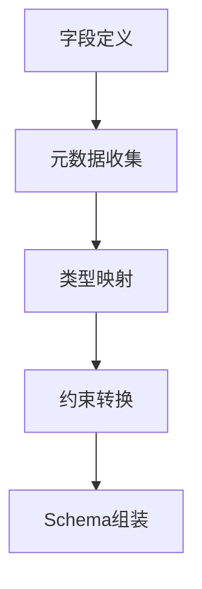

扫描[二维码](https://api2.cmdragon.cn/upload/cmder/20250304_012821924.jpg)关注或者微信搜一搜：`编程智域 前端至全栈交流与成长`

[探索数千个预构建的 AI 应用，开启你的下一个伟大创意](https://tools.cmdragon.cn/zh/apps?category=ai_chat)


---

### **第一章：Schema生成基础**

#### **1.1 默认Schema生成机制**

```python
from pydantic import BaseModel


class User(BaseModel):
    id: int
    name: str = Field(..., max_length=50)


print(User.schema_json(indent=2))
```

**输出特征**：

```json
{
  "title": "User",
  "type": "object",
  "properties": {
    "id": {
      "title": "Id",
      "type": "integer"
    },
    "name": {
      "title": "Name",
      "type": "string",
      "maxLength": 50
    }
  },
  "required": [
    "id",
    "name"
  ]
}
```

#### **1.2 Schema生成流程**



---

### **第二章：核心定制技术**

#### **2.1 字段级元数据注入**

```python
from pydantic import BaseModel, Field


class Product(BaseModel):
    sku: str = Field(
        ...,
        json_schema_extra={
            "x-frontend": {"widget": "search-input"},
            "x-docs": {"example": "ABC-123"}
        }
    )


print(Product.schema()["properties"]["sku"])
```

**输出**：

```json
{
  "title": "Sku",
  "type": "string",
  "x-frontend": {
    "widget": "search-input"
  },
  "x-docs": {
    "example": "ABC-123"
  }
}
```

#### **2.2 类型映射重载**

```python
from pydantic import BaseModel
from pydantic.json_schema import GenerateJsonSchema


class CustomSchemaGenerator(GenerateJsonSchema):
    def generate(self, schema):
        if schema["type"] == "string":
            schema["format"] = "custom-string"
        return schema


class DataModel(BaseModel):
    content: str


print(DataModel.schema(schema_generator=CustomSchemaGenerator))
```

---

### **第三章：动态Schema生成**

#### **3.1 运行时Schema构建**

```python
from pydantic import create_model
from pydantic.fields import FieldInfo


def dynamic_model(field_defs: dict):
    fields = {}
    for name, config in field_defs.items():
        fields[name] = (
            config["type"],
            FieldInfo(**config["field_params"])
        )
    return create_model('DynamicModel', **fields)


model = dynamic_model({
    "timestamp": {
        "type": int,
        "field_params": {"ge": 0, "json_schema_extra": {"unit": "ms"}}
    }
})
```

#### **3.2 环境感知Schema**

```python
from pydantic import BaseModel, ConfigDict


class EnvAwareSchema(BaseModel):
    model_config = ConfigDict(json_schema_mode="dynamic")

    @classmethod
    def __get_pydantic_json_schema__(cls, core_schema, handler):
        schema = handler(core_schema)
        if os.getenv("ENV") == "prod":
            schema["required"].append("audit_info")
        return schema
```

---

### **第四章：企业级应用模式**

#### **4.1 OpenAPI增强方案**

```python
from pydantic import BaseModel


class OpenAPICompatible(BaseModel):
    model_config = dict(
        json_schema_extra={
            "components": {
                "schemas": {
                    "ErrorResponse": {
                        "type": "object",
                        "properties": {
                            "code": {"type": "integer"},
                            "message": {"type": "string"}
                        }
                    }
                }
            }
        }
    )
```

#### **4.2 版本化Schema管理**

```python
from pydantic import BaseModel, field_validator


class VersionedModel(BaseModel):
    model_config = ConfigDict(extra="allow")

    @classmethod
    def __get_pydantic_json_schema__(cls, core_schema, handler):
        schema = handler(core_schema)
        schema["x-api-version"] = "2.3"
        return schema


class V1Model(VersionedModel):
    @classmethod
    def __get_pydantic_json_schema__(cls, *args):
        schema = super().__get_pydantic_json_schema__(*args)
        schema["x-api-version"] = "1.2"
        return schema
```

---

### **第五章：错误处理与优化**

#### **5.1 Schema验证错误**

```python
try:
    class InvalidSchemaModel(BaseModel):
        data: dict = Field(format="invalid-format")
except ValueError as e:
    print(f"Schema配置错误: {e}")
```

#### **5.2 性能优化策略**

```python
from functools import lru_cache


class CachedSchemaModel(BaseModel):
    @classmethod
    @lru_cache(maxsize=128)
    def schema(cls, **kwargs):
        return super().schema(**kwargs)
```

---

### **课后Quiz**

**Q1：如何添加自定义Schema属性？**  
A) 使用json_schema_extra  
B) 修改全局配置  
C) 继承GenerateJsonSchema

**Q2：处理版本兼容的正确方式？**

1) 动态注入版本号
2) 创建子类覆盖Schema
3) 维护多个模型

**Q3：优化Schema生成性能应使用？**

- [x] LRU缓存
- [ ] 增加校验步骤
- [ ] 禁用所有缓存

---

### **错误解决方案速查表**

| 错误信息                    | 原因分析          | 解决方案                             |
|-------------------------|---------------|----------------------------------|
| ValueError: 无效的format类型 | 不支持的Schema格式  | 检查字段类型与格式的兼容性                    |
| KeyError: 缺失必需字段        | 动态Schema未正确注入 | 验证__get_pydantic_json_schema__实现 |
| SchemaGenerationError   | 自定义生成器逻辑错误    | 检查类型映射逻辑                         |
| MemoryError             | 大规模模型未缓存      | 启用模型Schema缓存                     |

---


**架构箴言**：Schema设计应遵循"契约优先"原则，建议使用Git版本控制管理Schema变更，通过CI/CD流水线实现Schema的自动化测试与文档生成，建立Schema变更通知机制保障多团队协作。

余下文章内容请点击跳转至 个人博客页面 或者 扫码关注或者微信搜一搜：`编程智域 前端至全栈交流与成长`，阅读完整的文章：

## 往期文章归档：

- [Pydantic递归模型深度校验36计：从无限嵌套到亿级数据的优化法则 | cmdragon's Blog](https://blog.cmdragon.cn/posts/614488cbbf44/)
- [Pydantic异步校验器深：构建高并发验证系统 | cmdragon's Blog](https://blog.cmdragon.cn/posts/6ed5f943c599/)
- [Pydantic根校验器：构建跨字段验证系统 | cmdragon's Blog](https://blog.cmdragon.cn/posts/60d359baeb6c/)
- [Pydantic配置继承抽象基类模式 | cmdragon's Blog](https://blog.cmdragon.cn/posts/fa86615d7d3a/)
- [Pydantic多态模型：用鉴别器构建类型安全的API接口 | cmdragon's Blog](https://blog.cmdragon.cn/posts/4ab129859b04/)
- [FastAPI性能优化指南：参数解析与惰性加载 | cmdragon's Blog](https://blog.cmdragon.cn/posts/a281359d556b/)
- [FastAPI依赖注入：参数共享与逻辑复用 | cmdragon's Blog](https://blog.cmdragon.cn/posts/3b96477f5460/)
- [FastAPI安全防护指南：构建坚不可摧的参数处理体系 | cmdragon's Blog](https://blog.cmdragon.cn/posts/1d6d61c6ff85/)
- [FastAPI复杂查询终极指南：告别if-else的现代化过滤架构 | cmdragon's Blog](https://blog.cmdragon.cn/posts/63d68d803116/)
- [FastAPI 核心机制：分页参数的实现与最佳实践 | cmdragon's Blog](https://blog.cmdragon.cn/posts/6a3cba67a72d/)
- [FastAPI 错误处理与自定义错误消息完全指南：构建健壮的 API 应用 🛠️ | cmdragon's Blog](https://blog.cmdragon.cn/posts/615a966b68d9/)
- [FastAPI 自定义参数验证器完全指南：从基础到高级实战 | cmdragon's Blog](https://blog.cmdragon.cn/posts/c08aca091616/)
- [FastAPI 参数别名与自动文档生成完全指南：从基础到高级实战 🚀 | cmdragon's Blog](https://blog.cmdragon.cn/posts/67c76d0b9297/)
- [FastAPI Cookie 和 Header 参数完全指南：从基础到高级实战 🚀 | cmdragon's Blog](https://blog.cmdragon.cn/posts/143aef8a44f0/)
- [FastAPI 表单参数与文件上传完全指南：从基础到高级实战 🚀 | cmdragon's Blog](https://blog.cmdragon.cn/posts/378acc9ed556/)
- [FastAPI 请求体参数与 Pydantic 模型完全指南：从基础到嵌套模型实战 🚀 | cmdragon's Blog](https://blog.cmdragon.cn/posts/17872b9724be/)
- [FastAPI 查询参数完全指南：从基础到高级用法 🚀 | cmdragon's Blog](https://blog.cmdragon.cn/posts/361d6ce26859/)
- [FastAPI 路径参数完全指南：从基础到高级校验实战 🚀 | cmdragon's Blog](https://blog.cmdragon.cn/posts/14c3a0c58061/)
- [FastAPI路由专家课：微服务架构下的路由艺术与工程实践 🌐 | cmdragon's Blog](https://blog.cmdragon.cn/posts/11c340ef08d4/)
- [FastAPI路由与请求处理进阶指南：解锁企业级API开发黑科技 🔥 | cmdragon's Blog](https://blog.cmdragon.cn/posts/8737e29cfe7a/)
- [FastAPI路由与请求处理全解：手把手打造用户管理系统 🔌 | cmdragon's Blog](https://blog.cmdragon.cn/posts/7fa6ec101733/)
- [FastAPI极速入门：15分钟搭建你的首个智能API（附自动文档生成）🚀 | cmdragon's Blog](https://blog.cmdragon.cn/posts/4e5a7adbcde4/)
- [HTTP协议与RESTful API实战手册（终章）：构建企业级API的九大秘籍 🔐 | cmdragon's Blog](https://blog.cmdragon.cn/posts/2d417c3e7cac/)
- [HTTP协议与RESTful API实战手册（二）：用披萨店故事说透API设计奥秘 🍕 | cmdragon's Blog](https://blog.cmdragon.cn/posts/074086de21be/)
- [从零构建你的第一个RESTful API：HTTP协议与API设计超图解指南 🌐 | cmdragon's Blog](https://blog.cmdragon.cn/posts/e5078a4d6fad/)
- [Python异步编程进阶指南：破解高并发系统的七重封印 | cmdragon's Blog](https://blog.cmdragon.cn/posts/f49972bd19a6/)
- [Python异步编程终极指南：用协程与事件循环重构你的高并发系统 | cmdragon's Blog](https://blog.cmdragon.cn/posts/b279dbab11eb/)
- [Python类型提示完全指南：用类型安全重构你的代码，提升10倍开发效率 | cmdragon's Blog](https://blog.cmdragon.cn/posts/8f8db75c315d/)
- [三大平台云数据库生态服务对决 | cmdragon's Blog](https://blog.cmdragon.cn/posts/d0b1b6a9f135/)
- [分布式数据库解析 | cmdragon's Blog](https://blog.cmdragon.cn/posts/91aae808d87e/)
- [深入解析NoSQL数据库：从文档存储到图数据库的全场景实践 | cmdragon's Blog](https://blog.cmdragon.cn/posts/5fcc2532e318/)
- [数据库审计与智能监控：从日志分析到异常检测 | cmdragon's Blog](https://blog.cmdragon.cn/posts/c971b2302602/)
-

