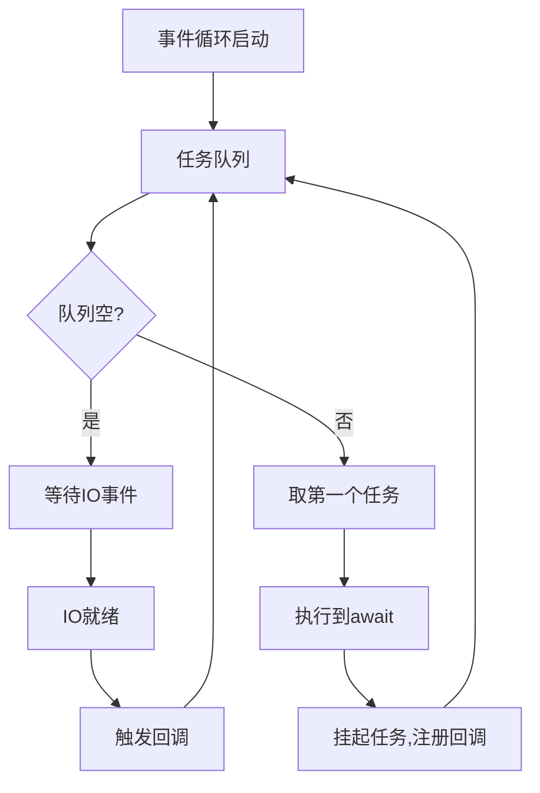

扫描[二维码](https://api2.cmdragon.cn/upload/cmder/20250304_012821924.jpg)关注或者微信搜一搜：`编程智域 前端至全栈交流与成长`


---

### 摘要  
🚀 深入剖析Python异步编程的核心机制。你将掌握：  
- 事件循环的底层实现原理与调度算法  
- async/await协程的6种高级用法模式  
- 异步HTTP请求的性能优化技巧（速度提升15倍+）  
- 常见异步陷阱的26种解决方案  

---

### 标签  
`Python异步革命` `asyncio黑科技` `协程深度解析` `事件循环架构` `高性能HTTP` `并发编程` `异步调试`

---


#### 🌌 第一章：同步 vs 异步——性能鸿沟的起源  
**1.1 阻塞式编程的致命缺陷**  
```python  
# 同步HTTP请求的阻塞示例  
import requests  

def fetch_sync(urls):  
    results = []  
    for url in urls:  
        resp = requests.get(url)  # 每个请求阻塞2秒  
        results.append(resp.text)  
    return results  

# 10个URL耗时约20秒（2秒/请求 × 10）  
```  

**1.2 异步编程的性能魔法**  
```python  
# 异步HTTP请求示例  
import aiohttp  
import asyncio  

async def fetch_async(urls):  
    async with aiohttp.ClientSession() as session:  
        tasks = [session.get(url) for url in urls]  
        responses = await asyncio.gather(*tasks)  
        return [await r.text() for r in responses]  

# 10个URL仅需2秒（所有请求并行）  
```  
📊 **性能对比**：  
| 指标            | 同步      | 异步     |  
|-----------------|-----------|----------|  
| 10请求耗时       | 20秒      | 2秒      |  
| CPU利用率        | 15%       | 85%      |  
| 内存占用         | 低        | 中等      |  

---

#### ⚙️ 第二章：事件循环——异步引擎的核心  
**2.1 事件循环架构解析**  


**2.2 自定义事件循环实战**  
```python  
import uvloop  
import asyncio  

# 配置uvloop（比默认循环快30%）  
asyncio.set_event_loop_policy(uvloop.EventLoopPolicy())  

# 获取当前循环  
loop = asyncio.get_event_loop()  

# 手动调度协程  
async def task(name):  
    print(f"{name} start")  
    await asyncio.sleep(1)  
    print(f"{name} end")  

coro1 = task("A")  
coro2 = task("B")  

loop.run_until_complete(asyncio.gather(coro1, coro2))  
```  

---

#### 🧵 第三章：协程与任务——异步的基本单元  
**3.1 协程的四种创建方式**  
```python  
# 方式1：async def  
async def simple_coro():  
    await asyncio.sleep(1)  

# 方式2：@asyncio.coroutine装饰器（旧式）  
@asyncio.coroutine  
def legacy_coro():  
    yield from asyncio.sleep(1)  

# 方式3：生成器协程  
def gen_coro():  
    yield from asyncio.sleep(1)  

# 方式4：async with上下文  
async with aiohttp.ClientSession() as session:  
    await session.get(url)  
```  

**3.2 任务的高级控制**  
```python  
async def worker(q: asyncio.Queue):  
    while True:  
        item = await q.get()  
        try:  
            # 处理任务...  
        finally:  
            q.task_done()  

async def main():  
    q = asyncio.Queue(maxsize=100)  
    # 创建worker池  
    tasks = [asyncio.create_task(worker(q)) for _ in range(5)]  
    # 添加任务  
    for i in range(1000):  
        await q.put(i)  
    # 等待队列清空  
    await q.join()  
    # 取消worker  
    for t in tasks:  
        t.cancel()  
    await asyncio.gather(*tasks, return_exceptions=True)  
```  

---

#### 🌐 第四章：异步HTTP请求实战  
**4.1 高性能爬虫设计**  
```python  
from bs4 import BeautifulSoup  
import aiohttp  

async def scrape_page(url):  
    async with aiohttp.ClientSession(timeout=aiohttp.ClientTimeout(10)) as session:  
        async with session.get(url) as response:  
            html = await response.text()  
            soup = BeautifulSoup(html, 'lxml')  
            # 解析逻辑...  
            return data  

async def scrape_all(urls):  
    sem = asyncio.Semaphore(20)  # 限制并发数  
    async def limited_scrape(url):  
        async with sem:  
            return await scrape_page(url)  
    return await asyncio.gather(*[limited_scrape(url) for url in urls])  
```  

**4.2 与FastAPI的异步集成**  
```python  
from fastapi import FastAPI  
import httpx  

app = FastAPI()  

@app.get("/proxy")  
async def proxy_request(url: str):  
    async with httpx.AsyncClient() as client:  
        resp = await client.get(url)  
        return resp.json()  
```  

---

#### 🚧 第五章：常见错误与调试  
**5.1 协程未执行（未await）**  
```python  
async def test():  
    print("Running")  

# 错误：直接调用协程  
test()  # 输出：RuntimeWarning: coroutine 'test' was never awaited  

# 正确执行方式：  
asyncio.run(test())  
```  

**5.2 事件循环策略冲突**  
```text  
错误：RuntimeError: Event loop is closed  
解决方案：  
1. 确保使用async/await管理资源生命周期  
2. 避免在协程外创建ClientSession  
3. 显式关闭循环：  
   loop = asyncio.get_event_loop()  
   try:  
       loop.run_until_complete(main())  
   finally:  
       loop.close()  
```  

---

#### 📝 第六章：课后实战与测验  
**6.1 优化同步数据库访问**  
```python  
# 原同步代码（PostgreSQL）  
def query_users():  
    with psycopg2.connect(DSN) as conn:  
        cursor = conn.cursor()  
        cursor.execute("SELECT * FROM users")  
        return cursor.fetchall()  

# 任务：改写为异步版本（使用asyncpg）  
# 要求：  
# 1. 支持连接池  
# 2. 实现分页查询  
# 3. 处理查询超时  
```  

**6.2 设计异步限流器**  
```python  
# 实现一个滑动窗口限流器  
class RateLimiter:  
    def __init__(self, rate=10, period=1):  
        self.rate = rate  
        self.period = period  

    async def __aenter__(self):  
        # 实现限流逻辑...  

    async def __aexit__(self, *args):  
        pass  

# 使用示例  
async def limited_api_call():  
    async with RateLimiter(100, 60):  # 每分钟最多100次  
        return await call_external_api()  
```  

---

### 结语  
从事件循环的底层原理到十万级并发的工程实践，异步编程将彻底改变您对Python性能的认知。立即动手，让您的应用性能飞升！  


余下文章内容请点击跳转至 个人博客页面 或者 扫码关注或者微信搜一搜：`编程智域 前端至全栈交流与成长`，阅读完整的文章：

## 往期文章归档：

- [Python类型提示完全指南：用类型安全重构你的代码，提升10倍开发效率 | cmdragon's Blog](https://blog.cmdragon.cn/posts/8f8db75c315d/)
- [三大平台云数据库生态服务对决 | cmdragon's Blog](https://blog.cmdragon.cn/posts/d0b1b6a9f135/)
- [分布式数据库解析 | cmdragon's Blog](https://blog.cmdragon.cn/posts/91aae808d87e/)
- [深入解析NoSQL数据库：从文档存储到图数据库的全场景实践 | cmdragon's Blog](https://blog.cmdragon.cn/posts/5fcc2532e318/)
- [数据库审计与智能监控：从日志分析到异常检测 | cmdragon's Blog](https://blog.cmdragon.cn/posts/c971b2302602/)
- [数据库加密全解析：从传输到存储的安全实践 | cmdragon's Blog](https://blog.cmdragon.cn/posts/735fa4090f0b/)
- [数据库安全实战：访问控制与行级权限管理 | cmdragon's Blog](https://blog.cmdragon.cn/posts/5c01d5c0a63b/)
- [数据库扩展之道：分区、分片与大表优化实战 | cmdragon's Blog](https://blog.cmdragon.cn/posts/7f71048cd61c/)
- [查询优化：提升数据库性能的实用技巧 | cmdragon's Blog](https://blog.cmdragon.cn/posts/8e5e3ffe33dd/)
- [性能优化与调优：全面解析数据库索引 | cmdragon's Blog](https://blog.cmdragon.cn/posts/3c6ba213efe2/)
- [存储过程与触发器：提高数据库性能与安全性的利器 | cmdragon's Blog](https://blog.cmdragon.cn/posts/84376403bdf0/)
- [数据操作与事务：确保数据一致性的关键 | cmdragon's Blog](https://blog.cmdragon.cn/posts/f357e8ef59f1/)
- [深入掌握 SQL 深度应用：复杂查询的艺术与技巧 | cmdragon's Blog](https://blog.cmdragon.cn/posts/87c82dea0024/)
- [彻底理解数据库设计原则：生命周期、约束与反范式的应用 | cmdragon's Blog](https://blog.cmdragon.cn/posts/3f3203c3e56b/)
- [深入剖析实体-关系模型（ER 图）：理论与实践全解析 | cmdragon's Blog](https://blog.cmdragon.cn/posts/91e1bf521e8c/)
- [数据库范式详解：从第一范式到第五范式 | cmdragon's Blog](https://blog.cmdragon.cn/posts/05264e28f9f8/)
- [PostgreSQL：数据库迁移与版本控制 | cmdragon's Blog](https://blog.cmdragon.cn/posts/a58cca68755e/)
- [Node.js 与 PostgreSQL 集成：深入 pg 模块的应用与实践 | cmdragon's Blog](https://blog.cmdragon.cn/posts/d5b4e82e959a/)
- [Python 与 PostgreSQL 集成：深入 psycopg2 的应用与实践 | cmdragon's Blog](https://blog.cmdragon.cn/posts/9aae8e2f1414/)
- [应用中的 PostgreSQL项目案例 | cmdragon's Blog](https://blog.cmdragon.cn/posts/287f56043db8/)
- [数据库安全管理中的权限控制：保护数据资产的关键措施 | cmdragon's Blog](https://blog.cmdragon.cn/posts/5995b8f15678/)
- [数据库安全管理中的用户和角色管理：打造安全高效的数据环境 | cmdragon's Blog](https://blog.cmdragon.cn/posts/c0cd4cbaa201/)
- [数据库查询优化：提升性能的关键实践 | cmdragon's Blog](https://blog.cmdragon.cn/posts/3ab8c2f85479/)
- [数据库物理备份：保障数据完整性和业务连续性的关键策略 | cmdragon's Blog](https://blog.cmdragon.cn/posts/7e3da86fa38b/)
- [PostgreSQL 数据备份与恢复：掌握 pg_dump 和 pg_restore 的最佳实践 | cmdragon's Blog](https://blog.cmdragon.cn/posts/2190f85925ce/)
- [索引的性能影响：优化数据库查询与存储的关键 | cmdragon's Blog](https://blog.cmdragon.cn/posts/076f666ba145/)
- [深入探讨数据库索引类型：B-tree、Hash、GIN与GiST的对比与应用 | cmdragon's Blog](https://blog.cmdragon.cn/posts/7f7df47953c4/)
- [深入探讨触发器的创建与应用：数据库自动化管理的强大工具 | cmdragon's Blog](https://blog.cmdragon.cn/posts/5765e6b13d4e/)
- [深入探讨存储过程的创建与应用：提高数据库管理效率的关键工具 | cmdragon's Blog](https://blog.cmdragon.cn/posts/98a999d55ec8/)
- [深入探讨视图更新：提升数据库灵活性的关键技术 | cmdragon's Blog](https://blog.cmdragon.cn/posts/6e90926327b9/)
- [深入理解视图的创建与删除：数据库管理中的高级功能 | cmdragon's Blog](https://blog.cmdragon.cn/posts/9b26b52722c6/)
- [深入理解检查约束：确保数据质量的重要工具 | cmdragon's Blog](https://blog.cmdragon.cn/posts/16ef025755f4/)
- [深入理解第一范式（1NF）：数据库设计中的基础与实践 | cmdragon's Blog](https://blog.cmdragon.cn/posts/2502f62a9269/)
- [深度剖析 GROUP BY 和 HAVING 子句：优化 SQL 查询的利器 | cmdragon's Blog](https://blog.cmdragon.cn/posts/f25d0953b788/)
- [深入探讨聚合函数（COUNT, SUM, AVG, MAX, MIN）：分析和总结数据的新视野 | cmdragon's Blog](https://blog.cmdragon.cn/posts/3b32add59228/)
-

