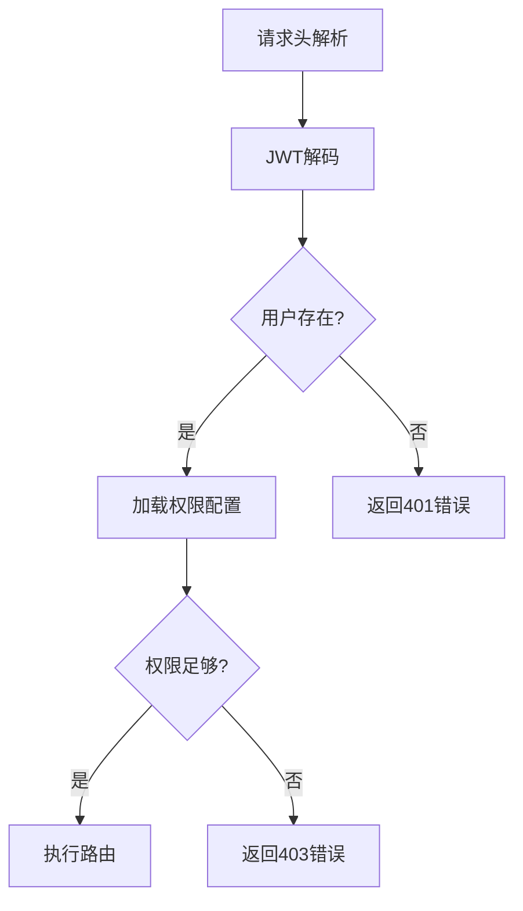

----
title: 如何在FastAPI中构建一个既安全又灵活的多层级权限系统？
date: 2025/06/14 12:43:05
updated: 2025/06/14 12:43:05
author: cmdragon

excerpt:
  FastAPI通过依赖注入系统和OAuth2、JWT等安全方案，支持构建多层级权限系统。系统设计包括基于角色的访问控制、细粒度权限验证、权限继承机制和动态权限加载。通过定义用户角色和权限模型，结合权限验证流程，实现用户权限的动态加载和校验。路由集成示例展示了如何在API端点中应用角色和权限依赖项。高级配置技巧包括动态权限加载和缓存优化。常见错误解决方案针对HTTP 401和403错误提供了排查步骤。

categories:
  - 后端开发
  - FastAPI

tags:
  - FastAPI
  - 权限系统
  - 多层级访问控制
  - OAuth2
  - JWT
  - 依赖注入
  - RBAC

----


扫描[二维码](https://api2.cmdragon.cn/upload/cmder/20250304_012821924.jpg)
关注或者微信搜一搜：`编程智域 前端至全栈交流与成长`

[发现1000+提升效率与开发的AI工具和实用程序](https://tools.cmdragon.cn/zh/apps?category=ai_chat)：https://tools.cmdragon.cn/

以下是符合要求的完整技术博客内容：

---

# 1. FastAPI多层级权限系统配置指南

## 1.1 权限系统概述

在复杂的企业级应用中，权限系统需要支持多层级访问控制。FastAPI通过其强大的依赖注入系统，配合OAuth2和JWT等安全方案，可以构建包含以下特征的权限系统：

- 基于角色的访问控制（RBAC）
- 细粒度权限验证（单个接口多条件校验）
- 权限继承机制（管理员继承普通用户权限）
- 动态权限加载（从数据库读取实时权限）

## 1.2 权限系统设计

### 基础数据结构模型

```python
# requirements.txt
fastapi == 0.68
.0
python - jose[cryptography] == 3.3
.0
pydantic == 1.10
.7
```

```python
from enum import Enum
from pydantic import BaseModel


class UserRole(str, Enum):
    GUEST = "guest"
    USER = "user"
    ADMIN = "admin"
    SUPER_ADMIN = "super_admin"


class User(BaseModel):
    username: str
    role: UserRole
    permissions: list[str] = []
```

### 权限验证流程



## 1.3 创建权限依赖项

### 基础用户获取依赖

```python
from fastapi import Depends, HTTPException, status
from fastapi.security import OAuth2PasswordBearer

oauth2_scheme = OAuth2PasswordBearer(tokenUrl="token")


async def get_current_user(token: str = Depends(oauth2_scheme)):
    # 模拟数据库查询
    fake_users_db = {
        "user1": User(username="user1", role=UserRole.USER),
        "admin1": User(username="admin1", role=UserRole.ADMIN)
    }

    user = fake_users_db.get(token)
    if not user:
        raise HTTPException(
            status_code=status.HTTP_401_UNAUTHORIZED,
            detail="无效的认证信息"
        )
    return user
```

### 权限检查依赖

```python
from typing import List


def require_role(required_role: UserRole):
    async def role_checker(user: User = Depends(get_current_user)):
        if user.role not in [required_role, UserRole.SUPER_ADMIN]:
            raise HTTPException(
                status_code=status.HTTP_403_FORBIDDEN,
                detail="权限不足"
            )
        return user

    return Depends(role_checker)


def require_permissions(required_perms: List[str]):
    async def perm_checker(user: User = Depends(get_current_user)):
        missing = [perm for perm in required_perms
                   if perm not in user.permissions]
        if missing and user.role != UserRole.SUPER_ADMIN:
            raise HTTPException(
                status_code=status.HTTP_403_FORBIDDEN,
                detail=f"缺少权限: {', '.join(missing)}"
            )
        return user

    return Depends(perm_checker)
```

## 1.4 路由集成示例

```python
from fastapi import APIRouter

router = APIRouter()


@router.get("/user-data",
            dependencies=[Depends(require_role(UserRole.USER))])
async def get_user_data():
    return {"data": "普通用户数据"}


@router.get("/admin-report",
            dependencies=[Depends(require_role(UserRole.ADMIN)),
                          Depends(require_permissions(["report_view"]))])
async def get_admin_report():
    return {"report": "管理员专属报表"}
```

## 1.5 高级配置技巧

### 动态权限加载

```python
from functools import lru_cache


@lru_cache()
async def load_permissions(user: User):
    # 模拟数据库查询
    perm_map = {
        UserRole.USER: ["data_view"],
        UserRole.ADMIN: ["data_view", "report_view"]
    }
    user.permissions = perm_map.get(user.role, [])
    return user


def dynamic_permission(perm_name: str):
    async def checker(user: User = Depends(get_current_user)):
        await load_permissions(user)
        if perm_name not in user.permissions:
            raise HTTPException(status_code=403,
                                detail="动态权限不足")
        return user

    return Depends(checker)
```

## 1.6 常见错误解决方案

### 错误 1：HTTP 401 Unauthorized

**原因分析**：

- 缺失Authorization请求头
- JWT令牌过期或格式错误
- 用户不存在于数据库

**解决方案**：

1. 检查请求头格式：
   ```bash
   curl -H "Authorization: Bearer your_token" http://api.example.com/endpoint
   ```
2. 使用jwt.io调试工具验证令牌有效性
3. 确保用户查询逻辑正确

### 错误 2：HTTP 403 Forbidden

**典型场景**：

```python
@router.get("/special-data",
            dependencies=[Depends(require_role(UserRole.ADMIN))])
async def get_special_data(user: User = Depends(get_current_user)):
# 用户具有ADMIN角色但仍被拒绝访问
```

**排查步骤**：

1. 检查依赖项执行顺序
2. 验证用户对象中的角色字段值
3. 查看权限检查条件是否过于严格

## 1.7 课后Quiz

**问题 1**：如何在保持代码整洁的同时实现多层级权限校验？
A. 使用多个if条件判断
B. 采用装饰器模式分层验证 ✔️
C. 为每个路由编写独立验证逻辑

**解析**：正确答案是B。FastAPI的依赖注入系统天然支持装饰器模式，可以通过组合不同层级的权限校验器实现清晰的多层校验。

**问题 2**：防止权限系统被绕过的关键措施是？
A. 前端隐藏按钮
B. 后端独立权限校验 ✔️
C. 使用HTTPS协议

**解析**：正确答案是B。前端控制只是表象，必须确保每个API端点都有独立的后端权限校验。

---

通过本指南，开发者可以构建基于角色和权限的多层级访问控制系统。建议在实际项目中结合数据库进行权限持久化存储，并使用Redis等缓存方案优化权限加载性能。

余下文章内容请点击跳转至 个人博客页面 或者 扫码关注或者微信搜一搜：`编程智域 前端至全栈交流与成长`，阅读完整的文章：

## 往期文章归档：

- [FastAPI如何用角色权限让Web应用安全又灵活？ | cmdragon's Blog](https://blog.cmdragon.cn/posts/3f8813fdf899/)
- [FastAPI权限验证依赖项究竟藏着什么秘密？ | cmdragon's Blog](https://blog.cmdragon.cn/posts/a918f4d412db/)
- [如何用FastAPI和Tortoise-ORM打造一个既高效又灵活的角色管理系统？ | cmdragon's Blog](https://blog.cmdragon.cn/posts/c8ac5399cf26/)
- [JWT令牌如何在FastAPI中实现安全又高效的生成与验证？ | cmdragon's Blog](https://blog.cmdragon.cn/posts/79b35f91fefe/)
- [你的密码存储方式是否在向黑客招手？ | cmdragon's Blog](https://blog.cmdragon.cn/posts/5eaec1519e8c/)
- [如何在FastAPI中轻松实现OAuth2认证并保护你的API？ | cmdragon's Blog](https://blog.cmdragon.cn/posts/a1070c09af14/)
- [FastAPI安全机制：从OAuth2到JWT的魔法通关秘籍 | cmdragon's Blog](https://blog.cmdragon.cn/posts/62ff5d35e235/)
- [FastAPI认证系统：从零到令牌大师的奇幻之旅 | cmdragon's Blog](https://blog.cmdragon.cn/posts/209b68f4f80b/)
- [FastAPI安全异常处理：从401到422的奇妙冒险 | cmdragon's Blog](https://blog.cmdragon.cn/posts/48d0eea47030/)
- [FastAPI权限迷宫：RBAC与多层级依赖的魔法通关秘籍 | cmdragon's Blog](https://blog.cmdragon.cn/posts/ac15f0972638/)
- [JWT令牌：从身份证到代码防伪的奇妙之旅 | cmdragon's Blog](https://blog.cmdragon.cn/posts/ec3aa76fc0de/)
- [FastAPI安全认证：从密码到令牌的魔法之旅 | cmdragon's Blog](https://blog.cmdragon.cn/posts/4541d035d084/)
- [密码哈希：Bcrypt的魔法与盐值的秘密 | cmdragon's Blog](https://blog.cmdragon.cn/posts/e1b940e13b4d/)
- [用户认证的魔法配方：从模型设计到密码安全的奇幻之旅 | cmdragon's Blog](https://blog.cmdragon.cn/posts/15de786fd044/)
- [FastAPI安全门神：OAuth2PasswordBearer的奇妙冒险 | cmdragon's Blog](https://blog.cmdragon.cn/posts/bbb2f2716edb/)
- [OAuth2密码模式：信任的甜蜜陷阱与安全指南 | cmdragon's Blog](https://blog.cmdragon.cn/posts/4054bb761a12/)
- [API安全大揭秘：认证与授权的双面舞会 | cmdragon's Blog](https://blog.cmdragon.cn/posts/547a7e3d7ac7/)
- [异步日志监控：FastAPI与MongoDB的高效整合之道 | cmdragon's Blog](https://blog.cmdragon.cn/posts/4a29b618aa59/)
- [FastAPI与MongoDB分片集群：异步数据路由与聚合优化 | cmdragon's Blog](https://blog.cmdragon.cn/posts/6455cdef0c41/)
- [FastAPI与MongoDB Change Stream的实时数据交响曲 | cmdragon's Blog](https://blog.cmdragon.cn/posts/3c81964d922c/)
- [地理空间索引：解锁日志分析中的位置智慧 | cmdragon's Blog](https://blog.cmdragon.cn/posts/b933afc93ab1/)
- [异步之舞：FastAPI与MongoDB的极致性能优化之旅 | cmdragon's Blog](https://blog.cmdragon.cn/posts/73a07166228e/)
- [异步日志分析：MongoDB与FastAPI的高效存储揭秘 | cmdragon's Blog](https://blog.cmdragon.cn/posts/f243ecf59662/)
- [MongoDB索引优化的艺术：从基础原理到性能调优实战 | cmdragon's Blog](https://blog.cmdragon.cn/posts/2565cdc59f74/)
- [解锁FastAPI与MongoDB聚合管道的性能奥秘 | cmdragon's Blog](https://blog.cmdragon.cn/posts/714772e1fbe0/)
- [异步之舞：Motor驱动与MongoDB的CRUD交响曲 | cmdragon's Blog](https://blog.cmdragon.cn/posts/bd24c2bf486f/)
- [异步之舞：FastAPI与MongoDB的深度协奏 | cmdragon's Blog](https://blog.cmdragon.cn/posts/8d4b0186aaf6/)
- [数据库迁移的艺术：FastAPI生产环境中的灰度发布与回滚策略 | cmdragon's Blog](https://blog.cmdragon.cn/posts/67c49b3ab489/)
- [数据库迁移的艺术：团队协作中的冲突预防与解决之道 | cmdragon's Blog](https://blog.cmdragon.cn/posts/c761e999ff26/)
- [驾驭FastAPI多数据库：从读写分离到跨库事务的艺术 | cmdragon's Blog](https://blog.cmdragon.cn/posts/1129cda88dea/)
- [数据库事务隔离与Alembic数据恢复的实战艺术 | cmdragon's Blog](https://blog.cmdragon.cn/posts/e878319e1f7e/)
- [FastAPI与Alembic：数据库迁移的隐秘艺术 | cmdragon's Blog](https://blog.cmdragon.cn/posts/24aeaadbab78/)
- [飞行中的引擎更换：生产环境数据库迁移的艺术与科学 | cmdragon's Blog](https://blog.cmdragon.cn/posts/944b5aca784d/)
- [Alembic迁移脚本冲突的智能检测与优雅合并之道 | cmdragon's Blog](https://blog.cmdragon.cn/posts/24dfbc5f2148/)
- [多数据库迁移的艺术：Alembic在复杂环境中的精妙应用 | cmdragon's Blog](https://blog.cmdragon.cn/posts/91ba0550aa71/)
- [数据库事务回滚：FastAPI中的存档与读档大法 | cmdragon's Blog](https://blog.cmdragon.cn/posts/55a63eaa29d3/)
- [XML Sitemap](https://tools.cmdragon.cn/sitemap_index.xml)
- 